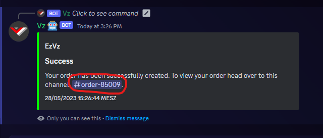
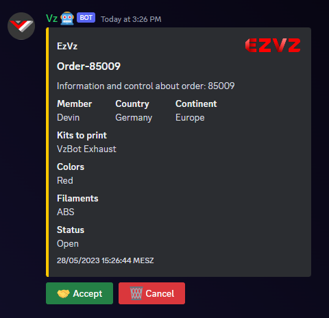
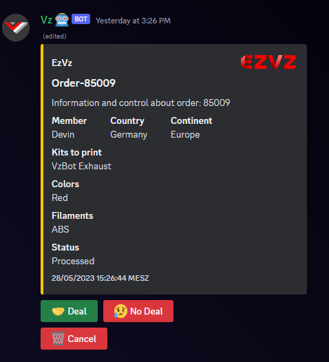
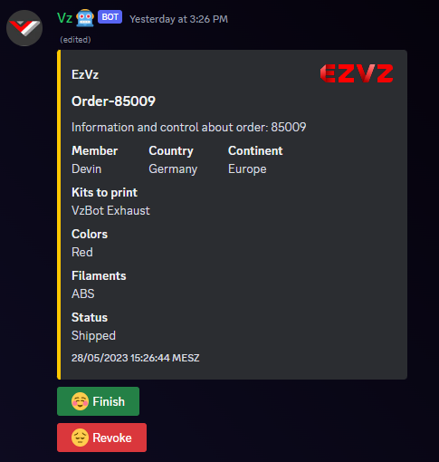

# Step by Step Tutorial - Customer

Everything from this point is meant to be executed in the discord client.

1. Head over to the EzVz-Info category and go into the #order channel. From the order-panel you can select which kits you would like to order.

    

2. After selecting the kits close the selection and a new menu will pop up.
   Fill out the data as needed.

    

3. Head over to the newly created channel. And now its time to wait, until a provider accepts your order.

    

4. In here you will see the main ordering panel. This allows you to perform certain actions on the order, as well as to see the current status. The message is pinned so you can easily get back to it later.

    

    You can ignore the accept button. This button is only for interested providers who want to accept this order and negotiate with you. With the cancel button you can cancel the order. All details will then be deleted.

5. Now its waiting time. Wait until somebody accepts your order to get to the next step.
6. As soon as somebody accept your order you will get the following message:

    

    You can now discusss with the provider further details, such as shipping cost or special wishes. While in this state only you and the provider can see this order, its hidden from the rest of the server.

7. When both of you agree on a deal, click the green apply button at the initial order info panel.

    
    

8. As soon as both of you have accepted the deal the order will continue to the next step. If one of the parties should decline the deal, the order will go back into the initial state of looking for a provider. The provider is not able to type inside of the channel anymore. The order is visible again for the other providers. Accepting the order will remove the option for you to cancel the order. So be sure that you really want the parts before ordering them. At the order panel a new "Revoke" button will appear. You can ignore this button, it is only usable for the provider.

    

9. Now its time for the provider to print you wished parts. You have to wait until the provider ships the parts. When this happens you will be notified inside of the channel.

    

10. When you have received the parts and everything is fine, click the finish button on the order panel to complete this order.

    

11. You have now successfully ordered parts trough EzVz.
