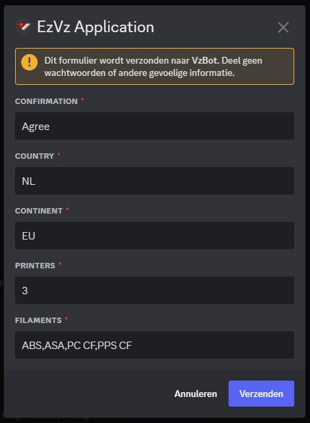

# Step by Step Tutorial - Provider

**Everything from this point is meant to be executed in the discord client.**

# Commands

A list of important and useful comands can be found here

| Command             | Description                                                        |
| ------------------- | ------------------------------------------------------------------ |
| ```/ezvz edit```    | Edits your provided information, such as filaments and printers.   |
| ```/ezvz preview``` | Previews your current information panel as a customer would see it |

# Applying

1. Head over to the EzVz-Info category and go into the #Apply channel.


2. Now fill in the form like the example below and you'r application will be put in the list.



3.If you check the Applications channel there should now be one for you.


4. Now open your channel and you'll see what you'll need to do to apply for being a provider.


5. Now print the cube and upload your pictures. You might get a couple of questions from the team to upload some more pictures or close ups but once provided and we're happy with the quality you'll be accepted as a provider and you'll be able to accept some open order.


# Accepting orders

1. Head over to the EzVz-Info category and go into the #order channel. You'll see al the open orders there that you can check out and accept.


2. If you press a order you'll see the parts required by the user and what material/color and where they're located. If you have that and are willing to print it press the Accept button.


3. Once you've accepted the order the Buyer will also get a notification off this and you can start discussing Shipping costs and the price for the parts.


4. If both of you agree on the Price and timeframe just scroll up a bit and press the Deal button. If you can't agree on the button press the No Deal button and the order will go back to open for another Provider to Accept it.


5. Once you both press Deal the channel goes into the waiting for shipment stage. Here you can still talk and keep the Buyer updated on his order.


6. Once you're ready to ship the package simply press the shipped button and put in the tracking link for the package.


 
 7. Once the user receives his package he can press the finish button and give you a review.

 If at anytime during the Printing fase you can not finish the order so after you've made a Deal and agreed to the price and timeframe you can press the Revoke button. This will be noted in your provider profile and will be visible by customers when you accept their order. 