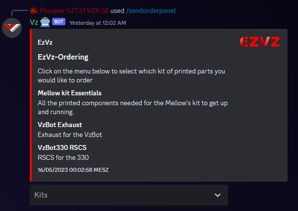

# How to use EzVz

Before we show you an in depth tutorial on how to use the EzVz Program, it is mandatory to understand the steps and general idea behind EzVz.

## How it works

First of all, compared to other printing services such as PIF, we don't have a regulated queue which randomly provides customers with a provider based on certain factors. EzVz utilizes the principle of order picking. This means that customers (also often called buyers) can offer their order for the public. This includes information such as: Country, Continent, Filaments and Colors wished. These orders are listed in a discord category called EzVz-Orders. Providers which have been approved by the VzBoT team, can then select orders which they can complete, and further details can be negotiated between the customer and provider. 
To sort a bit of the orders, only providers in the same continent as the order are able to see the channel. Don't worry, if your continent doesn't have any providers yet, providers from the closest continent can also see your order then. 

## Order states

After sending your order, the order goes trough certain steps: 

1. The buyer selects the kits he wants, as well as colors for the parts.
2. The order gets listed, and the suppliers can see the order with the requirements
3. If a supplier finds a order where he can meet the criteria, he can accept the order.
4. The order no goes into a negotiation state. The provider and buyer can discuss about order details, shipping cost and a deadline.
5. If both parties agree on a deal the printing state begins. The provider has now time to print the parts and start shipping them.
6. As soon as the buyer receives the part, he can close the order and rate the provider.

## Step by Step Tutorial - Customer

Everything from this point is meant to be executed in the discord client.

1. Head over to the EzVz-Info category and go into the #order channel. From the order-panel you can select which kits you would like to order.

1. After selecting the kits close the selection and a new menu will pop up.
   Fill out the data as needed.

1. Head over to the newly created channel. And now its time to wait, until a provider accepts your order.
2. TODO