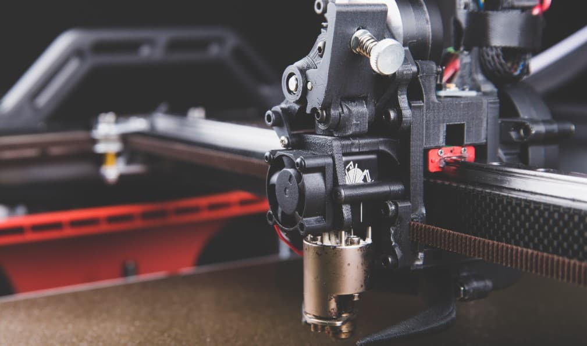
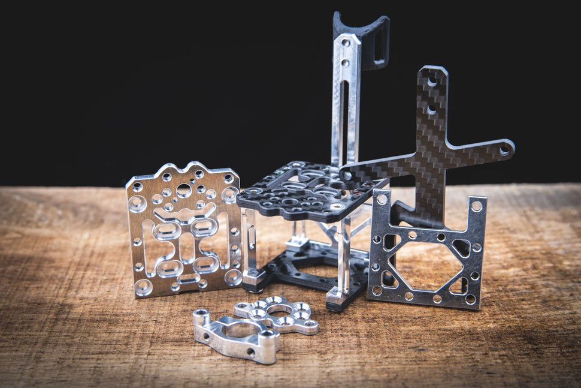

# Frequently Asked Questions

## What is the VzBoT?

The VzBoT is a high speed, moderately sized 3d Printer. Originally based on the TronXY X5SA / X5S Frame, this printer was aimed at those who want more performance out of their 330x330mm sized 3d printer.

Since this era, the VzBoT project has come very far. From Aluminum CNC parts to a full kit (soon) and custom high performance hotend, the project has developed at a lightning pace to be one of the fastest printers out there.

### The printers
Originally, the VZ project started with a VZ330 by Simon Vez. Recently, Guillaume has developed his iteration of the VzBoT. This printer aims to address a few compromises with the larger sized printer, by using a 235x235 bed size (ender 3 sized). This makes sourcing the parts for this printer relatively easy. Combined with the AWD functionality (all wheel drive, 2 motors on X and 2 on Y) and shorter belt loops, this printer is for those who thrive to be the fastest.

## What will a VzBoT cost me?
Originally, as of start of 2022, a VZ330 would set you back as follows:

- 800 USD if you source really well and efficiently (budget)
- 1000 USD for the average VzBoT
- 1500 USD for the whole shablam with alu parts, 48v, all extras etc.

Add 100-150 USD for panels, and you've got yourself a very nice 3D-printer.

Unfortunately, due to inflation, and other costs, this price may be a higher (think 100-200 USD).

Additionally, a VZ235 will be less expensive, due to the smaller size and easily source able parts.

## Are the aluminium parts open source?
Unfortunately, the aluminium parts are not open source. The printhead was developed in collaboration with F3D, who have put extensive efforts and work into developing and testing this hardware, and bringing it to the point that it is at now. Buying products from them directly supports our efforts to develop the VzBoT further, and bring you full kits and new cool Long Schlong Dongs ;).

### F3D
[https://f3d-racing-fdm.myshopify.com/](https://f3d-racing-fdm.myshopify.com/)

Apart from the printhead, most other aluminum parts can also be bought from Mellow store on aliexpress. If you want an all blacked out look, or you are ordering there anyways, consider checking out their sets.

### Mellow
VZ235 AWD: [https://s.click.aliexpress.com/e/_DEkSu5h](https://s.click.aliexpress.com/e/_DEkSu5h)
VZ330 2WD: [https://s.click.aliexpress.com/e/_9u11AP](https://s.click.aliexpress.com/e/_9u11AP)

If you are from China / Asia, we understand that buying and shipping a printhead from Germany can be very expensive. For this reason, the printhead is also available on Taobao in Black and Alu finish, sold by mellow.

You are free to design and produce your own iteration of the VzBoT aluminum parts. Please note that commercial redistribution and production will violate the CC BY-NC 4.0 license of the project!

## What is AWD (All wheel drive)?
In conventional CoreXY machines, a 2WD setup is used. This setup utilizes 2 stepper motors at the back or front of the machine. Recently, the VzBoT project has adapted the AWD setup! This setup utilizes 2 motors on X, and 2 on Y, doubling the amount of motors for the XY plane. What are the advantages of this setup? Let's go over them:

- Having two motors on one belt allows for a **shorter effective belt length**. This leads to less belt stretch, which usually gives better input shaper results.
- The **maximum useable acceleration** is about **1.5x higher** compared to 2WD due to the added torque.

We recommend using the **LDO-42STH48-2504AC** or **2504AH** 1.8° motors, as they give the best performance for the VzBoT's usecase.

