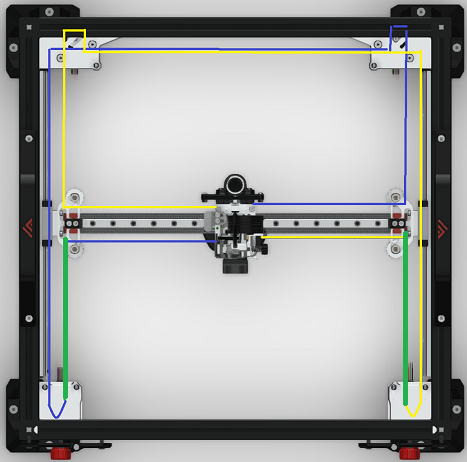

# Belt tensioning

{: .note}
> This guide is still a work in progress.

Belt tensioning is an important part of achieving good performance on your VzBoT printer. The specifications and numbers for tuning your printer may differ slightly between models and versions, but the steps for achieving these results are largely the same for all of them.

## What you will need

- A mobile phone or tablet
- Frequency analyzer application
- Quiet environment
- Tools for motor mounts

### VzBoT-330

The Vz330 belt tensioners are located at the back of the printer. Loosen the fixing screw on the rear motor mounts that go through the topplate and the spacer into the motors before turning the tensioning screw. Also loosen the M4x12 bolt with washer holding the motor plate at the back 2020. Tighten the fixing screw and M4x12 from motor plate back up when you're done adjusting belt tension.

Recommended target acoustic frequency:

- Printed version: Min 135Hz - Max 180Hz
- CNC / Mellow kit: Min 150Hz - Max 189Hz

Put the gantry at 150mm's from the front and use the 2 short belts on the Front Left and Right side from Idler/motor to X gantry Pulley. Use the green sections to measure the Freq.

### VzBoT-235

The Vz235 belt tensioners are located at the front of the printer, either side of the front doors. Loosen the fixing screw on the Front motor mounts that go through the topplate and the spacer into the motors before turning the tensioning screw .Also loosen the M4x12 bolt with washer holding the motor plate at the Left and right 2020. Tighten the fixing screw and M4x12 from motor plate back up when you're done adjusting belt tension.

Recommended target acoustic frequency:

- Printed version: Min 135Hz - Max 180Hz
- CNC / Mellow kit: Min 150Hz - Max 189Hz

Put  at roughly 150mm's from the front and use the 2 short belts on the front Left and Right side from idler/motor to X gantry pulley. Use the green sections to measure the Freq.

