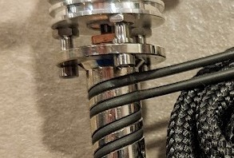

# Assembly & disassembly

The Goliath is assembled in roughly this order:

1. Heater wire around the heater block
2. Heat break inserted into the top end of the heater block
3. Heatsink or extruder (as heatsink) placed on to the heater block
4. Nozzle is inserted into the bottom end of the heater block

## Heater wire

The Goliath uses a nichrome heater wire as heater for the hot-end heater block. It is quite stiff but can also be bent to shape as desirable or necessary. In some situations, it may be necessary to tweak the way the wire sits. For that, please see the full Goliath documentation: [Readme - VzBoT3D/Goliath](https://github.com/VzBoT3D/Goliath/blob/main/README.md)

On the **Vz-Printhead**, you can either send the nichrome wire over to the right and to the back under the printhead, or route it to the right or left side in front of the printhead. Routing the wire to the right will keep the "natural" bend of the wire.

  
<small>© @adam_the_dev</small>

    
Example showing heater wire on the right side

    

    
Example showing heater wire around the back

    

## Temperature sensor

The temperature sensor used on the Goliath is usually a PT1000 platinum [resistance thermometer](https://en.wikipedia.org/wiki/Resistance_thermometer).

The PT1000 temperature sensor is installed in to the side of the Goliath heater block using an M3 screw thread.

## Nozzle and Heatbreak

The nozzle and heatbreak are both screwed in to the heater block (solid part wrapped in heater wire).

The goliath uses V6-style nozzles with an M6 screw thread and has mounting flanges for a 7mm wrench. Use this 7mm wrench to screw the nozzle in to place.  

It is recommended to add some **thermal paste** between the heatbreak and heatsink for better heat transfer. Do not use boron nitride as it will dry and make it really hard to remove heatbreak from heatsink.It's good practice to verify the heatbreak is still installed tightly and as specified whilst you are performing maintenance on the hot end. This can prevent future leakages and clogging issues.

**Tightening torque:**  
The heatbreak is installed into the heater block with about 1.0-1.2 Nm (Newtonmeters) of torque.  
The nozzle is installed into the heater block with about 1.2-1.4 Nm (Newtonmeters) of torque.

### Replacing the nozzle

1. Heat the hot end using the printer controls
2. Use a spanner or wrench appropriate for your nozzle's flat sides to unscrew the nozzle
3. Screw in a new nozzle
4. Tighten the nozzle to specific torque ratings.
    You can use this [printed torque wrench] from Thingiverse <small>(not sponsored)</small>.

Only remove or install the nozzle when the hot end is up to temperature. Unscrewing the nozzle cold can damage the threads of the heater block, or even sheer the nozzle cleanly at the line between it and the heater block.

### Replacing the heatbreak

To remove the heatbreak, you will have to heat the hotend first to melt the plastic inside first. This can be challenging.

1. Remove the hotend assembly from the the printhead
2. Remove the PT1000 temperature sensor from the heater block
3. Remove the (silicone) sock from the heater block
4. Unscrew the 3 M2 screws holding the heatsink to the heater block
5. Heat the heater block using the printer controls (Or use a heat gun).  
    Re-connect the heater to the printer wiring to use the printer controls.
    The goal is to heat the plastic inside the heatbreak enough to unscrew the heatbreak.
6. Use a 5.5mm / M3 wrench to loosen the heatbreak.  
    Use a 9mm wrench to hold the heater block to avoid breaking the heatbreak

Tip: Wear protective gloves to avoid burning yourself.

| Air cooled | Water cooled |
|------------|--------------|
|||
