# 6.2 Mellow Super8 V1.3

# Setup guide
Here's A detailed guide on how to install the Mellow Super8 V1.3 with Mellow 5160HV Externals and how to wire everything up.

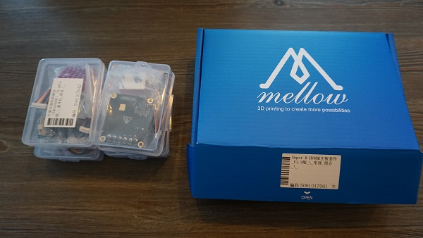

 
What's in the boxes
 
 

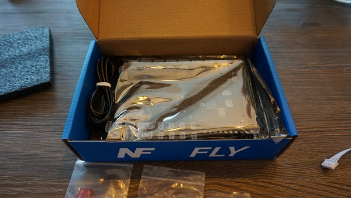
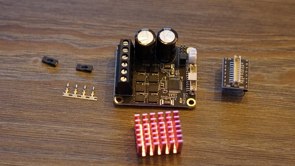
 

Overview of the board.

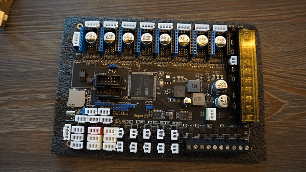
# Fuses
The first thing we need to do is install the fuses. These are in one off the small bags and should be put in the board as shown down below.

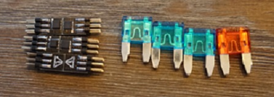
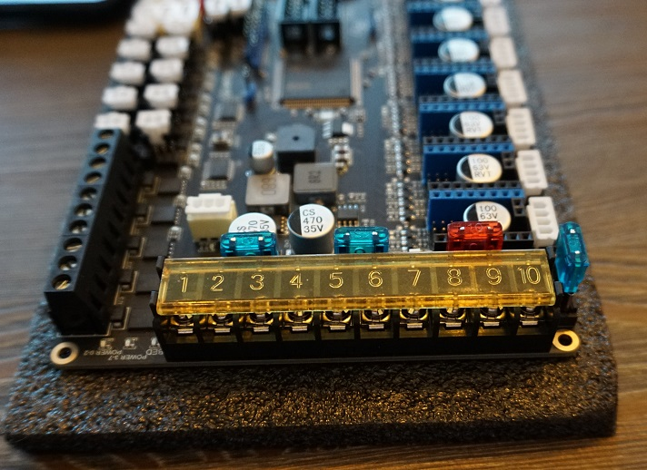

# Mosfets
Now we're gonna install the Mosfets for the fansports. These are needed otherwise the fanports won't work. The mosfets are in the same small bag the Fuses where in. Don't be afraid to break them in halve they're ment to be.
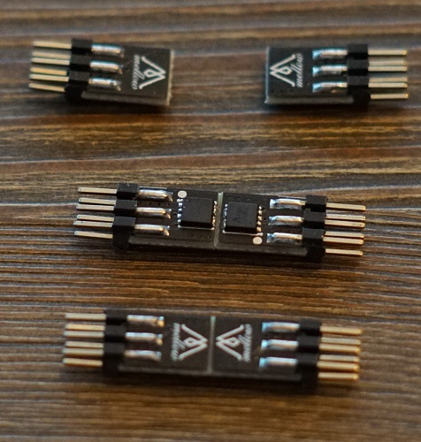

You'll see that the mosfet ports on the board arrive empty and are in between the fan plugs.

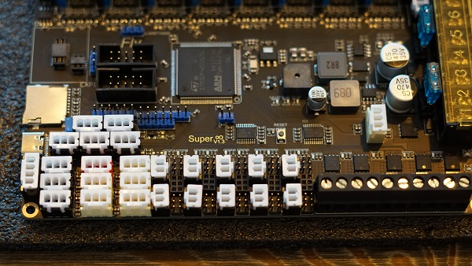

Insert the mosfets into the holes the direction they face doesn't matter.

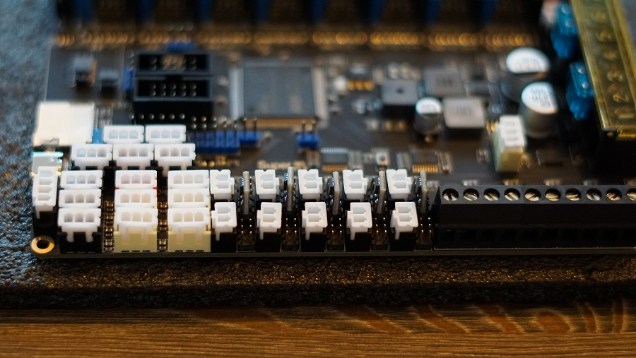

# Driver setup

Now we're done with that we're going to the plugs for the driver ports. We're gonna install the bridges for SPI and UART.
 

Here's a view of the board with all the plugs still not filled. It's important to not put bridges on the ports you're not gonna use.

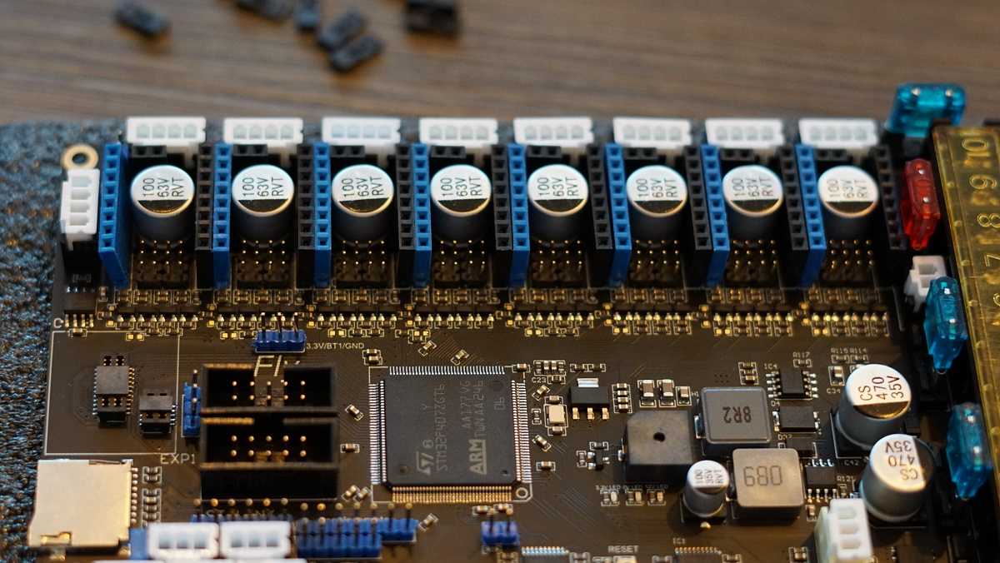

For SPI you need to put bridges on the front 2 rows of pins. These are used for the 5160's

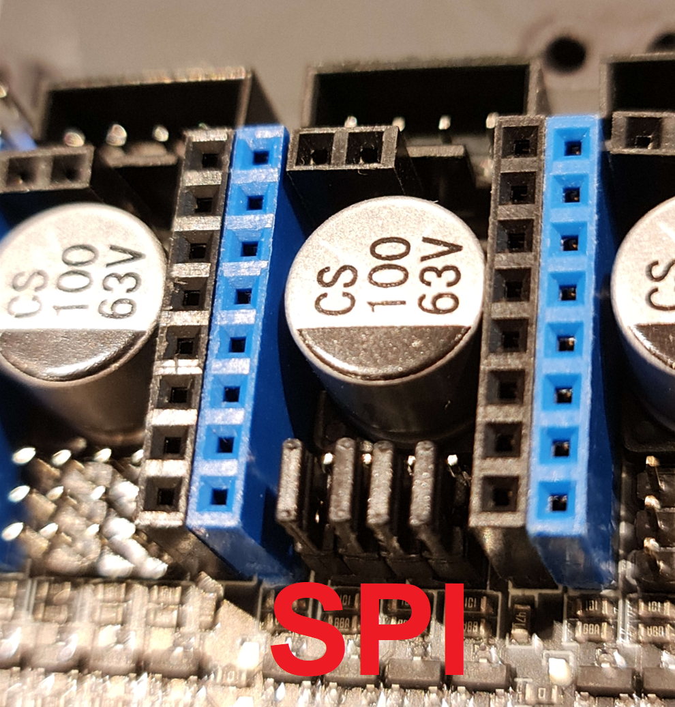

For UART you need to put the bridge on the second pin from the left and then bridge the front and middle row. These are for the 2209's.

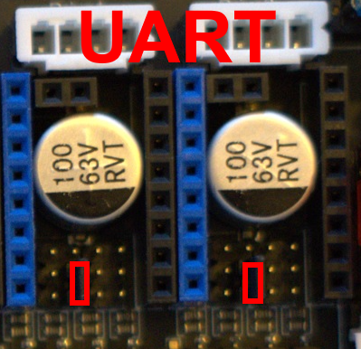

Next step is to populate all the driver slots that you're gonna use. Here's a example for a AWD setup on 5160's and Z and E on 2209's.

# installing the 5160's.

We start off by putting the Heatsinks on the 5160's. If you don't do this they will go into overtemp error.

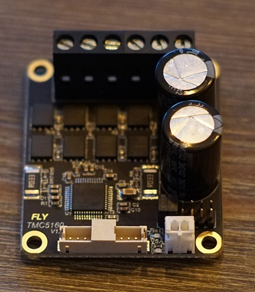
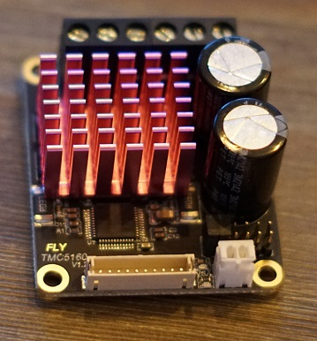

Now we'll plug in the adapter into the Driver slots. Make sure they are set to SPI like shown in the instructions above here.

It's important to use Slot 3-4-5-6 for your AWD system. Slot 7 has some issue's with SPI. So leave the most Left slot open like shown in the picture below.

Next up is to connect the cable between the adapter board and the External 5160.

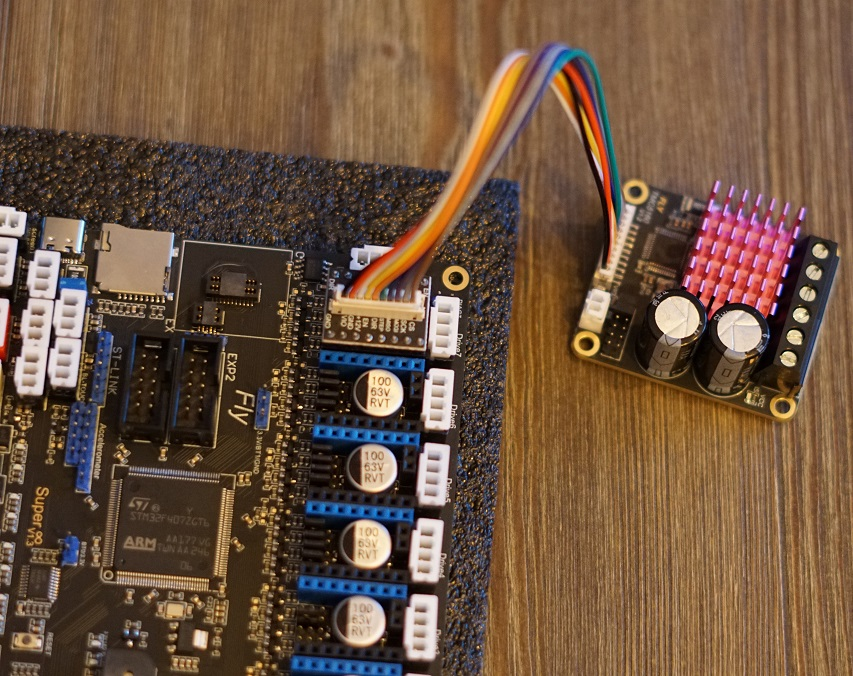

# Fan Voltage Selection

Next up we're gonna put the fan ports on the voltage we would like to run them on. You can choose 5V/12V/24V. Each plug has a voltage selection pin grid to the right of it.

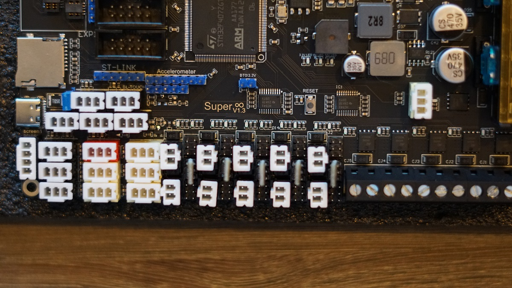
The bridges are to be inserte Left to right. The Top row is 5V. Middle row is 12V and the Bottom row is 24V.

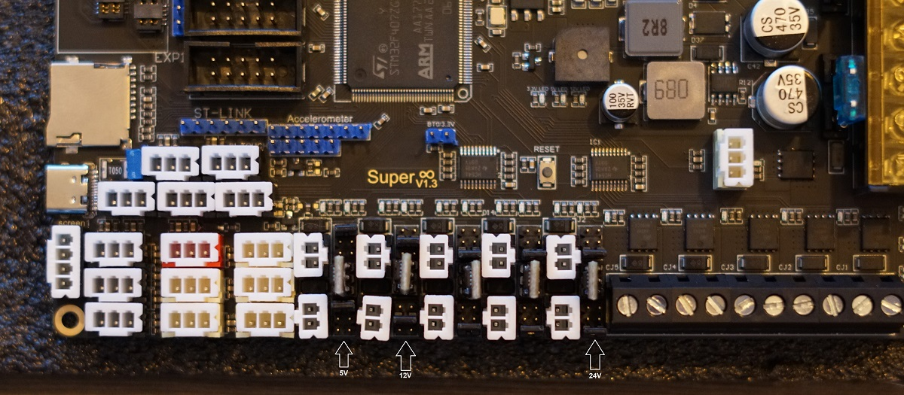

# Setting up the board on the machine.

Now we know how the board works a bit we can start setting it up on the machine. Mount the PSU's and Board on the back of the printer in the order you prefer or how it's layed out for the Kit.

# choosing a layout
Here is the layout For the Mellow Vz235 kit. It's important to check if everything fits where you want before attaching it.

Left is the 24V psu and to the right side is the 48V psu. This is because only the 5160's need 48V so we make the path to them the shortest by having the 48V PSU to the side of them. 
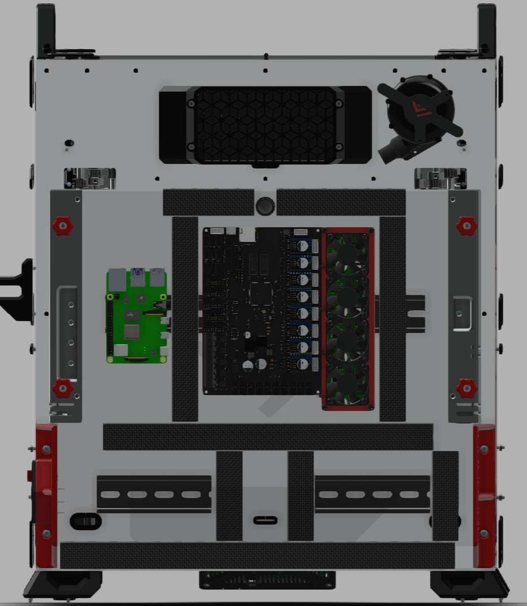

# Plugging in the 5160's

Now it's time to hookup the 5160's to the Motherboard.

Here you see al the 5160's installed on the holder and plugged into the Motherboard. Make sure to add all the Heatsinks to the 5160's. They'll get overheated fast if you forget these.

# Hooking up the AC side.

Here you see my AC setup using the Distribution blocks. the Yellow/Green is Ground. Blue is live and Black is my Neutral side.

It's very important to Properly ground everything. The Distrubution blocks i used for Ground have a passage to the DIN rail so those are automatically also grounded once a block is put on them. You can see i also grounded the top DIN rail and the Wire on the bottom middle slot is connected to the bolt holding my backpanel to the frame. This way the entire frame is also grounded. It's also important to run a ground wire from our bed to our distribution block or Wago so that the bed is properly grounded. We are after all running AC through the bed and don't wanna shock ourselves.

The Live side Blue get's distributed to the L inputs on the PSU's and too 1 input of the AC side of the SSR's. You can see i used the right screw terminal for both SSR's.

The Neutral side get's connected to the N on our PSU's.

# Bed heater SSR

Now it's time to hookup the SSR for the Bed heater.

Check your SSR to see where the + and - is for your DC side and hook that up to your Board like shown Bellow.

The SSR will also get a AC line put in on the other side. like shown Bellow. that's your Live AC line to power to the bed. I used the right terminal for the input here. the Left terminal goes to your Bed heater and then the other wire coming back from the Bed heater get's plugged into your Neutral distribution block for your AC marked with N in the picture above.

# Plugging in the 24V side.

{: .highlight }
> &#8226; Your Motherboard only get's 24V this is the beauty of the External 5160's you don't need to run 48V to your motherboard lowering the risk of damaging your motherboard when you have a issue with your 5160's.

Here you can see the first Wago blocks i used for my 24V + and - the PSU has a wire from the +V to the top Wago and -V has a wire running to the Bottom Wago block. This way you can have more outputs for your PSU.

# Plugging in our 48V side.

Next up is our 48V lines.

If using Wago's you run a +V line to the top Wago and a -V to the Bottom Wago. From there we can start distributing it to our 5160's.

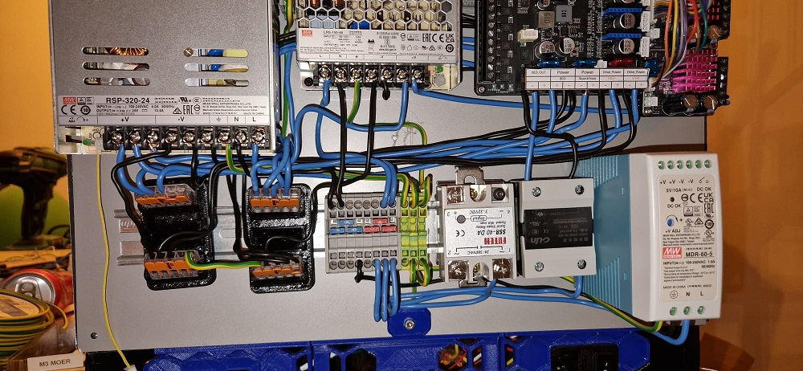

Plug in a Wire to the +V side of the wago and run it to your 5160. Put it in the Bottom slot like shown in the picture below. 
Plug in a wire to the -V side of the Wago and run it to your 5160. Put it in the second slot of the 5160 like shown below.

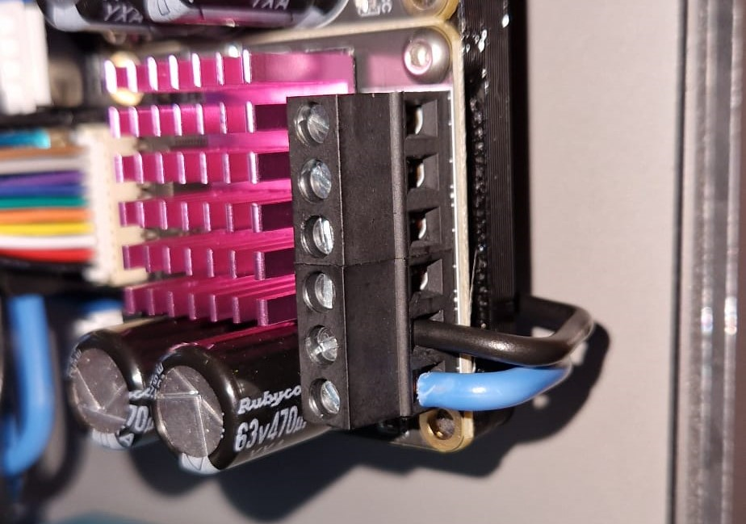

Now do this for all your 5160's like you see down below. That's all the wiring you have to do for 48V.

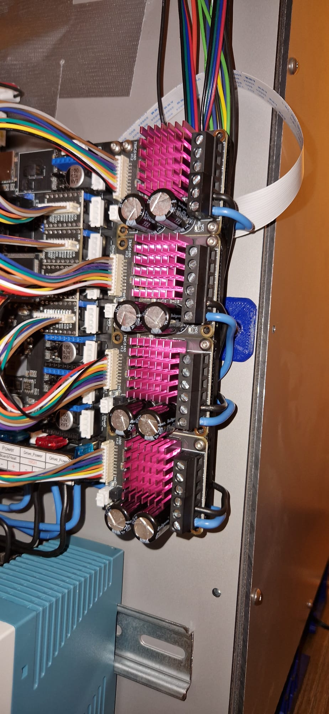
{: .smallpictures }

One last IMPORTANT step to do is to link your 24V - to your 48V -. Like you see Below i used a piece of wire to connect my 24V Negative Wago to my 48V Negative Wago. 

If you forget this step you can have issue's with your 5160's once we try to start using them.

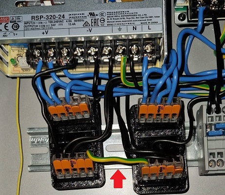

# Plugging everything into the board

Now were going into depth what to plug in where on the Motherboard.

Here's a quick overview of how a final setup could look depending on the options you have on your machine.

Here's a pinout for the Motherboard. We're gonna be using this to find where we need to plug in things.

And a closeup of the more important section we're gonna be talking about next.

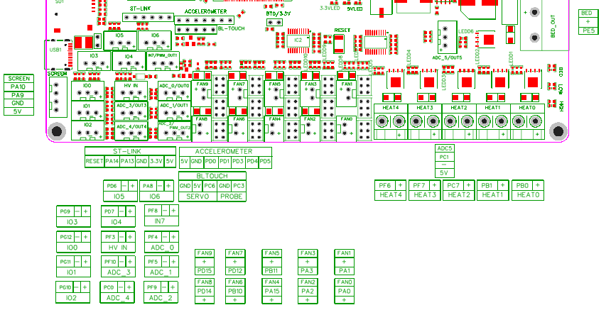

Your Bed thermistor get's plugged into the ADC5 port. This is just above the Heat2 port and is a Yellow plug on the Motherboard. We need to use the top 2 pins in our connector. so PC1 and -.

your Hotend Heater will be connected to Heat0. It doesn't matter in what order you plug in your heater wires.

# Fans
 
 {: .highlight }
> &#8226; Make sure you set the correct Voltage for your Fans using the 5V , 12V , 24V jumpers.

Your Hotend Fan get's connected to fan port FAN0. which is the first plug after the heaters on the edge of the board. 

Your Exhaust Fan get's attached to FAN4 wich is 2 plugs up from Fan0. The Exhaust fan can be used to keep the chamber from not raising above a set temperature of to exhaust the air in the chamber through a Filter at the end of a print before you upen up the chamber.

Your Chamber Fan get's attached to FAN9 wich is the top right one. The chamber fan will circulate the air in your chamber to get a even temperature in it.

Your RSCS get's connected to fan port FAN1 wich is next to FAN0

Make sure you set it to the correct voltage of your fans with the jumpers under it check a bit up in this guide how to setup the jumpers for the correct voltage.

# Other
Now it's time to setup some optional stuff that you could use if wanted.

your Chamber thermistor get's plugged into ADC_2 wich is to the left of the FAN8 port. For using a thermistor on this port we use the PF9 and - pins. These are the 2 left ones.

Your Fillament sensor get's plugged into the IO6 port. this is the plug under the ST-LINK port. Depenging on your sensor you might need to power it or not. The Fillament sensor in the Mods section for the Alu VzHextrudort uses a simpel switch and only requires the PA8 and - Pin of the port.

If you have LEDS to hookup we are going to be plugging those into the FAN8 port. Make sure you set the correct Voltage for your LED's.

# CPAP
To hookup CPAP we need to use the pictures below.

For powering the CPAP we hookup the Plug on the controlboard's bottom right Directly to the 24V of your PSU. So Black goes to Negative 24V and Red goes to Positive 24V.

From the large plug on the bottom left we only need the Grey wire so the second from left. This wire get's plugged into port PF8 on the Motherboard. 

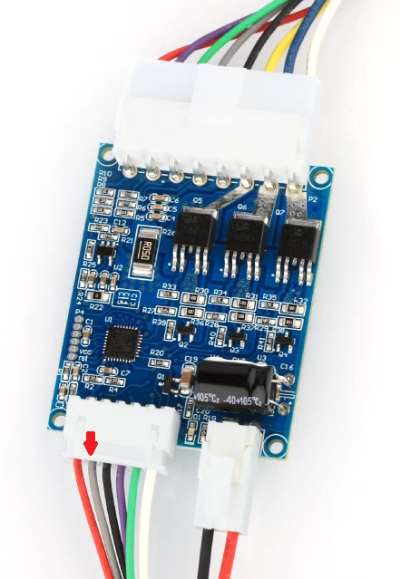
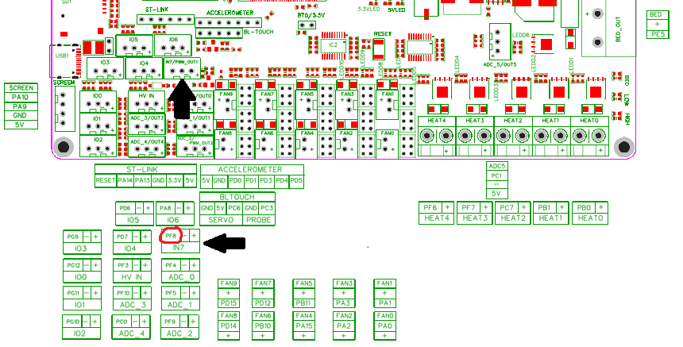

# Connecting the Motors.

First of we're gonna be putting the TMC2209's on the Motherboard if you haven't already done this. Make sure port 0 and 1 are set to UART with the correct jumpers. and plugin the 2209's. Make sure you plug them in the correct orientation. The part with the pins on the side of the 2209 sits on the outside of the board. and the text on the 2209 is on the inside of the board. like shown Bellow.

 

First the extruder

For the Plugs coming from the motors we need to make sure we put in the wires correctly into the plug. 

The wires have to make a Pair and you can check that with a Multimeter. put it on continuity mode and check wich 2 wires beep when touched. that's a pair and those get plugged into A A on DRIVER0 the other 2 wires are automaticaly also a pair and get plugged into B B.

Repeat this for your Z motor on DRIVER1

# 5160 motor setup
Next up we're going to be wiring up the motors to the 5160's.

First of we're going to be wiring the X motor into the 5160's that's plugged into  DRIVER6. This should be your top 5160.

Again measure the continuity of the motors and put your first pair in B2 and B1 and put the other pair in A1 and A2.

Repeat this for the X1 in slot DRIVER5,Y in slot DRIVER4,Y1 in slot DRIVER3.

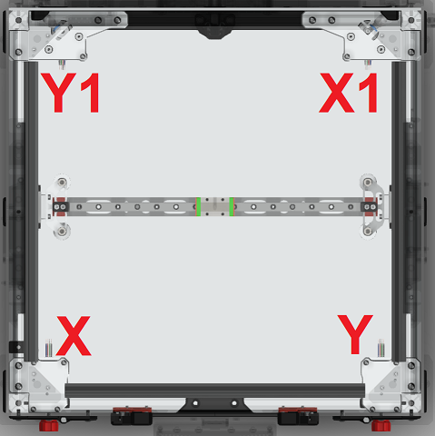

# Powering the Pi
Next we're hooking up the power to the Pi.

For this we're going to be using the included adapter in the box of the motherboard.

This adapter get's plugged into the CAN port of the motorboard wich is to the left of the DRIVER7 slot. Next simply plugin the USB cable to the adapter and plug it in the USB C port of the Pi.

To also be able to connect the Pi to the motherboard for Data we plugin a USB to USB-C cable into the Pi and then into the USB C plug of the motherboard located next to the SDCard slot. This way the Pi is powered and can send/receive data from the motherboard.

# End result

Once everything is hooked up it might look something like this 

