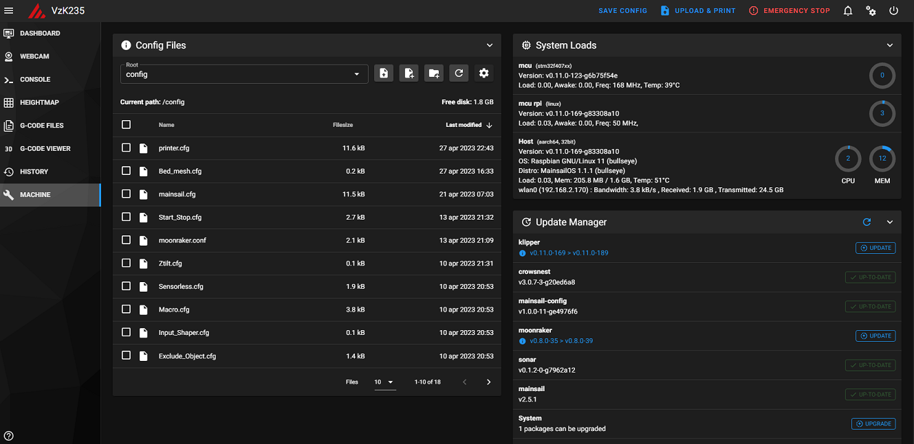
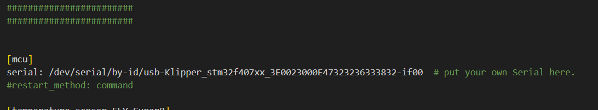
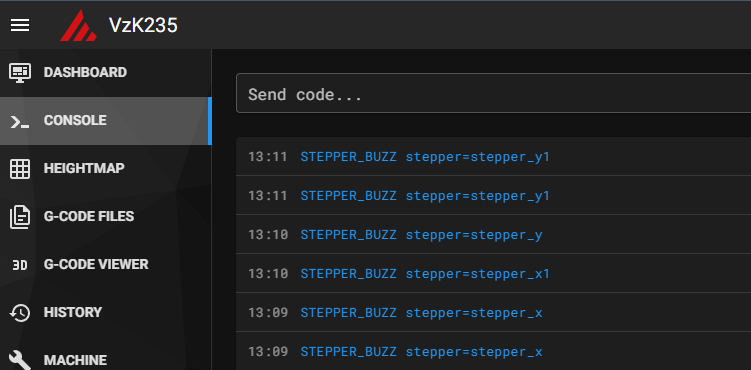
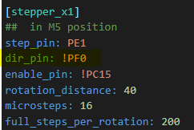
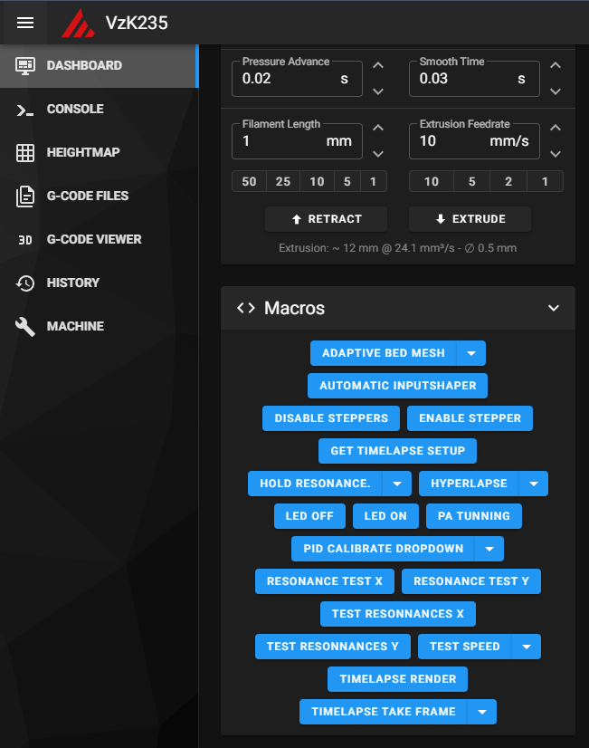

# 6.4 Setting up the Printer.cfg

Now comes the fun part of the setup. Configuring your printer.cfg.

We're gonna start with this basic start config file for you guys to use:
[Printer.cfg](../../assets/images/manual/vz235_printed/electronics/Printer_config/printer.cfg)

In order to use the Exlcude object command in your Mainsail or Fluid we're also gonna need this file: [Exclude_Object.cfg](../../assets/images/manual/vz235_printed/electronics/Printer_config/Exclude_Object.cfg)

To make our life a bit easier we're gonna use some Macro's that are in this file: [Macro.cfg](../../assets/images/manual/vz235_printed/electronics/Printer_config/Macro.cfg)

To be able to do some test to find our Max speed and Accel we also have a nice script for that :[Speed.cfg](../../assets/images/manual/vz235_printed/electronics/Printer_config/Speed.cfg)


And to make our Start and End of the print a bit easier to use we also have a file for that. [Start_Stop.cfg](../../assets/images/manual/vz235_printed/electronics/Printer_config/Start_Stop.cfg)

Put all of those files in your Machine tab of Mainsail like this:


{: .smallpictures }


# Serial time

Now we're gonna put the serial from the Motherboard into your printer.cfg so Klipper knows where to send the commands.

Once it's all powered on open Putty Login and type in this command.

```ls /dev/serial/by-id/*```

This will give you the serial you need to put in your Printer.cfg to make sure they can talk to eachother.


{: .smallpictures }

Put the serial here:


{: .smallpictures }

# Motor Movements.

Next up we're gonna check if the motors move and if they move to the correct side.<br>
We're gonna do this with the Stepper_buzz command ```STEPPER_BUZZ stepper=stepper_```<br>


{: .smallpictures }

When the steppers move X and X1 should move to the same side. This is the same with Y and Y1. If this is not the case we need to add a ! at the dir pin like so:<br>

{: .smallpictures }

When we've made sure that the steppers move to the correct sides we're gonna see if they home to the correct spots.

Send a ```G28 X``` and check if X moves to the Left. If this is not the case we're going have to play with the Dir_Pin.<br>

Go to your printer.cfg and check what the Dir_Pin is for X,X1,Y,Y1. And note this down somewhere.

{: .highlight }
> &#8226; You have to make sure that if you change your X Dir_Pin you make sure the X1 pin also get's changed since we already made sure those move to the same sides in the first step. This is the same for Y ofcourse.

X moves to the wrong side:

If there's no ! at the X Dir_Pin add this there and home X again.<br>
Still wrong also change Y's Dir_Pin and home X again.<br>
Still wrong Change X Dir_Pin again but leave Y's and Home X again.<br>


To make it a bit easier i always make a list for myself like shown below. that way i can keep track of what i've already tried. the ! standing for the changed Dir_Pin. If you try all these 4 options one of them should be correct. If not you have put the wrong motor on the drivers so you have to go back to that step and make sure those are correct.

X! Y<br>
X! Y!<Br>
X Y!<BR>
X Y<br>

# Fans and other Accessories

The last step is to test all your fans and see if these work correctly. to Enable / Disable these you can look in your Macro section of Mainsail. Here you'll see all buttons of the things you have setup in your Printer.cfg so RSCS, Exhaust, LED etc.




# Time to print and get your Serial Number.

Once all this is done you should be able to start your first print and make a video off it for your serial request.


{: .highlight }
> &#8226; Make sure to go to your start up routine first and check your Z-offset like you would with any other machine. The VzBot uses a Physical Z endstop switch and Bed leveling knobs. You should only have to dial those in once and it won't change after that.