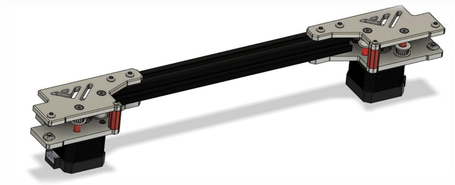
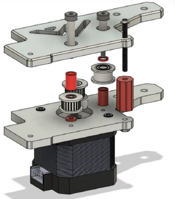

# 3.2(A) Rear motor mounts

## Overview

## BOM

| Material        | Quantity          | Notes |
|:-------------|:------------------|:------|
| M3 6mm           | 4 | - |
| M3 10mm ( countersunk ) | 4 | - |
| M3 12mm | 4 | - |
| M3 35mm | 4 | - |
| M4 8mm ( countersunk ) | 2 | - |
| M4 10mm | 4 | - |
| M4 12mm | 8 | - |
| M4 30mm ( set screw ) | 2 | - |
| M4 40mm ( socket head) | 4 | - |
| M4 t-nut | 8 | - |
| M3 nut | 8 | - |
| M4 nut | 10 | also for hinges |
| 4mm ID washer | 2 | - |
| NEMA 17 stepper | 2 | - |
| GT2 20 teeth | 2 | - |

## STL's

| File name | Amount to print |
|-----------|-----------------|
| <a href="https://github.com/VzBoT3D/VzBoT-Vz235/blob/main/Assemblies%20%26%20STL/Frame/Frame%20brace.stl" target="_blank">Spacer long</a> | 4 |
| <a href="https://github.com/VzBoT3D/VzBoT-Vz235/blob/main/Assemblies%20%26%20STL/Frame/Frame%20brace.stl" target="_blank">Spacer short bottom</a> | 2 |
| <a href="https://github.com/VzBoT3D/VzBoT-Vz235/blob/main/Assemblies%20%26%20STL/Frame/Frame%20brace.stl" target="_blank">Spacer short top</a> | 2 |
| <a href="https://github.com/VzBoT3D/VzBoT-Vz235/blob/main/Assemblies%20%26%20STL/Frame/Frame%20brace.stl" target="_blank">Spacer M3 corner</a> | 2 |

### Step 1

Mount the motor to the bottom plate with the M3 screws ( 3 needed )

### Step 2
Mount the bottom assembly ( left & right) to the frame with the rear extrusion  

### Step 3
Mount the pulleys with their respective spacers and hardware like shown below. Mind that the bottom spacer for the toothed idler pulley has a smaller inside diameter then the top one for the smooth idler. 

*when getting the top plate in position with all hardware it is recommended to either have the printed parts printed with some excess first layer squish or put some thicker grease between the last spacer and the shoulder bolt to keep the assembly together before mounting.*  

### Step 4
Secure the top plate with the M4 screws to the frame.  
