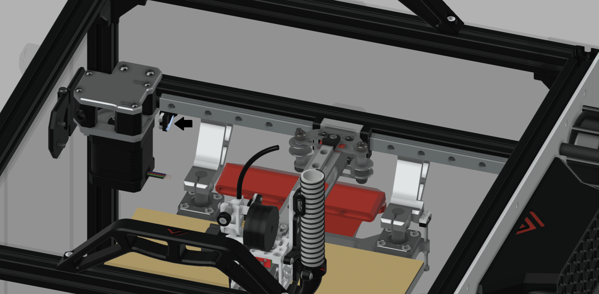

# 3.6 Y end stop-switch mount

## BOM

| Material    | Quantity | Notes |
| ----------- | -------- | ----- |
| M2 10mm     | 2        |       |
| M4 8mm      | 1        |       |
| M4 t-nut    | 1        |       |
| Microswitch | 1        |       |

## STL's

| File name          | Amount to print |
| ------------------ | --------------- |
| [Y switch mount][] | 1               |

[Y switch mount]: https://github.com/VzBoT3D/VzBoT-Vz235/blob/main/Assemblies%20%26%20STL/Frame/Frame%20brace.stl

## Location

The Y switch sits in the front left of the machine right infront of the X motor.

