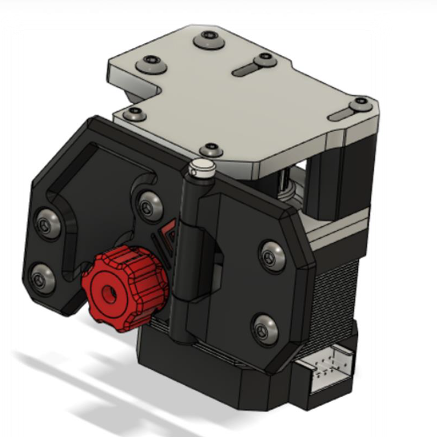
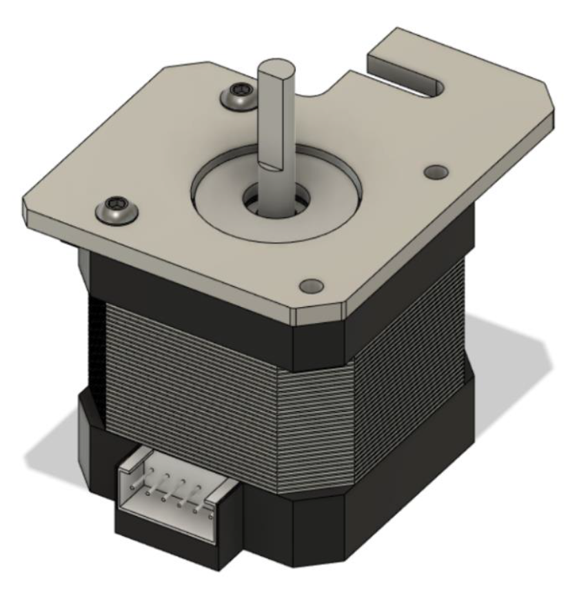
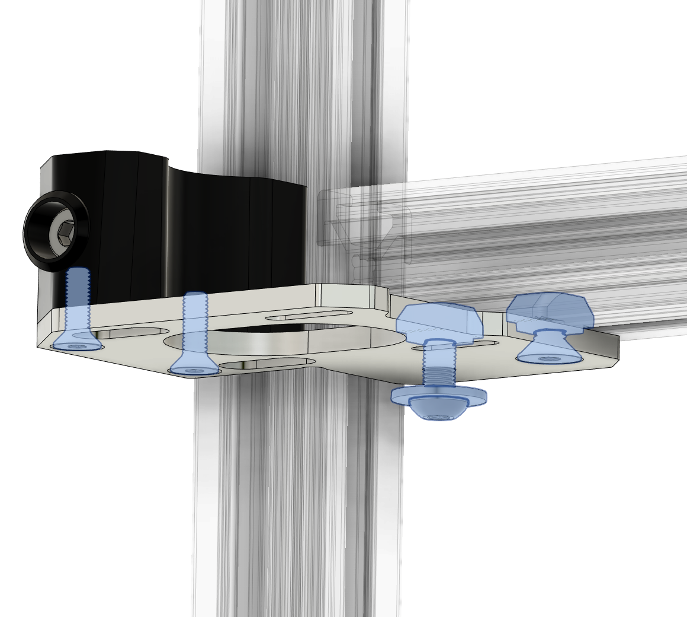
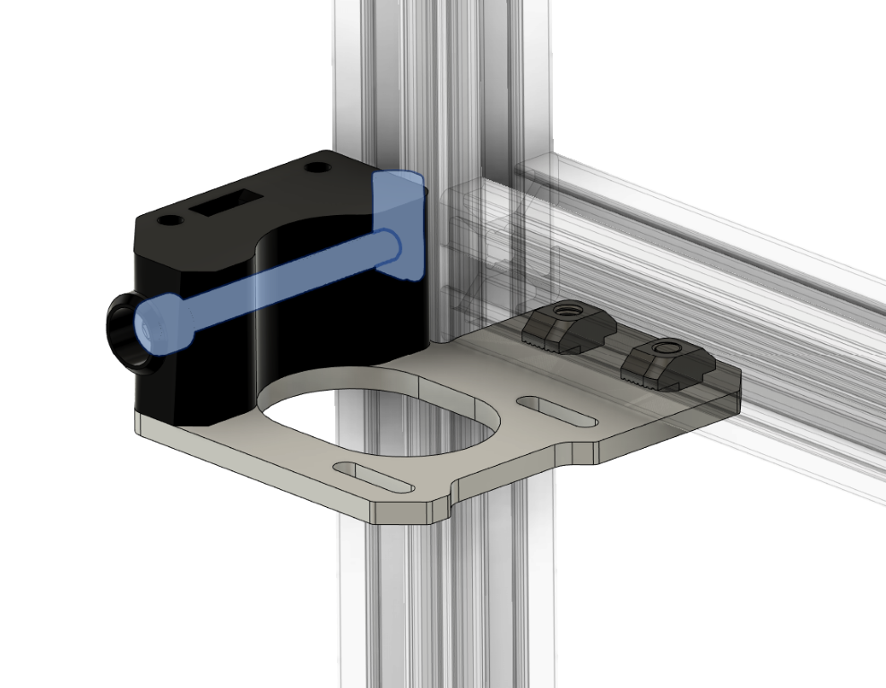
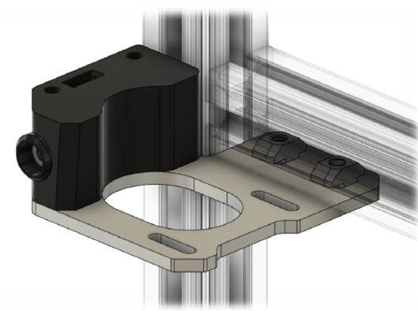
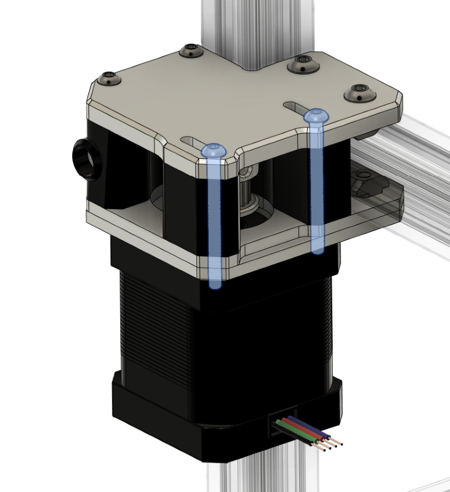
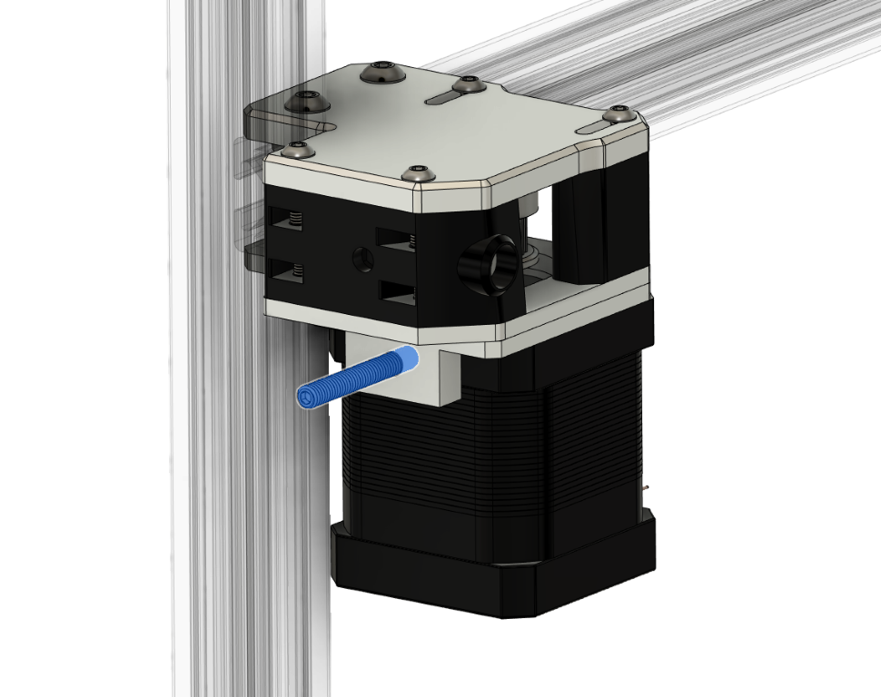

# 3.1 Motor mounts + integrated hinges

## Overview

## BOM

| Material                | Quantity | Notes           |
| ----------------------- | -------- | --------------- |
| M3 6mm                  | 4        |                 |
| M3 10mm ( countersunk ) | 4        |                 |
| M3 12mm                 | 4        |                 |
| M3 35mm                 | 4        |                 |
| M4 8mm ( countersunk )  | 2        |                 |
| M4 10mm                 | 4        |                 |
| M4 12mm                 | 8        |                 |
| M4 30mm ( set screw )   | 2        |                 |
| M4 40mm ( socket head)  | 4        |                 |
| M4 t-nut                | 8        |                 |
| M3 nut                  | 8        |                 |
| M4 nut                  | 10       | also for hinges |
| 4mm ID washer           | 2        |                 |
| NEMA 17 stepper         | 2        |                 |
| GT2 20 teeth            | 2        |                 |

## STL's

| File name | Amount to print |
| --------- | --------------- |
| [TODO][]  | 3               |

### Step 1

Insert the 4 M3 nuts and single M4 nut in the printed standoff motor anchor as shown above.

### Step 2

Attach the stepper motor to the bottom motor plate with 2 6mm M3 screws. And insert the Gt2 20t pulley loose on the motor shaft, and upside down for the left motor mount (as shown below), and normal upright for the right side. You will tight the pulley set screws later.

### Step 3

Screw the standoff in the middle plate using 2x10mm countersunk M3, and attach the plate to the frame using one 12mm button head M4 + M4 washer and a 8mm countersunk M4 plus 2 M4 T-nuts. (Leave the 12mm M4 bolts+washer loose for now. At this point only 8mm countersunk should be tighten).

Lock the standoff in place using the 40mm M4 and a spring loaded M4 T-nut (One could use a normal hammer M4 t-nut too. If so then it might be easier to pre-install the t-nut at step 3, or you could try to slide it in from under using a small tool to hold it in place while your screw the M4 bolt).

### Step 4

Attach the top plate using the 2x12mm M4 and T-nuts to the frame and screw in the 2 x 12mm M3 into the printed standoff.

### Step 5

Insert the final standoffs and insert the 35mm M3, slide in the motor with its plate and tighten the M3 screws finger tight.(You might have to give the under M4 bolt + washer a bit more loose if you can't slide it in)

### Step 6

Screw in the 30mm M4 set screw into the bottom tensioner. The tensioner plate and knob will be installed later when the enclosure panels are on the printer.

### Step 7

Repeat [Step 1](#step-1) through [Step 6](#step-6) for the other side of the printer.
