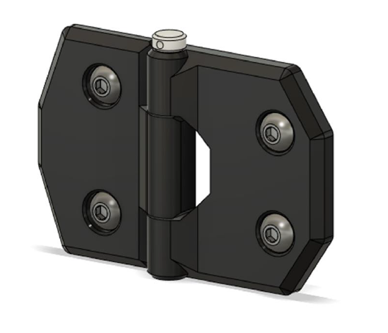

# 8.2 Front doors hinges & doors

## Overview

## BOM

| Material                   | Quantity | Notes                                                |
| -------------------------- | -------- | ---------------------------------------------------- |
| M4 10mm                    | 8        | -                                                    |
| M4 40mm / 4x40mm shaft     | 2        | -                                                    |
| M4 nut                     | 8        | -                                                    |
| 443X160X3 mm acrylic panel | 2        | Refer to the .step file for placement of the cutouts |

## STL's

| File name            | Amount to print |
| -------------------- | --------------- |
| [Hinge door side][]  | 4               |
| [Hinge frame side][] | 2               |

### Step 1

Mount the hinges to their respective panel.

### Step 2

Put the door panels in position and insert the 40mm M4

[Hinge door side]: https://github.com/VzBoT3D/VzBoT-Vz235/blob/main/Assemblies%20%26%20STL/Enclosure/Hinges%20(lower)/hinges%20%5Blower%5D/door%20side.stl
[Hinge frame side]: https://github.com/VzBoT3D/VzBoT-Vz235/blob/main/Assemblies%20%26%20STL/Enclosure/Hinges%20(lower)/hinges%20%5Blower%5D/hinge%20frame%20side.stl
