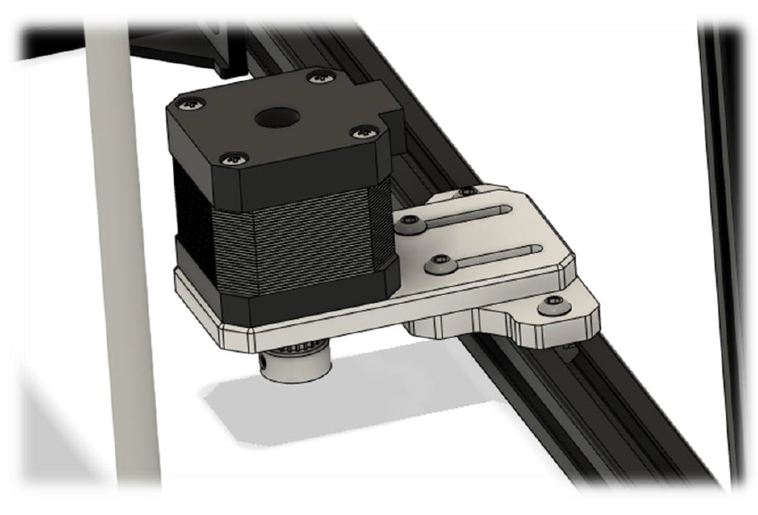

# 2.4 Z-Motor bracket

## Overview

## BOM

| Material        | Quantity | Notes |
|:----------------|:---------|:------|
| M3 10mm         | 6        | -     |
| M4 10mm         | 2        | -     |
| M4 t-nut        | 2        | -     |
| M3 washer       | 2        | -     |
| GT2 20 teeth    | 1        | -     |
| NEMA 17 stepper | 1        | -     |

### Step 1

Mount the bracket shown below to the frame using the 10mm M4 screws and T-nuts. Make sure it is nicely centered in the middle of the frame.

### Step 2

Mount the stepper motor to the top bracket using the 10mm M3 screws. Attach the motor pulley like shown below.

### Step 3

Mount the previous assembly to the bracket on the frame using 10mm M3 screws.

### Step 4

With the motor in the furthest position, loop the belt around the motor pulley and tighten the belt. Be sure to check if the belt is horizontally parallel to the frame for smoothest operation.
