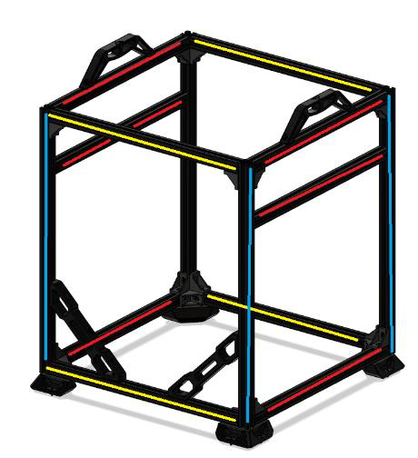
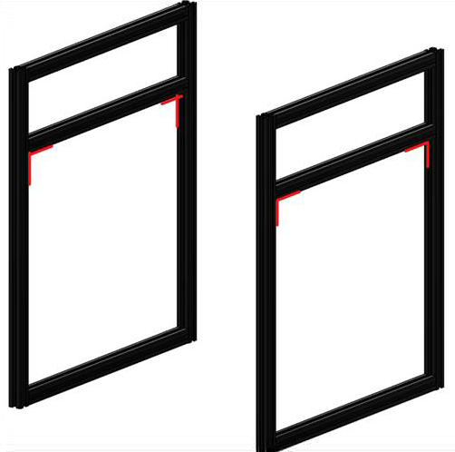

# 1. Frame

## Overview

The frame is assembled through a combination of blind joints, reinforcing corner brackets and blind corner brackets. The reinforcing corner brackets are to help stiffen up the frame and are optional, though we highly recommend using them on every possible corner for best results.

For detailed informations on how to assemble blind joints visit this [page](../general/misc-info/blind-joints)

## Video tutorial

Vz235 Build Part 1: The Frame  

[0:45](https://www.youtube.com/watch?v=d9kQt_cF3Xo&t=45s) Cutting the frame to size  
[1:17](https://www.youtube.com/watch?v=d9kQt_cF3Xo&t=77s) The frame  
[1:24](https://www.youtube.com/watch?v=d9kQt_cF3Xo&t=84s) Parts  
[4:44](https://www.youtube.com/watch?v=d9kQt_cF3Xo&t=284s) Water cooling kit  
[6:04](https://www.youtube.com/watch?v=d9kQt_cF3Xo&t=364s) Acrylic panels  
[6:49](https://www.youtube.com/watch?v=d9kQt_cF3Xo&t=409s) Aluminium parts  
[19:00](https://www.youtube.com/watch?v=d9kQt_cF3Xo&t=1140s) Bottom plate

## BOM

| Material                 | Quantity | Notes                                                           |
| :----------------------- | :------- | :-------------------------------------------------------------- |
| M5/M6 10mm buttonhead    | 20       | Depending on the type of 2020 you use, you need M5 or M6 screws |
| 385mm 2020 extrusion     | 4        | Yellow                                                          |
| 375mm 2020 extrusion     | 6        | Red                                                             |
| 470mm 2020 extrusion     | 4        | Blue                                                            |
| 385mm 2020 extrusion     | 1        | Only for 2WD, mount the same as Y gantry extrusions             |
| 2020 corner joints       | 18       | -                                                               |
| 2020 blind corner joints | 4        | -                                                               |
  

## STL's

| File name          | Amount to print |
| ------------------ | --------------- |
| [Brace]            | 2               |
| [Handle]           | 2               |
| [Y Alignment Tool] | 2               |
| [Nut inserts]      | 2               |
| [Door latch]       | 4               |

{: .highlight }
> To see the recommended print settings please refere [here](../general/misc-info/print-settings).

### Step 1

To start you are going to build the 2 sides of your frame. Make sure you do your building on a nice flat surface. You will lay your frame half down with the included printed alignment tools for the y gantry extrusions and hand tighten all blind joints.

After hand tightening you can start tightening everything down properly. Make sure every corner is exactly 90 degrees. Moreover, make sure the Y gantry extrusion is parallel to the upper and lower extrusion of the frame half. The Y gantry extrusion is the only extrusion that can’t use a 2020 corner joint bracket, it is stabilized by the motormount so there is no need for extra reinforcement.

Once you are done with one half repeat for the other half. Check the two halves by laying them on top of each other with all corners exactly in the same spot and check the y gantry extrusions for the two halves whether they are parallel to each other. They need to be parallel for the printer to operate smoothly.

{: .highlight }
> It's important to make sure the y-gantry is the same height.

### Step 2

The bottom, top and upright extrusions in the front of the frame all have printed nut inserts inserted. 2 in the top for the door latches, 2 in the bottom for the lower latches and 1 in upright for the motor mounts to attach to. Insert the M4 nuts into the M4 inserts and push them in the uprights on the frame half. Next insert the 2x5mm magnets and the m3 nut into the frame part of the magnetic door latches and put 2 in the front lower and 2 in the front upper extrusion as shown in the picture before assembling the final part of the frame.

Front Door latch magnetic inserts: Skip if using mechanical latches found [here](https://github.com/VzBoT3D/VzBoT-Vz235/tree/main/Assemblies%20&%20STL/Enclosure/Front%20door%20latches/Locking%20latch)  
The bottom, top and upright extrusions in the front of the frame all have printed nut inserts inserted. 2 in the top for the door latches, 2 in the bottom for the lower latches  Next insert the 2x5mm magnets and the m3 nut into the frame part of the magnetic door latches and put 2 in the front lower and 2 in the front upper extrusion as shown in the picture before assembling the final part of the frame.

### Step 3

Attach the extrusions to connect the two halves of the frame. Make sure to put the part you are assembling on the flat surface and afterwards check the frame on squareness.

### Step 4

Attach all corner joints and check if your frame is square and strong. After this checks out attach the handles and the frame is built.

[Brace]: https://github.com/VzBoT3D/VzBoT-Vz235/blob/main/Assemblies%20%26%20STL/Frame/Frame%20brace.stl
[Door latch]: https://github.com/VzBoT3D/VzBoT-Vz235/tree/main/Assemblies%20%26%20STL/Enclosure/Front%20door%20latches
[Handle]: https://github.com/VzBoT3D/VzBoT-Vz235/blob/main/Assemblies%20%26%20STL/Frame/handle.stl
[Nut inserts]: https://github.com/VzBoT3D/VzBoT-Vz235/blob/main/Assemblies%20%26%20STL/Gantry/Motormounts/left%20motormounts/nut%20insert%20for%20motormount.stl
[Y Alignment Tool]: https://github.com/VzBoT3D/VzBoT-Vz235/blob/main/Assemblies%20%26%20STL/Tools/vzbot%20y%20gantry%202020%20allignment%20tool%20v1.stl
