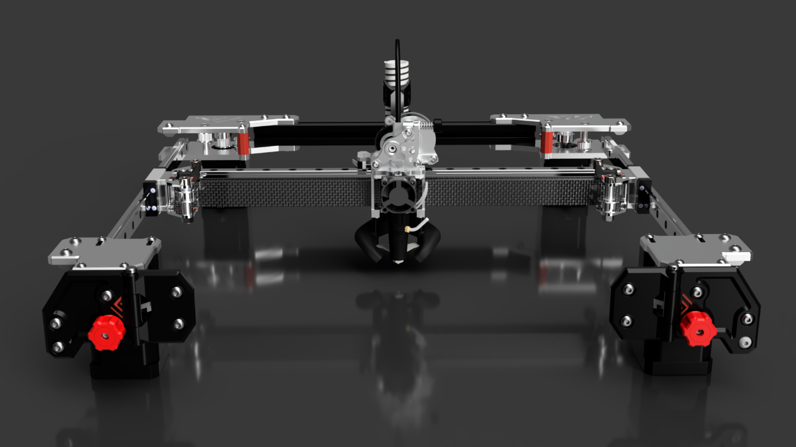

# VzBoT 235 - Mellow Kit

Vz235 is the smaller brother of the original [VzBot 330 - Printed Version](../vz330_printed) / [VzBot 330 - Mellow Kit](../vz330_mellow) 3D-printer. With its
relatively small build volume, it has reduced weight and a smaller form factor. The design
is built around the popular Creality Ender 3 bed, but is not limited to this size: the
frame can be scaled up or down to fit the individual builder's requirements.

This build differs from the [Vz235 - Printed Version](../vz235_printed) just in the part that gantry and z-assembly is replaced by manufactured aluminium pieces.

On how to print the files for this printer please refer to [print settings](../general/misc-info/print-settings)

We advice to build the printer in the following order:

1. [Frame](/vz235_mellow/frame)
2. [Z-Assembly & Bed](/vz235_mellow/z_assembly)
3. [Gantry](/vz235_mellow/gantry)
4. [Bottom and rear panel](/vz235_mellow/bottom_panels)
5. [Fume extractor](/vz235_mellow/fume_extractor)
6. [Electronics](/vz235_mellow/electronics)
7. [Side panels + RSCS](/vz235_mellow/rscs)
8. [Top cover and doors panel](/vz235_mellow/top_cover)

## Video tutorial

[**Vz235 AWD** by Vez3D](/video-tutorials/vz235-awd/){: .btn .doc-link } 
