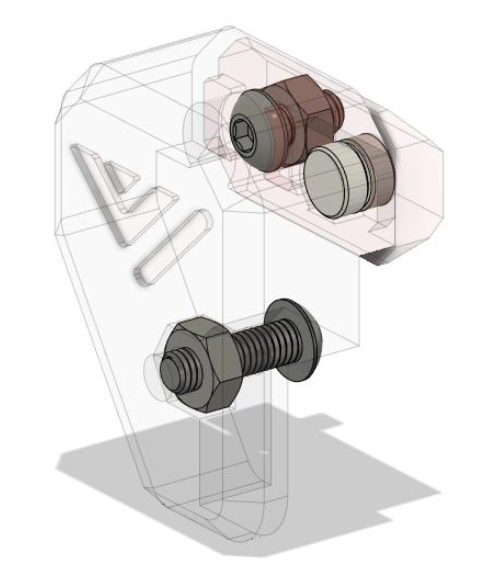

# 8.3 Front door latches

## Overview

## BOM

| Material              | Quantity | Notes |
| ------------          | -------- | ----- |
| M3 x 6mm BHCS         | 4        |       |
| M3 x 10mm BHCS        | 4        |       |
| M3 nut                | 8        |       |
| 2x5mm magnet          | 4        |       |

## STL's

| File name                                                            | Amount to print |
| -------------------------------------------------------------------- | --------------- |
| [Latch Top Left]                                                     | 1               |
| [Latch Top Right]                                                    | 1               |
| [Latch Bottom Left]                                                  | 1               |
| [Latch Bottom Right]                                                 | 1               |
| [Latch Mount] (not needed when done while assembling the frame)      | 4               |

### Step 1

Insert the 2x5mm magnet in the latches, they are press fit. Ensure the magnets are installed with the correct polarity facing the latch mount installed to the frame, so the latches are attracted to them. If the magnets are not a tight to the latch use super glue to hold them in.

### Step 2

Insert the M3 nuts in the latches

### Step 3

Screw the latches to the door panels using the M3 x 10 BHCS

### Step 4

Untighten the set screws in the frame side latches and line them up with the latches, then to lock them tighten the M3 screw.

[Latch Top Left]: https://github.com/VzBoT3D/VzBoT-Vz235/blob/main/Assemblies%20%26%20STL/Enclosure/Front%20door%20latches/Magnetic%20latch/Door%20latch%top%20left.stl
[Latch Top Right]: https://github.com/VzBoT3D/VzBoT-Vz235/blob/main/Assemblies%20%26%20STL/Enclosure/Front%20door%20latches/Magnetic%20latch/Door%20latch%20top%20right.stl
[Latch Bottom Left]: https://github.com/VzBoT3D/VzBoT-Vz235/blob/main/Assemblies%20%26%20STL/Enclosure/Front%20door%20latches/Magnetic%20latch/Door%20latch%20bottom%20left.stl
[Latch Bottom Right]: https://github.com/VzBoT3D/VzBoT-Vz235/blob/main/Assemblies%20%26%20STL/Enclosure/Front%20door%20latches/Magnetic%20latch/Door%20latch%20bottom%20right.stl
[Latch Mount]: https://github.com/VzBoT3D/VzBoT-Vz235/blob/main/Assemblies%20%26%20STL/Enclosure/Front%20door%20latches/Magnetic%20latch/Door%20latch%20mount.stl
