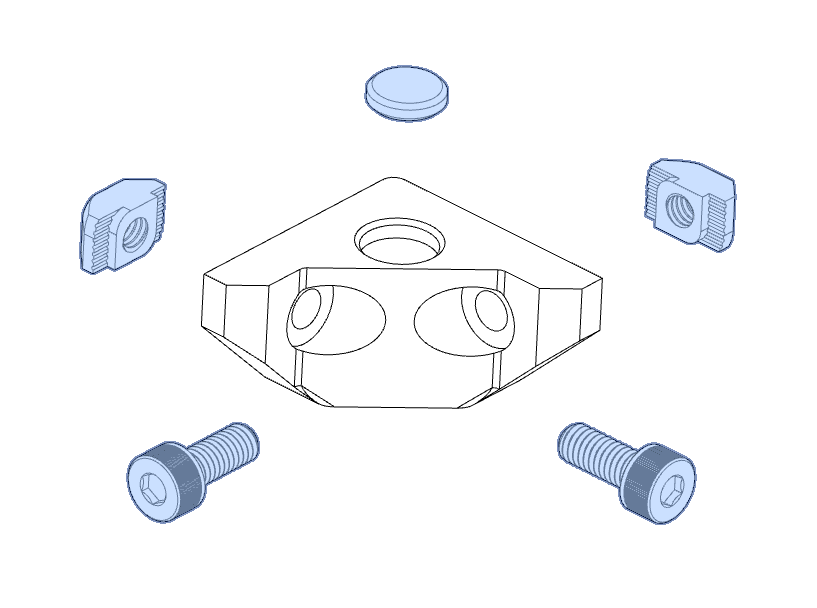

# 8.1 Top Cover Assembly

## BOM

| Material                    | Quantity | Notes                                                |
| --------------------------- | :------: | ---------------------------------------------------- |
| M3 x 8 BHCS                 | 8        |                                                      |
| M3 Nut                      | 8        |                                                      |
| M4 x 10 SHCS                | 8        |                                                      |
| M4 hammer t-nut             | 8        |                                                      |
| 2 x 8mm Magnet              | 8        |                                                      |
| 395\*405\*3mm acrylic panel | 1        |                                                      |

## STL's

| File name                      | Amount to print |
| ------------------------------ | :-------------: |
| [Top cover holder]             | 4               |
| [Top cover middle part]        | 4               |
| [Top cover top part]           | 4               |

## Step 1

Assemble one (1) 2 x 8mm Magnets, two (2) of the M4 x 10 SHCS's and two (2) of the M4 hammer t-nuts to each of the Top cover holders.
Ensure that the polarity of the magnets is the same in each holder.

## Step 2

Install one (1) assembled Top cover holder into each corner at the top of the machine with the magnet facing upwards.

## Step 3

Assemble one (1) 2 x 8mm Magnet to the Top cover middle part. Ensure that the Magnet installed so it would be attracted to the magnet in the Top cover holder.
Assemble one (1) Top cover middle cover middle part, one (1) Top cover top part, two (2) M3 x 8 BHCS and two (2) M3 nuts to each corner of the acrylic top panel.

## Step 4

Slacken the four (4) M4 x 10 SHCS's which secure the Handles to the top of the frame to allow them to be moved.

## Step 5

Install the top cover assembly to the top of the frame, centering the handles in the cutouts.

## Step 6

Tighten the four (4) M4 x 10 SHCS's which secure the Handles to the top of the frame.

[Top cover holder]: https://github.com/VzBoT3D/VzBoT-Vz235/blob/main/Assemblies%20%26%20STL/Enclosure/Topcover%20Latches/topcover%20latch/topcover%20holder.stl
[Top cover middle part]: https://github.com/VzBoT3D/VzBoT-Vz235/blob/main/Assemblies%20%26%20STL/Enclosure/Topcover%20Latches/topcover%20latch/topcover%20holder%20top%20part.stl
[Top cover top part]: https://github.com/VzBoT3D/VzBoT-Vz235/blob/main/Assemblies%20%26%20STL/Enclosure/Topcover%20Latches/topcover%20latch/topcover%20holder%20top%20part%202.stl
