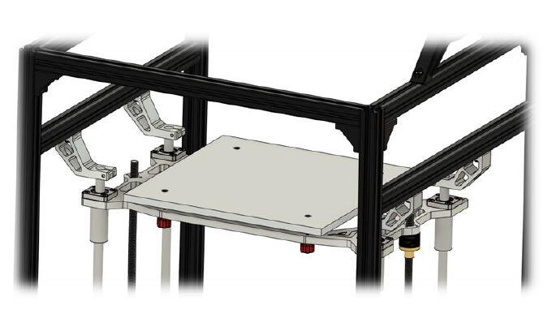

# 2.3 Top rod mounts

## Overview

## BOM

| Material | Quantity | Notes |
|:---------|:---------|:------|
| M4 10mm  | 4        | -     |
| M4 20mm  | 4        | -     |
| M4 t-nut | 4        | -     |

### Step 1

**Important:** When mounting the top rod's make sure the top rod with the extra hole for the z switch is in the back.

Mount the 10mm M4 screws and t-nuts to all top rod mounts and loosely turn in the 20mm M4 screws in the clamping mechanism.

### Step 2

Mount all top rod mounts to the rod first, finally tighten the rod holders to the frame with the pre-inserted M4 hardware.

### Step 3

After installing check the movement of the bed assembly by turning the leadscrews. This should operate smoothly. If not, place the bed assembly in the top most position, untighten all top rod holders and retighten to align the rods.
