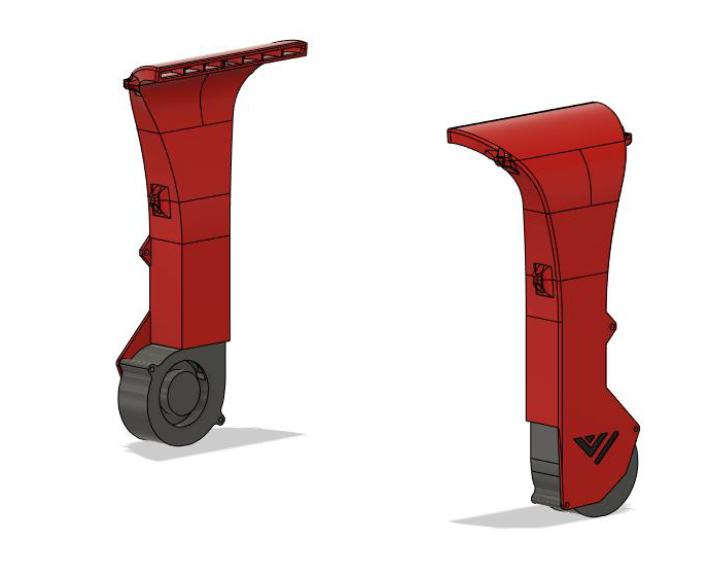
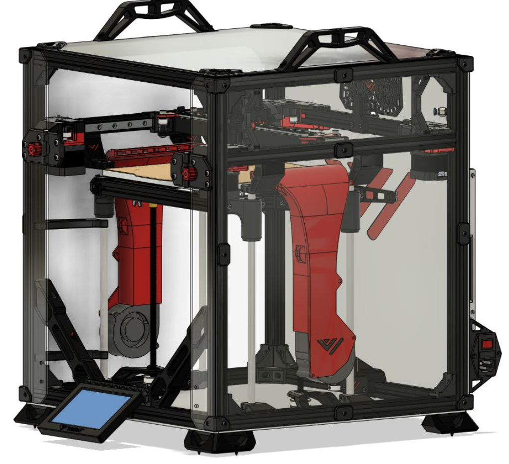

# 7. Side panels + RSCS

## Overview

 

RSCS short for remote static cooling is an optional extra pair of cooling fans which help cool the entire print when doing unicorn speeds! RSCS is mounted to the acrylic panels and this version fits in very tight to the Z-assembly. To ensure its proper fitment it is recommended to check the CAD for accurate measurements on the hole positions. Panels with pre made holes again available at F3D-racing.

## BOM

| Material        | Quantity          | Notes |
|:-------------|:------------------|:------|
| M3 8mm           | 8 | - |
| M3 10mm | 22 | - |
| M3 35mm | 4 | - |
| M3 nut | 12 | - |
| M3 t-nut | 22 | - |
| M4 8mm | 2 | - |
| M4 nut | 2 | - |
| 7530 radial fan | 2 | Gdstime |
| 470x415mm acrylic panel | 2 | - |

## STL's

| File name | Amount to print |
|-----------|-----------------|
| <a href="https://github.com/VzBoT3D/VzBoT-Vz235/blob/main/Assemblies%20%26%20STL/Frame/Frame%20brace.stl" target="_blank">Cover corner piece</a> | 8 |
| <a href="https://github.com/VzBoT3D/VzBoT-Vz235/blob/main/Assemblies%20%26%20STL/Frame/Frame%20brace.stl" target="_blank">Cover middle piece</a> | 8 |
| <a href="https://github.com/VzBoT3D/VzBoT-Vz235/blob/main/Assemblies%20%26%20STL/Frame/Frame%20brace.stl" target="_blank">RSCS top piece</a> | 2 |
| <a href="https://github.com/VzBoT3D/VzBoT-Vz235/blob/main/Assemblies%20%26%20STL/Frame/Frame%20brace.stl" target="_blank">RSCS middle piece</a> | 2 |
| <a href="https://github.com/VzBoT3D/VzBoT-Vz235/blob/main/Assemblies%20%26%20STL/Frame/Frame%20brace.stl" target="_blank">RSCS bottom piece</a> | 2 |

### Step 1
Use the M3 hardware to put the RSCS together like shown below. If the assembly won’t fit through between the 2 Z-rods. Unscrew the top part and put this on after assembly.
 

### Step 2
Mount the RSCS to the panel. When drilling the holes make sure the duct is approximately 5mm above the Z-rods.
 

### Step 3
Insert the M3 hardware in the side and front (narrow) panel using the available trim pieces like shown below. When everything lines up screw everything down starting with the bolts in the middle outward.
 

