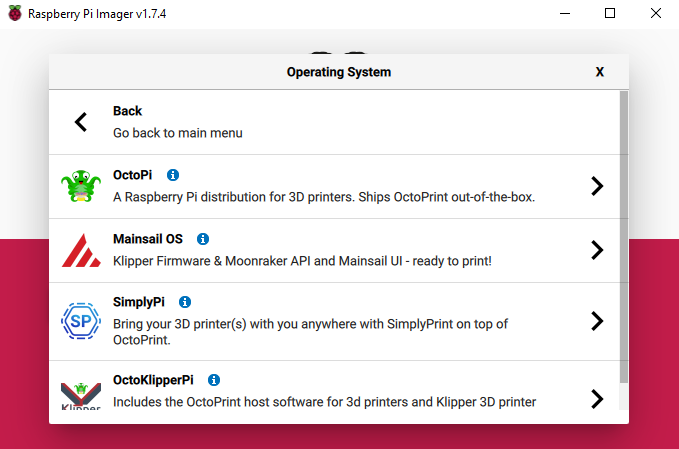
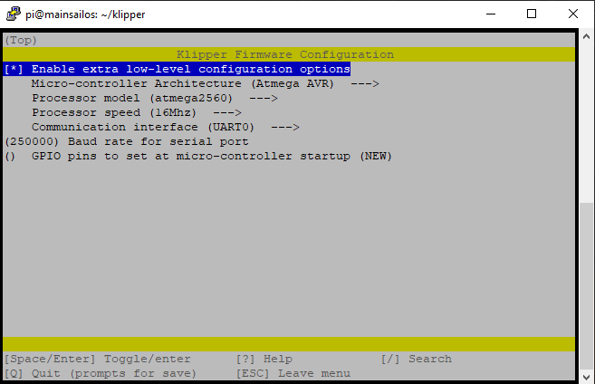
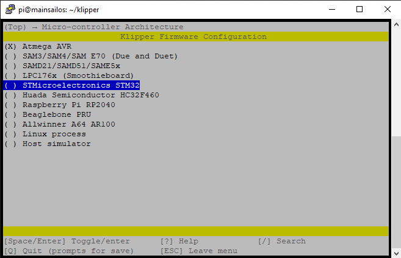
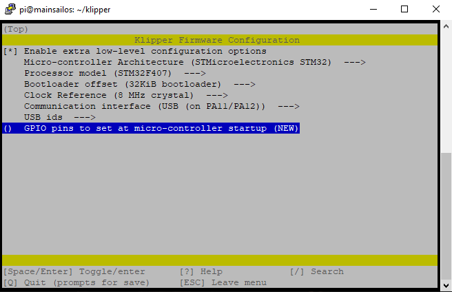
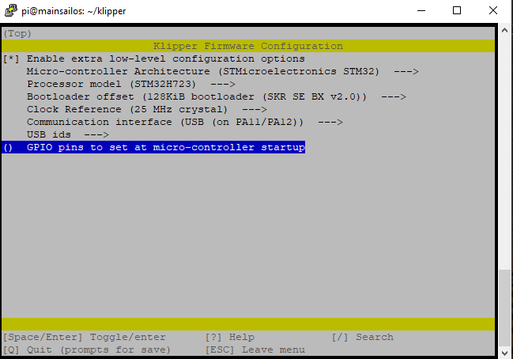
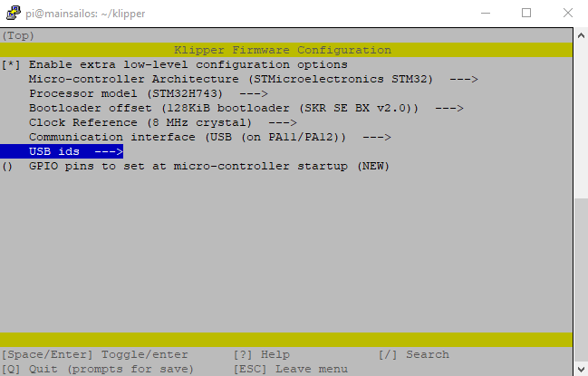
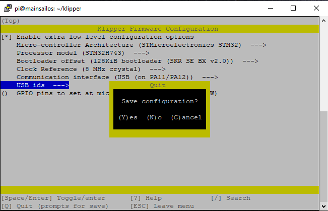
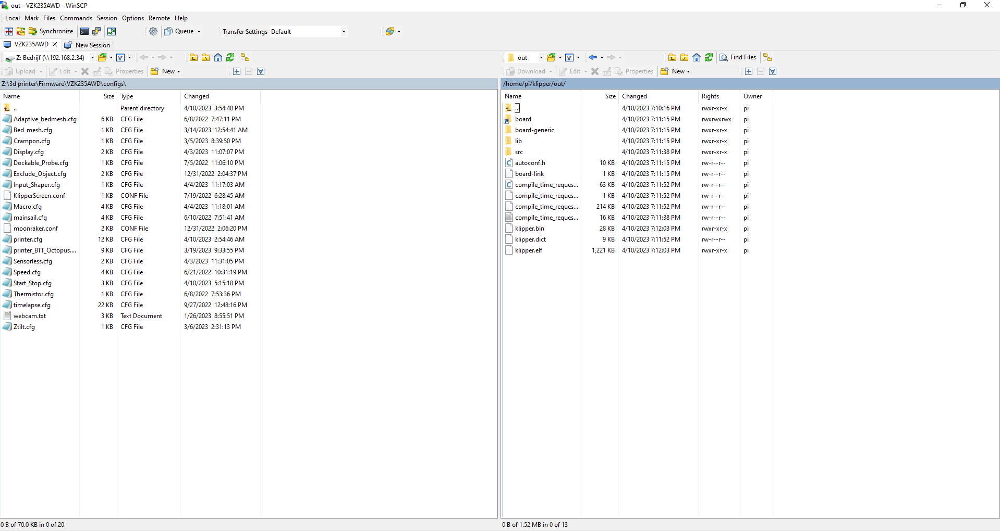

# 6.3 Firmware Setup

Time to start flashing our Pi and Motherboard.

## Flashing the Pi

Take your Pi's SDCard and put it in your PC/laptop. Now we're gonna use the program called Raspberry Pi Imager to flash the firmware for it onto our SDCard. You can get it here [Raspberry Pi Imager](https://www.raspberrypi.com/software/)

Once downloaded start the software You'll be greated by this wonder full screen.


First we're gonna choose the correct OS. So press Choose OS and scroll down till you see Other specific-purpose OS like shown below.


Next select 3D Printing


And Select Mainsail OS. and choose the 64Bit version.



Now we've done that Press Choose Storage and select your SDCard from the list.


Next up press the Gear on the right bottom once everything is selected.


And scroll down to the Wifi setup bit. Check the Configure wireless LAN box and put your wifi name in the SSID part and your wifi's Password in the Password: line. Next up select your country from the list and press Save.


Now you've done that Press the big button saying Write and it's time to wait a bit. This can take some time. sometimes upto 15/20min. Just wait for it to say you can remove your SDCard once it's done and it's now time to plug it into your Pi and power it on.


## Installing Klipper

Once you've booted up your Pi find the IP adress of it with your Router. This IP will be user specific so we can't help much there.

Once you have the IP it's time to start Putty from this website. [Putty](https://www.putty.org/)

If you've downloaded it start it up and you'll be greeted with this screen. Put your printes IP adress in the Host Name section and make sure port is set to 22 and SSH is checked. if you wanna save your printers settings enter a name in the Saved sessions box and press Save. Now press Open and you'll be greeted with a message just press yes there.


Next up you'll be greeted with the Login screen. The username is default: pi and Password is default: raspberry. Once entered you'll be greeted with this screen.


First we're gonna be updating the Pi with some commands. You'll be asked to enter your password sometimes and that's the same as we used to login so: raspberry. 

Enter these 2 commands in the order shown bellow and wait for everything to finish.

```bash
sudo apt-get update
```

```bash
sudo apt-get upgrade
```

Now that we have a updated Pi it's time to setup the firmware for our Motherboard.

```bash
cd ~/klipper/
```

```bash
make menuconfig
```

You'll be greeted with this beautifull screen.


First off we're gonna press the space bar on Enable Extra low-Level configuration options so we can see a bit more options.

You can navigate the screen with the arrow keys on your keyboard and Spacebar selects the option.

You'll see something like this now.



Go down to Micro-controller Architecture and press the spacebar. you'll see a list of options for selecting the correct architecture. We're gonna be using the STM32. Press space to select it.



Now go down to Processor Model and press space there. We're gonna be selecting the correct MCU we have on our Motherboard.

For the Mellow Super 8 V1.3 we need the STM32F407.

And we next Select the Bootloader offset to be 32KiB Bootloader like this.



For the Mellow Super 8 Pro we need to use the STM32H723 or the STM32H743 Check wich one you have by reading it on the Chip of the Motherboard.

Use both with a 128KiB bootloader Offset. And a 25MHz Crystal Like this.




Now you simply Press: Q and hit Y for Yes save configuration.



Once that is done you simply type this command in putty and it will make the firmware file for you.

```bash
make
```

Once it's done with compiling the firmware you'll see something like this telling you the file is ready and where it is located.


## Putting the firmware on the Motherboard

Now we're gonna use are next bit of software called WinSCP from this site [WinSCP](https://winscp.net/eng/download.php).

Once downloaded start it up and you'll see a screen like this.


Again fill in your printers details and press Login. It will give you a warning since this is the first time connecting but just press Add. Once logged in you'll see the files on your Pi.


Next on the right side go to the Folder: Klipper and then go to the Folder: Out Like shown Bellow.



Next Right click the file klipper.bin and press Download you'll see a screen giving you a option where to save the file. Put it on the SDCard for the Motherboard. wich you should have plugged into your PC/Laptop at this time.

Now open the SDCard and rename the file from klipper.bin to firmware.bin.


Now power off your Printer and put in the SDCard with the firmware.bin file. Once you power it back on again and wait a couple of minutes and take out the SDCard and put it in your PC/Laptop.

The file should now be named FLY.CUR meaning the board successfully flashed.

## Serial time

Now we're gonna make sure the Motherboard can talk to the Pi. Put back the SDCard and power up the printer.

Once it's all powered on open Putty Login and type in this command.

```bash
ls /dev/serial/by-id/*
```

This will give you the serial you need to put in your Printer.cfg to make sure they can talk to eachother.


## Pi as secondary MCU

Next up we're gonna run a few small commands through Putty so we can use the Pi as a secondary MCU to control CPAP.

```bash
cd ~/klipper/
```

```bash
sudo cp ./scripts/klipper-mcu.service /etc/systemd/system/
```

```bash
sudo systemctl enable klipper-mcu.service
```

Next we select the correct MCU for the Pi.

```bash
cd ~/klipper/
```

```bash
make menuconfig
```

In the menu, set "Microcontroller Architecture" to "Linux process," then save and exit.

To build and install the new micro-controller code, run:

```bash
sudo service klipper stop
```

```bash
make flash
```

```bash
sudo service klipper start
```

If klippy.log reports a "Permission denied" error when attempting to connect to /tmp/klipper_host_mcu then you need to add your user to the tty group. The following command will add the "pi" user to the tty group:

```bash
sudo usermod -a -G tty pi
```
