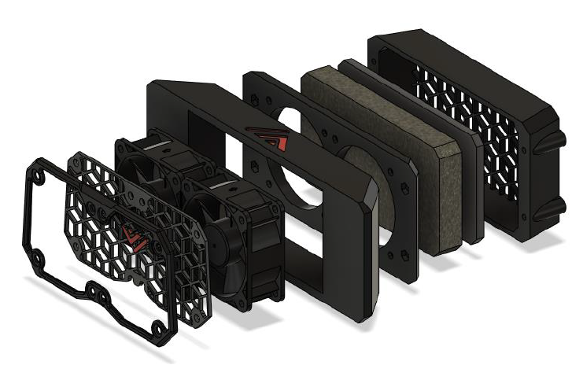
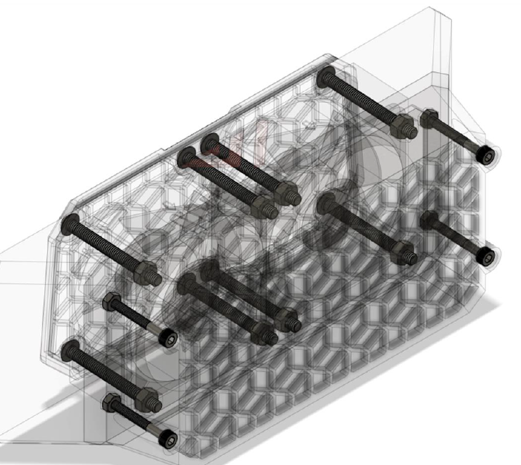
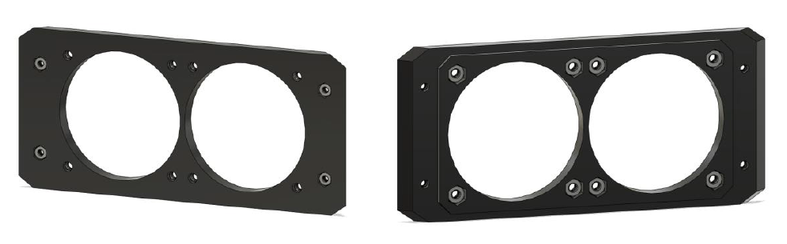
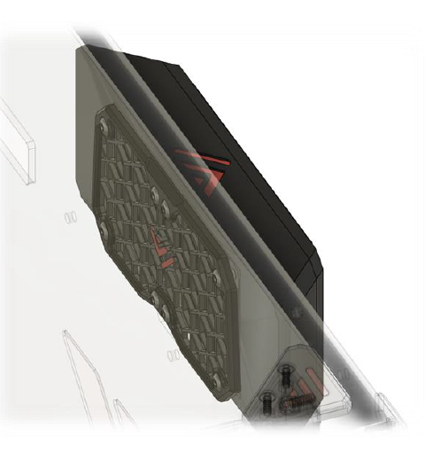
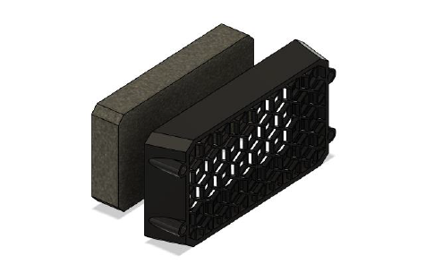

# 5. Fume extractor

## Overview

The fume extractor is an optional piece of hardware but highly recommended! This device gets rid of VOC’s (volatile organic compounds) and nasty smells that come from printing ABS filament.

## BOM

| Material                           | Quantity | Notes                            |
| :--------------------------------- | :------- | :------------------------------- |
| M3 x 25mm screw                    | 4        |                                  |
| M3 hex nut                         | 4        |                                  |
| M4 x 40mm screw                    | 8        |                                  |
| M4 hex nut                         | 8        |                                  |
| 60x60x25mm fan                     | 2        |                                  |
| HEPA filter (self-cut)             | 1        | Can be found in the kitchen isle |
| Activated carbon filter (self-cut) | 1        |                                  |

## STL's

| File name               | Amount to print | Notes                          |
| :---------------------- | :-------------- | :----------------------------- |
| [Fan guard][]           | 1               |                                |
| [Fan guard insert][]    | 1               |                                |
| [Exhaust fan housing][] | 1               |                                |
| [HEPA holder][]         | 1               |                                |
| [Exhaust cover][]       | 1               |                                |
| [TPU grommet][]         | 1               | Optional, for protecting wires |

### Step 1

Start by inserting all the M4 and M3 nuts into the exhaust cover like shown below

### Step 2

Next put the two fans in the exhaust fan housing, put the fan cover on the back panel and mount the exhaust housing, exhaust cover and fans with the M4 hardware.

### Step 3

Lastly, insert you HEPA filter and activated carbon filter in the printed HEPA filter holder and screw the holder on to the main fume extractor housing.

The activated carbon filter:

[Fan guard]: https://github.com/VzBoT3D/VzBoT-Vz235/blob/main/Assemblies%20%26%20STL/Enclosure/Fume%20extractor/fume%20extractor/fan%20guard.stl
[Fan guard insert]: https://github.com/VzBoT3D/VzBoT-Vz235/blob/main/Assemblies%20%26%20STL/Enclosure/Fume%20extractor/fume%20extractor/fan%20guard%20insert.stl
[Exhaust fan housing]: https://github.com/VzBoT3D/VzBoT-Vz235/blob/main/Assemblies%20%26%20STL/Enclosure/Fume%20extractor/fume%20extractor/exhaust%20fan%20housing.stl
[HEPA holder]: https://github.com/VzBoT3D/VzBoT-Vz235/blob/main/Assemblies%20%26%20STL/Enclosure/Fume%20extractor/fume%20extractor/hepa%20holder.stl
[Exhaust cover]: https://github.com/VzBoT3D/VzBoT-Vz235/blob/main/Assemblies%20%26%20STL/Enclosure/Fume%20extractor/fume%20extractor/exhaust%20cover.stl
[TPU grommet]: https://github.com/VzBoT3D/VzBoT-Vz235/tree/main/Assemblies%20%26%20STL/Enclosure/TPU%20Grommets%20(optional)