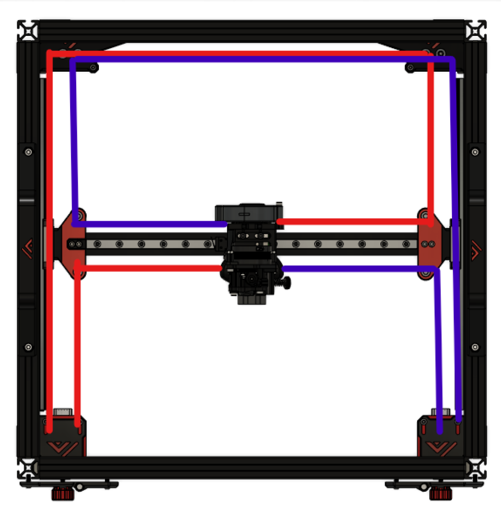

# 3.5 Belt routing and tensioning (AWD & 2WD)

## 2WD

## AWD

Because of shortening and lengthening of the belt and the fact that there are 2 driven pulleys for AWD, it is needed to synchronize the motors after each time the belts are tensioned.

To sync the belts properly it is important that the rear motor pulleys are **not** tightening the grub screws on to the flat part of the shaft. One can also use a motor with a round shaft instead of a D shaped shaft.

Before tightening one needs to loosen the set screws on both of the rear motor pulleys to get a proper reading of the tension. After tensioning you will need to power on the motors so they are engaged thus on a step position. You can now retighten the grubscrews again making sure the screws are not at the flat side of the shaft, turn the motor shaft if needed.

In the sample pinter.cfg file there is a macro included that enables all XY motors for synchronizing the belts. Make sure to have the pulleys and stepper shafts in a good position so they can be reached easily.

## Vz-Printhead

