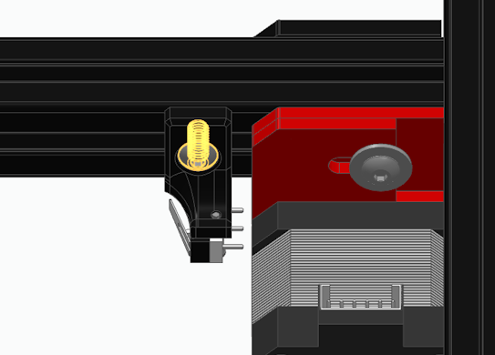

# 3.6 Y-axis endstop

Mounting the Y-axis (mechanical) endstop switch

## BOM

### Materials

| Material        | Quantity | Notes          |
| --------------- | -------- | -------------- |
| M2 10mm screw   | 2        |                |
| M4 8mm screw    | 1        |                |
| M4 t-nut        | 1        |                |
| D2F Microswitch | 1        | D2F with lever |

### Printed parts

| Part              | Quantity |
| ----------------- | -------- |
| [Y Endstop Mount] | 1        |

[Y Endstop Mount]: https://github.com/VzBoT3D/VzBoT-Vz235/blob/main/Assemblies%20%26%20STL/Gantry/Misc/Y%20switch%20mount.stl

## Instructions

1. Solder the Y-axis endstop wires to the Common and Normally Closed (NC) pins of the microswitch. Use heatshrink to insulate the contacts.  
    *Optionally, remove the middle (NO) contact's pin with flush cutters or sidecutters.*

    

2. Mount the D2F switch to the Y-axis endstop bracket using 2 `M2x10mm screws` as such that:

   * The bracket's large mounting tab with the large mounting hole is pointing up and away from you
   * The switch's lever pointing to the right and up.

    Or as shown:

    

3. Mount the assembled Y-axis endstop to the rail using 1 `M4x8mm screw` and 1 `M4 T-nut`.

    The Y-axis endstop is mounted front-left, immediately behind the left-side motor mount.

    
