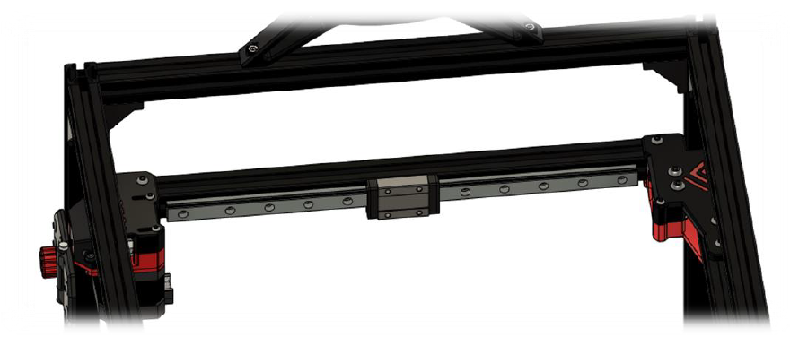
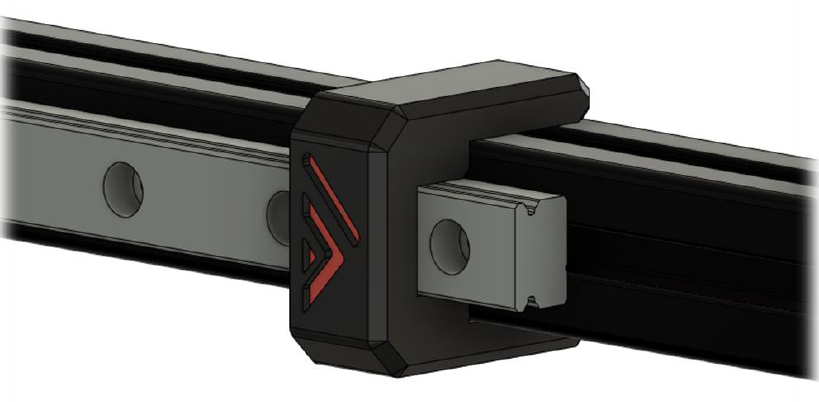
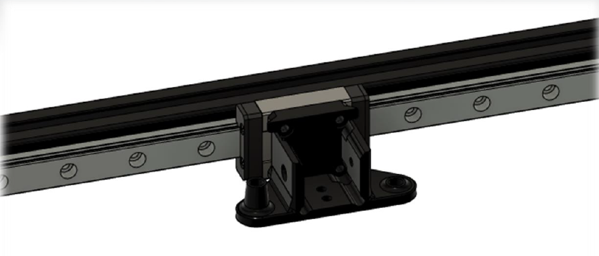
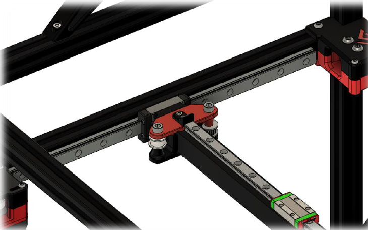

# 3.4 Y-gantry rails, X-gantry and idlers

## BOM

| Material        | Quantity          | Notes |
|:-------------|:------------------|:------|
| M3 8mm | 20 | (or more depending on how much you use to secure the MGN12 & MGN9) |
| M3 10mm | 8 | - |
| M3 30mm | 4 | - |
| M3 t-nut | 12 | - |
| M3 nut | 12 | - |
| M5 30mm (titanium) | 4 | - |
| M5 nut (self-locking) | 4 | - |
| GT2 smooth idler | 2 | - |
| CF square tube / aluminium tube | 1 | - |
| MGN9H 300mm | 1 | - |
| MGN12H 300m | 2 | - |

## STL's

| File name | Amount to print |
|-----------|-----------------|
| <a href="https://github.com/VzBoT3D/VzBoT-Vz235/blob/main/Assemblies%20%26%20STL/Frame/Frame%20brace.stl" target="_blank">MGN12 alignment tool</a> | 4 |
| <a href="https://github.com/VzBoT3D/VzBoT-Vz235/blob/main/Assemblies%20%26%20STL/Frame/Frame%20brace.stl" target="_blank">MGN9 alignment tool</a> | 4 |
| <a href="https://github.com/VzBoT3D/VzBoT-Vz235/blob/main/Assemblies%20%26%20STL/Frame/Frame%20brace.stl" target="_blank">Y gantry printed bottom</a> | 2 |
| <a href="https://github.com/VzBoT3D/VzBoT-Vz235/blob/main/Assemblies%20%26%20STL/Frame/Frame%20brace.stl" target="_blank">Y gantry printed top</a> | 2 |

### Step 1

Using the alignment tool, mount the MGN12 to the frame like shown below:

Use the 8mm M3 screws and T-nuts. You don’t need to fill all holes, but any other hole is fine. Make sure they are perfectly centered to the 2020 extrusion

### Step 2

Mount the lower half of the printed Y gantry pieces to their MGN12 cart with the 10mm M3 screws. Make sure the y gantry piece is parallel to the linear rail on both sides, you can use a small spirit level to achieve this.

### Step 3

To drill the holes in your CF-tube you’ll need to measure out where all holes will need, to do this the following is recommended: put a piece of painter’s tape on the tube, put the MGN9 on the tube with the alignment tools and have it centered. use a pencil to mark out all the holes you want to use. Put the CF-tube in your gantry and mark the holes for the tube to connect to the Y gantry, you will only need the 30mm M3 screws to secure the tube, the holes in the side are for 2020 extrusions.

!warning! drilling and sawing carbon fiber is very hazardous, if you don’t buy the predrilled tube from mellow or the aluminum tube from F3D’s shop be careful. Wear protection and drill in wet surfaces!

### Step 4

Mount the rail on the CF-tube using the alignment tools and the 8mm M3 screws, use the M3 insert piece to hold the M3 nuts and remove this printed holder after mounting.

### Step 5

Insert the endcaps in the CF-tube and put the tube in the Y gantry brackets, add the top part of the Y gantry and their corresponding hardware. Don’t forget to add the printed X end stop part on top of the left Y gantry. Keep all hardware on this point finger tight.

### Step 6

Insert the idlers and M5 bolts and nuts to secure, again only finger tight

### Step 7

Put the x gantry against the rear idlers and tighten the Y gantry M3 hardware that hold the CF-tube in place. Then tighten the M5 hardware that hold the idlers, now your X gantry should be parallel to your rear extrusion. Measure with calipers to verify.
