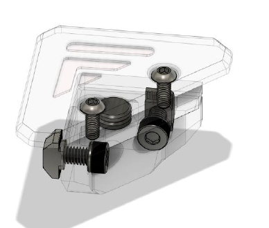

# 8.1 top cover & latches

## Overview

 

## BOM

| Material        | Quantity          | Notes |
|:-------------|:------------------|:------|
| M3 8mm           | 8 | - |
| M3 nut | 8 | - |
| M4 10mm | 8 | - |
| M4 t-nut | 8 | - |
| 2x8mm Magnet | 8 | - |
| 395X405X3 mm acrylic panel | 1 | Refer to the .step file for placement of the cutouts |

## STL's

 

| File name | Amount to print |
|-----------|-----------------|
| <a href="https://github.com/VzBoT3D/VzBoT-Vz235/blob/main/Assemblies%20%26%20STL/Frame/Frame%20brace.stl" target="_blank">Top cover holder top part</a> | 4 |
| <a href="https://github.com/VzBoT3D/VzBoT-Vz235/blob/main/Assemblies%20%26%20STL/Frame/Frame%20brace.stl" target="_blank">Top cover holder middle part</a> | 4 |
| <a href="https://github.com/VzBoT3D/VzBoT-Vz235/blob/main/Assemblies%20%26%20STL/Frame/Frame%20brace.stl" target="_blank">Top cover holder bottom part</a> | 4 |

### Step 1
Insert the magnets in the top and bottom parts. They should be press fit, if not tight enough use some superglue

### Step 2
Screw the bottom part with M4 in each corner of the frame.

### Step 3
Insert the rest of the magnets and m3 nuts in the middle pieces.

### Step 4
Attach the top and middle piece to each corner of the panel and test the functionality of the top cover latch mechanism.