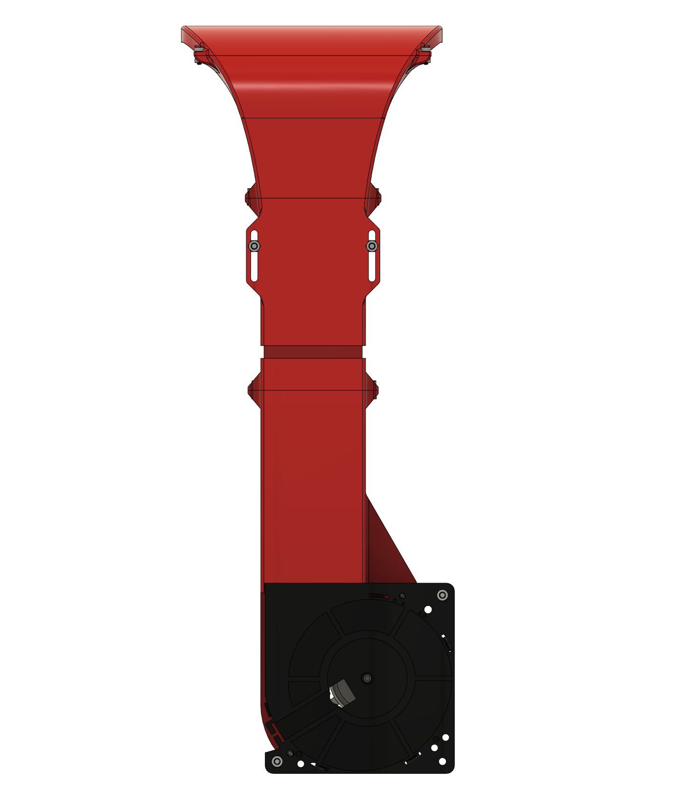
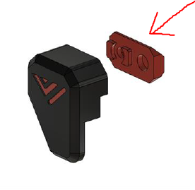
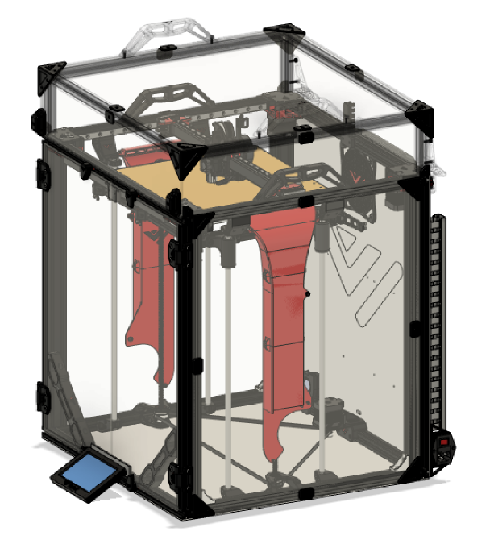

# 8. Side panels + RSCS

## Overview

RSCS short for remote static cooling is an optional extra pair of cooling fans which help cool the entire print when doing unicorn speeds! RSCS is mounted to the acrylic panels and this version fits in very tight to the Z-assembly.

## BOM

| Material         | Quantity | Notes   |
|:-----------------|:---------|:--------|
| M3 8mm           | 12       | -       |
| M3 10mm          | 4        | -       |
| M3 nut           | 16       | -       |
| M4 10mm          | 4        | -       |
| M4 nut           | 4        | -       |
| 120mm radial fan | 2        | Gdstime |
| acrylic panel    | 2        | -       |

## STL's

| File name               | Amount to print |
|-------------------------|-----------------|
| [Top duct][]            | 2               |
| [Middle lower part][]   | 2               |
| [Middle upper part][]   | 2               |
| [Bottom piece][]        | 2               |
| [Trim - side corner][]  | 8               |
| [Trim - side center][]  | 8               |
| [Magnetic door latch][] | 4               |

## Step 1

Use the M3 hardware to put the RSCS together like shown below. If the assembly won’t fit through between the 2 Z-rods. Unscrew the top part and put this on after assembly.

## Step 2

Mount the RSCS to the panel. When drilling the holes make sure the duct is approximately 5mm above the Z-rods.

## Step 3

Insert the M3 hardware in the side and front (narrow) panel using the available trim pieces like shown below. When everything lines up screw everything down starting with the bolts in the middle outward.

### Step 3a

Insert the latch mounts in the front and bottom extrusion of the front.

### Step 4

When adjusting the slider of the rscs take care that the top of the rscs is approximatly 3-4mm above the bed when z is fully homed.

### Step 5

When the panel with the rscs is mounted apply the Trim pieces like shown in the image below.

[Bottom piece]: https://github.com/VzBoT3D/VzBoT-Vz330/blob/master/Assemblies%20BOM%20and%20STL/RSCS/STLs/Lower.stl
[Magnetic door latch]: https://github.com/VzBoT3D/VzBoT-Vz330/blob/master/Assemblies%20BOM%20and%20STL/enclosure/Front%20door%20latches/Magnetic%20latch/Door%20latch%20mount.stl
[Middle lower part]: https://github.com/VzBoT3D/VzBoT-Vz330/blob/master/Assemblies%20BOM%20and%20STL/RSCS/STLs/Middle%20Lower.stl
[Middle upper part]: https://github.com/VzBoT3D/VzBoT-Vz330/blob/master/Assemblies%20BOM%20and%20STL/RSCS/STLs/Middle%20upper.stl
[Top duct]: https://github.com/VzBoT3D/VzBoT-Vz330/blob/master/Assemblies%20BOM%20and%20STL/RSCS/STLs/Top-upper.stl
[Trim - side center]: https://github.com/VzBoT3D/VzBoT-Vz330/blob/master/Assemblies%20BOM%20and%20STL/enclosure/Pannel%20trims/Trim%20-%20center.stl
[Trim - side corner]: https://github.com/VzBoT3D/VzBoT-Vz330/blob/master/Assemblies%20BOM%20and%20STL/enclosure/Pannel%20trims/Trim%20-%20side%20pannel%20corner%20trim.stl
