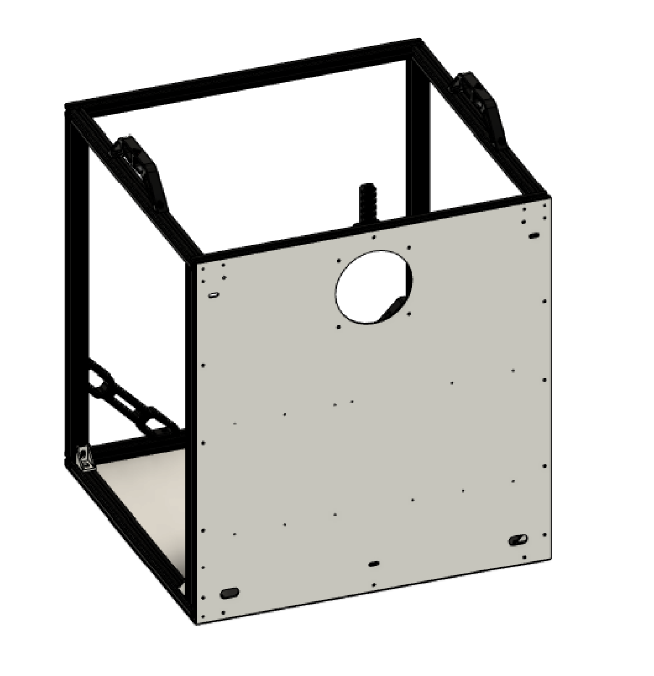
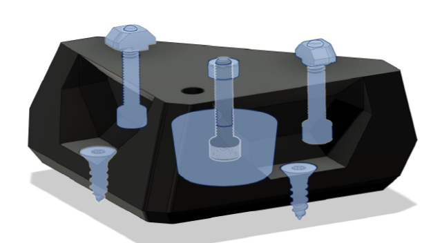

 

|:-|
|  |

 
 

## Parts

 

| Material        | Quantity          | Notes |
|:-------------|:------------------|:------|
| M3/M4 6-8mm           | 20* | Depending on the number of screws you use to secure your panels. Optionally you use the included enclosure trim pieces which are meant to use M3 hardware  |
| M4 20mm | 8 | - |
| M4 25mm | 4 | - |
| M4 t-nuts | 20*   | - |
| M5/M6 25mm           | 4      | Depending on the extrusion type |
| Wood screws | 8 | Optional, to screw the printer down to a surface |
| 570x500x3mm aluminium | 1 | Optionally thickness, 1.5mm also possible |
| 530x500x3mm aluminium | 1 | Optionally thickness, 1.5mm also possible |

## STL's

| File name | Amount to print |
|-----------|-----------------|
| <a href="https://github.com/VzBoT3D/VzBoT-Vz330/blob/master/Assemblies%20BOM%20and%20STL/Frame/Feet/STL/foot.stl" target="_blank">VzBoT Foot</a> | 4 |
| <a href="https://github.com/VzBoT3D/VzBoT-Vz330/blob/master/Assemblies%20BOM%20and%20STL/Frame/Feet/STL/Spacer.stl" target="_blank">Foot scalable spacer (optional)</a> | 4 |

 

## Step 1

### Notes

| Part | Location |
|:-|:-|
| M4 sliding t-nut   Quantity: x | **Layer**: 3   **Box**: VZ330 Box 6 |
| M4 x 8mm   Quantity: x | **Layer**: 3   **Box**: VZ330 Box 6 |

### Instructions

|:-|:-|
|  | &#8226; Mount the PSU to the backplate first   &#8226; Insert sliding t-nuts   &#8226; Align them with the holes of the panel   &#8226; Start screwing the panel down from the middle to the outside holes.

 

## Step 2

### Notes

| Part | Location |
|:-|:-|
| Rubber feet   Quantity: 4 | - |
| M4 x 20mm   Quantity: 12 | **Layer**: 3   **Box**: VZ330 Box 6 |

 

### Instructions

|:-|:-|
|  | &#8226; Insert all hardware in the printed feet   &#8226; The rubber feet should stick out 1-2 mm ( scale the spacer accordingly )  |

 

## Step 3

### Notes

| Part | Location |
|:-|:-|
| M4 sliding t-nut   Quantity: x | **Layer**: 3   **Box**: VZ330 Box 6 |
| M4 x 8mm   Quantity: x | **Layer**: 3   **Box**: VZ330 Box 6 |
| M5 x xx   Quantity: x | **Layer**: 3   **Box**: VZ330 Box 6 |

 

### Instructions

|:-|:-|
|  | &#8226; Insert all M4 sliding t-nuts in the frame and align them with the holes of the plate   &#8226; Mount plate and feet to the frame.
