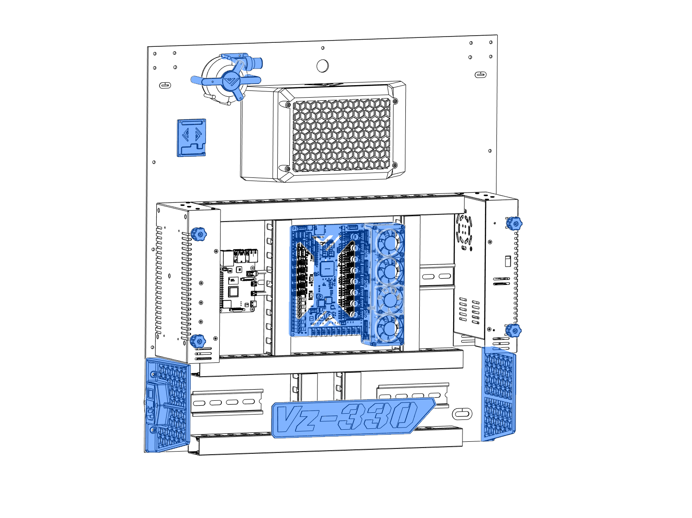

# 6. Electronics

This is a general overview of the parts recommended for a VzBot 330 build. Everyone is free to use their own choice of parts. STL-files for other screens etc are not natively provided and may be found in the community mod section on GitHub and Discord.
We trust everyone to use their own best judgement when wiring their printer, we do not recommend to do this without professional help if you are inexperienced in electronics.

1. [Wiring diagram](./electronics/diagram)
2. [Layout](./electronics/layout)
3. [Mellow Super8 v1.3](./electronics/super_mellow)
4. [Firmware](./electronics/Firmware)
5. [Printer config](./electronics/Printer_Config)
6. [Display](./electronics/display)

