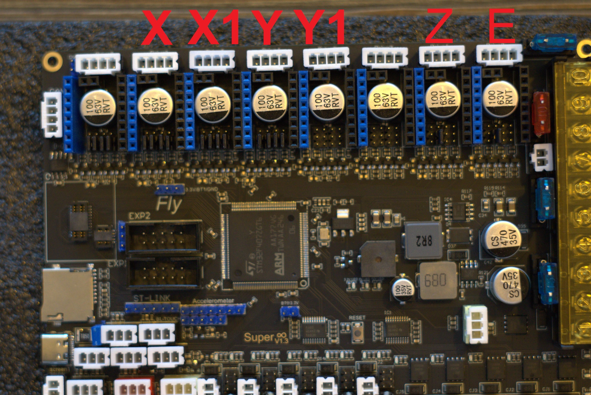

# 7.3 Mellow Super8 V1.3

## STL's

| File name | Amount to print |
|-----------|-----------------|
| <a href="https://github.com/VzBoT3D/VzBoT-Vz330/blob/master/Assemblies%20BOM%20and%20STL/electronics/Back%20Electronic%20bay/Fly%20Super8/FlySuper8%2B4x5160pro%20mount.stl" target="_blank">Super8 + 5160 mount</a> | 1 |
| <a href="https://github.com/VzBoT3D/VzBoT-Vz330/blob/master/Assemblies%20BOM%20and%20STL/electronics/Back%20Electronic%20bay/Fly%20Super8/FlySuper8%20din%20mountX2.stl" target="_blank">Super8 din mount</a> | 2 |
| <a href="https://github.com/VzBoT3D/VzBoT-Vz330/blob/master/Assemblies%20BOM%20and%20STL/electronics/Back%20Electronic%20bay/Fly%20Super8/FlySuper8%20fan%20cover.stl" target="_blank">5160 fan mount</a> | 1 |

### Setup guide
Here's A detailed guide on how to install the Mellow Super8 V1.3 with Mellow 5160HV Externals and how to wire everything up.

 
What's in the boxes
 
 

 

Overview of the board.

### Fuses
The first thing we need to do is install the fuses. These are in one off the small bags and should be put in the board as shown down below.

### Mosfets
Now we're gonna install the Mosfets for the fansports. These are needed otherwise the fanports won't work. The mosfets are in the same small bag the Fuses where in. Don't be afraid to break them in halve they're ment to be.

You'll see that the mosfet ports on the board arrive empty and are in between the fan plugs.

Insert the mosfets into the holes the direction they face doesn't matter.

### Driver setup

Now we're done with that we're going to the plugs for the driver ports. We're gonna install the bridges for SPI and UART.
 

Here's a view of the board with all the plugs still not filled. It's important to not put bridges on the ports you're not gonna use.

For SPI you need to put bridges on the front 2 rows of pins. These are used for the 5160's

For UART you need to put the bridge on the second pin from the left and then bridge the front and middle row. These are for the 2209's.

Next step is to populate all the driver slots that you're gonna use. Here's a example for a AWD setup on 5160's and Z and E on 2209's.

### installing the 5160's.

We start off by putting the Heatsinks on the 5160's. If you don't do this they will go into overtemp error.

Now we'll plug in the adapter into the Driver slots. Make sure they are set to SPI like shown in the instructions above here.

Next up is to connect the cable between the adapter board and the External 5160.

### Fan Voltage Selection

Next up we're gonna put the fan ports on the voltage we would like to run them on. You can choose 5V/12V/24V. Each plug has a voltage selection pin grid to the right of it.

The bridges are to be inserte Left to right. The Top row is 5V. Middle row is 12V and the Bottom row is 24V.

