# Touchscreen Assembly and Installation.

## Assembly

In you're kit you'll find your screen the Core board and the DSI cable.

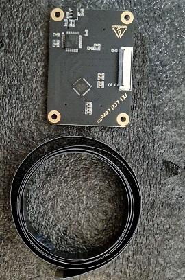
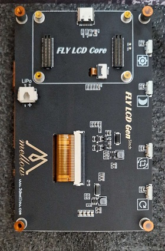

We're gonna start with attaching the Core board to the Screen like shown here:

{: .highlight }
> &#8226;Line up the 2 rows on the bottom side of the Core board to the slots in the Screen and press it down.

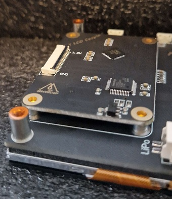


Next up We're attaching the DSI cable to the Core board like shown here: 

{: .highlight }
> &#8226;When inserting the DSI cable make sure the exposed traces are facing upwards and the black lip of the connector is flipped up.
Close the connector when the cable is inserted.

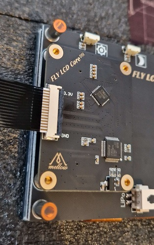

Next we need to grab our Printed parts and Hardware for assembling the screen.

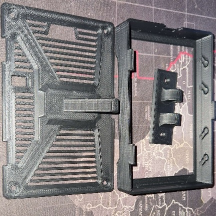
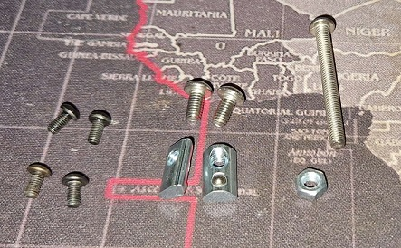

- 4 x 6mm M3 bolts
- 1 x 25mm M4 bolts (for the hinge)
- 1 x M4 nut
- 2 x M4 8mm bolt (to bolt to frame)
- 2 M4 T-nuts


Insert the screen into the printed part as shown. Make sure the DSI cable exits from the side with the Slot for it.

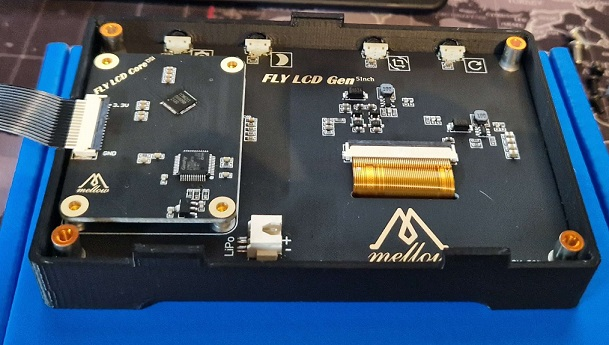

Remove the plastic protective layer from the Standoffs like shown here:

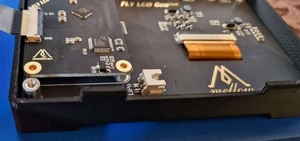

Next put on the backside with the 4 M3x6mm bolts.

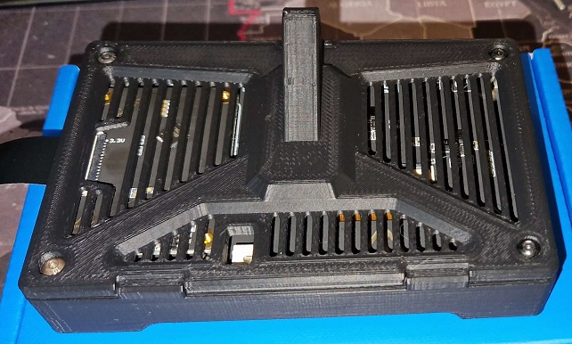

Next attach the Frame mount piece to the backside with the M4x25mm and Nut. You can also already put in the M4x8's and T-Nuts for mounting it to the frame:

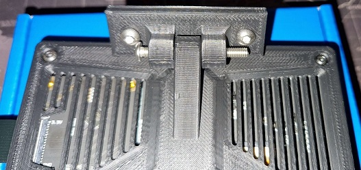

Time to mount it to the Machine:

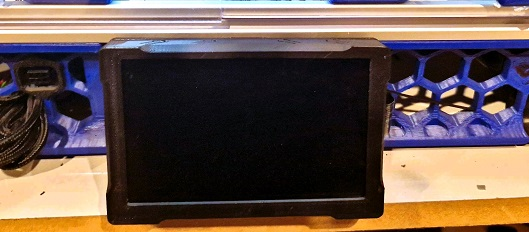

Installing the DSI cable to the Pi.

{: .highlight }
> &#8226;Open the black clip and insert the DSI cable with the exposed contacts to the white part of the connector and close the black clip.

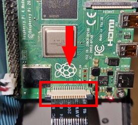


## Klipperscreen

We're going to install Klipperscreen so we can use our touchscreen.

First we're going to SSH into the Pi with Putty and we're going to install KIAUH

```bash
sudo apt-get update && sudo apt-get install git -y
```
```bash
cd ~ && git clone https://github.com/dw-0/kiauh.git
```
```bash
./kiauh/kiauh.sh
```

Then Press 1 for install and hit enter

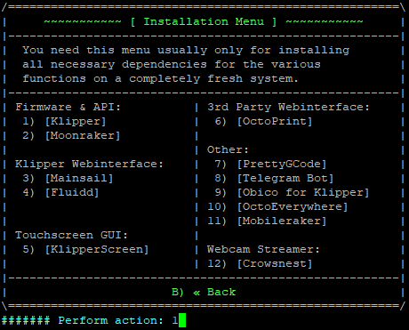

Press 5 for Klipperscreen and hit enter. This might take a while to install.


### Touchscreen issue's

If you're touchscreen isn't working SSH into your Pi with Putty and run:

```bash
sudo nano /boot/config.txt
```
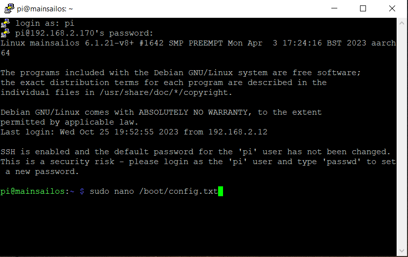

Then scroll down and change the highlited line From: 
```bash
dtoverlay=vc4-kms-v3d
```

To: 

```bash
dtoverlay=vc4-fkms-v3d
```
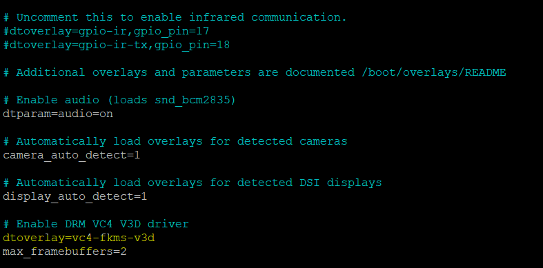


Press CTRL+X and then Y to save and exit. Now reboot your Pi and You're screen should be fully working.


## End result

Now that you're all done it should look something like this :

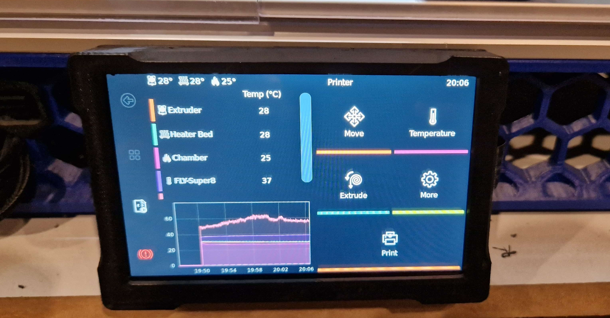
