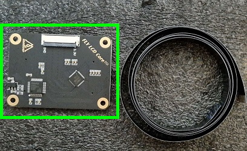
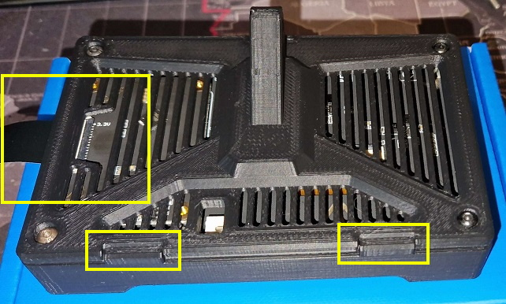

# Touchscreen installation

This step of the manual goes over the assembly of the touchscreen module, and its configuration for use with Klipper.

## Core board

The core board handles the signals to and from the motherboard, and interfaces with the LCD display. It is the smaller of two boards included.

The core board is installed on to the back side of the LCD display.

1. Place the Core board on to the designated area on the LCD display.

    The 2 connectors on the back of the LCD should correspond with the 2 connectors on the back of the Core board.  
    The Core board should be oriented with the white ribbon connector facing outwards, towards the edge of the LCD display.

    

2. Ensure the mounting holes in the corners of the Core board line up with the posts underneath it

    If these don't line up, your Core board is not aligned with the connectors on the LCD display.

3. Press down firmly and evenly until a firm click is felt

    The Core board should sit flush with the posts on the LCD display.

    

## Enclosure

The LCD display enclosure is a printed item consisting of multiple components.

You will need the following parts:

| Part            | Quantity | Comments                 |
| --------------- | -------- | ------------------------ |
| Front cover     | 1        | Printed part             |
| Back cover      | 1        | Printed part             |
| Mounting hinge  | 1        | Printed part             |
| M3 x 6mm screw  | 4        |                          |
| M4 x 25mm screw | 1        |                          |
| M4 x 8mm screw  | 2        |                          |
| M4 hex nut      | 1        |                          |
| M4 T-nut        | 2        | Optionally spring loaded |

1. Remove the polyimide stickers from the posts on the back of the LCD display

    These can be discarded

    

2. Place the assembled LCD display in to the front cover

    Take care to align the top row of buttons with the provisioned openings in the top of the front cover

    

3. Mount the back cover using 4 M3 x 6mm screws

    Take care to respect the orientation of the back cover. The notches in the back cover should align with the posts on the front cover.  
    The notched opening in the back cover should be over the ribbon connector of the Core board.

    

4. Insert the 2 M4 x 8mm screws into the mounting hinge, and loosely apply 2 M4 T-nuts to these screws  

    

5. Fasten the mounting hinge to the printer frame using the 2 M4 screws and corresponding T-nuts previously inserted.

    These screws don't need to be overly tight, as you may need to adjust the display to ensure smooth cooperation with the enclosure panels.

6. Loosely attach the display assembly to the mounting hinge using 1 M4 x 25mm screw and one M4 hex nut

    Don't overtighten these screws. The screw acts as a hinge and needs room to move ever so slightly.

    If you have not wired up the DSI cable yet, then dismount the display from the mounting hinge again after confirming the hinge works correctly.

    

## Wiring

Wiring up the display requires careful **attention to detail**, as the direction of the flat-flex cable is of utmost importance.

The DSI cable runs between the LCD display Core board and the DSI connector on the Raspberry Pi. The USB-C port on the LCD display PCB does not need connecting up when using the DSI cable.

DSI cable highlighted in red:

### Display

1. Lie the display assembly down on a flat surface, back side up.

    

2. Locate the locking tab on the DSI connector, and gently lift it up from underneath

    The locking tab is at a 90° angle to the connector when fully unlocked.  
    

3. Gently insert the DSI cable into the connector through the slotted opening in the side of the enclosure

    {: .danger }
    > Pay attention to the orientation of this cable! The pins should be facing up, away from the PCB.

    

4. Close the locking tab on the DSI connector

### Raspberry Pi

1. Locate the DSI connector on the Raspberry Pi board

    

2. Lift the locking black locking tab by both edges until it is loose

    {: .warning }
    >The black locking tab should not come out. Be careful with the locking tab; it's very fragile and breaks easily!

    

3. Insert the other end of the DSI cable in to the DSI connector of the Raspberry Pi board

   - The black plastic tab points towards the center of the Raspberry Pi board.
   - The side with the exposed shiny contacts points towards the edge of the Raspberry Pi board

## Finishing up

After running the DSI cable, the touchscreen assembly may be reinstalled onto the hinge previously installed to the frame. Instructions for this are outlined in **step 6** of the [enclosure assembly](#enclosure)
