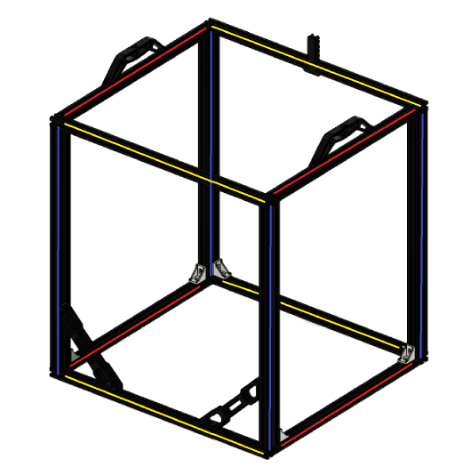
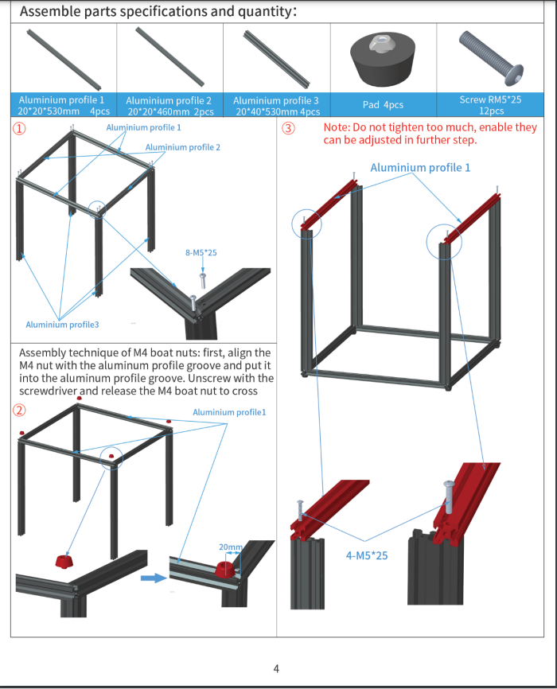

# 1. Frame

## Overview

The frame is assembled through a combination of blind joints and corner brackets. The corner brackets are to help stiffen up the frame and are optional, though we highly recommend using them on every possible corner for best results.

For detailed informations on how to assemble blind joints visit this [page](../general/blind-joints)

## BOM

| Material        | Quantity          | Notes |
|:-------------|:------------------|:------|
| M5/M6 10mm buttonhead           | 16 | Depending on the type of 2020 you use, you need M5 or M6 screws  |
| 530mm 2020 extrusion | 4   | Yellow  |
| 460mm 2020 extrusion           | 6      | Red   |
| 530mm 2040 extrusion           | 4 | Blue ( all ends need to be tapped ) |
| 2020 corner joints           | 8 | -  |
| 2020 blind corner joints           | 4 | -  |
| M4 T-nuts | 10 | - |
| M4 10mm | 2 | - |
| M4 15/16mm | 8 | - |
| TODO pick right bags and list | 1 | - |

### Frame colors 
 

 

### Frame detail
 

 

## STL's

| File name | Amount to print |
|-----------|-----------------|
| <a href="https://github.com/VzBoT3D/VzBoT-Vz330/blob/master/Assemblies%20BOM%20and%20STL/Frame/STLs/Frame_Brace.stl" target="_blank">Bracer</a> | 2 |
| <a href="https://github.com/VzBoT3D/VzBoT-Vz330/blob/master/Assemblies%20BOM%20and%20STL/Frame/STLs/handle.stl" target="_blank">Handle</a> | 4 |
| <a href="https://github.com/VzBoT3D/VzBoT-Vz330/blob/master/Assemblies%20BOM%20and%20STL/Frame/STLs/cable%20holder%20frame%20side.stl" target="_blank">Cable holder</a> | 1 |

### Step 1

To start you are going to build the 2 sides of your frame. Make sure you do your building on a nice flat surface (a stone surface is ideal if you have one available or maybe a kitchen counter). Make sure everything is as square as possible before tightening the corners. For more detail on blind joints look at the videos above. Add the optional corner braces on the bottom now.

After hand tightening you can start tightening everything down properly. Make sure every corner is exactly 90 degrees. Now you need to repeat this step a second time for the other side of the frame.   
Check the two halves by laying them on top of eachother with all corners exactly in the same spot and check that every thing is parallel to between them. They need to be parallel for the printer to operate smoothly.

### Step 2

Attach the red extrusions to one side of the frame and loosely attach them you should have a upside down table now like this.

### Step 3

And the final side to the frame and check that everything is square one final time before properly tightening the frame. It should look something like this.

### Step 4

Attach all corner joints and check if your frame is square and strong. Now you can add the handles, brackets and cable holder.

Congrats you have successfully built the frame to you VzBoT. This is the start of something truly impressive. This is like the foundation to your printer and is really important that it is built correctly.