# 2. Frame

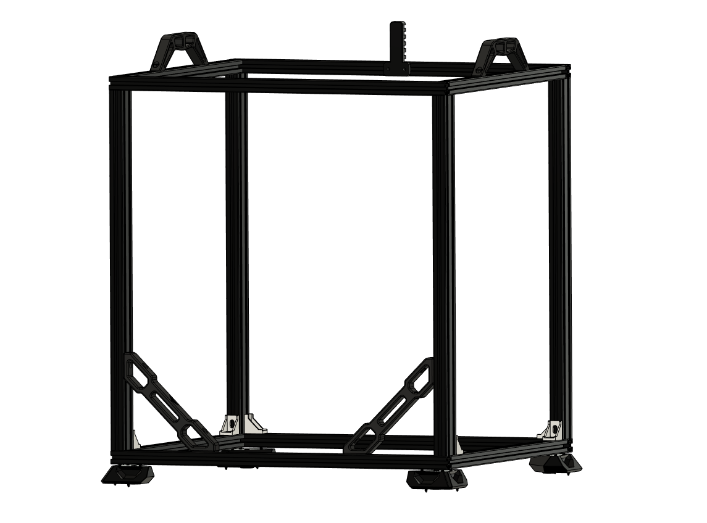

## Part's

| Material        | Quantity          | Notes |
|  | 4 | 2040 extrusion (530mm) |
|  | 4 | 2020 extrusion (530mm) with two holes|
|  | 4 | 2020 extrusion (460mm) with two holes|
|  | 6 | optional | 
|  | 16 | M5x25mm |
| xx | 4 | M4 t-nut | 

## STL's
 

**You can click on the object you wanna print on the plate and the corresponding STL will open up.**

 

  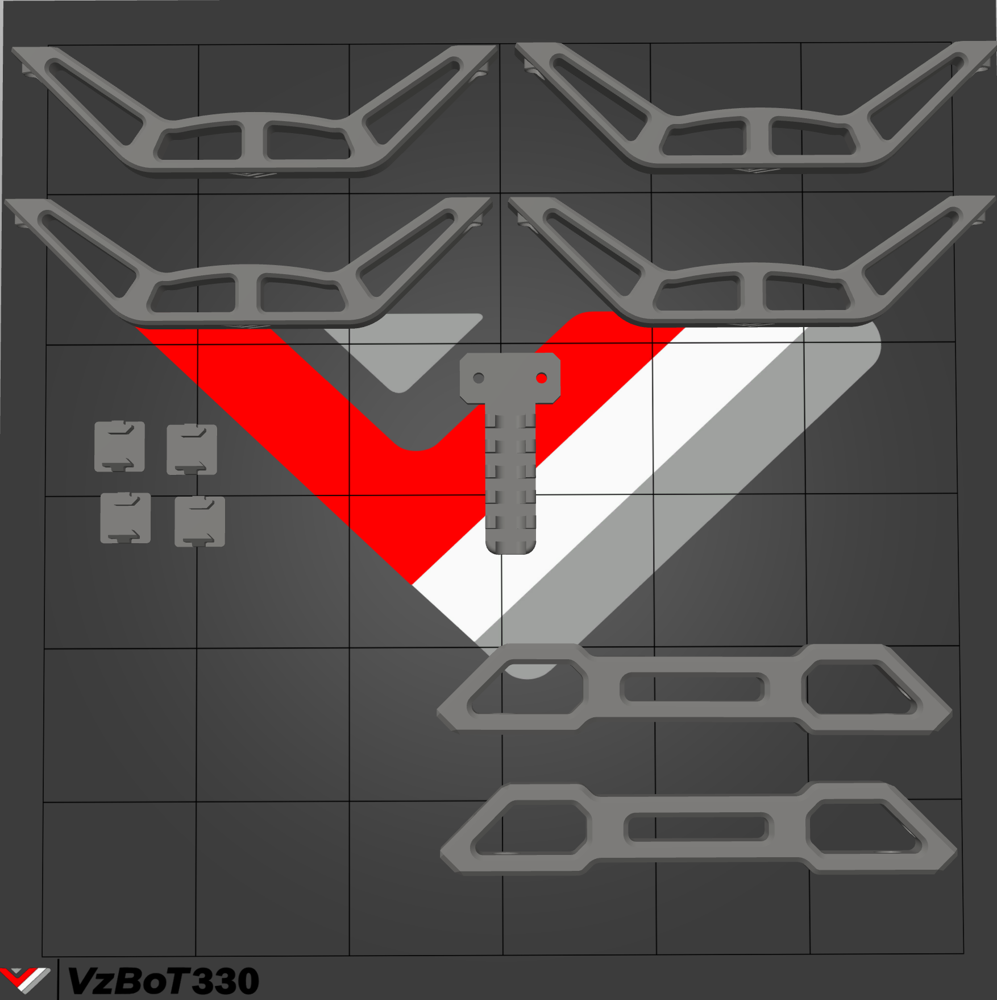
  <map name="stl">
      <area target="_blank" alt="Handle" title="Handle" href="https://github.com/VzBoT3D/VzBoT-Vz330/blob/master/Assemblies%20BOM%20and%20STL/Frame/STLs/handle.stl" coords="6, 26, 696, 233" shape="rect">
      <area target="_blank" alt="2020 endcaps" title="2020 endcaps" href="https://github.com/VzBoT3D/VzBoT-Vz330/blob/master/Assemblies%20BOM%20and%20STL/Frame/STLs/2020%20Endcap.stl" coords="6, 238, 234, 423" shape="rect">
      <area target="_blank" alt="Cable Holder" title="Cable Holder" href="https://github.com/VzBoT3D/VzBoT-Vz330/blob/master/Assemblies%20BOM%20and%20STL/Frame/STLs/cable%20holder%20frame%20side.stl" coords="313, 241, 402, 396" shape="rect">
      <area target="_blank" alt="Frame stablizer" title="Frame stablizer" href="https://github.com/VzBoT3D/VzBoT-Vz330/blob/master/Assemblies%20BOM%20and%20STL/Frame/STLs/Frame_Brace.stl" coords="300, 433, 697, 699" shape="rect">
  </map>

## Assembly

### Step 1

 
 

| | |
|-|-|
| 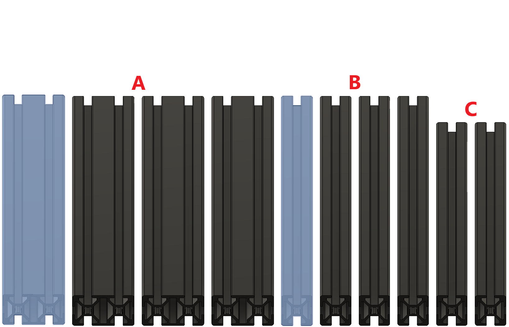 | 1) 2040 extrusion (530mm)   2) 2020 extrusion (530mm)   3) 2020 extrusion (460mm)   4) 2 x M5 25mm |
| 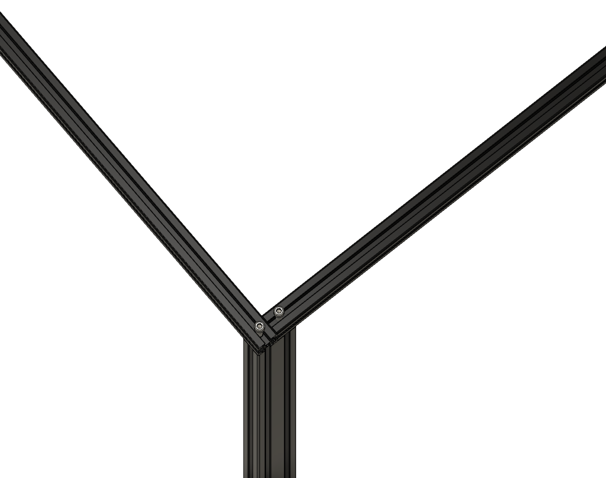 | 1) Align the extrusions flush |
| 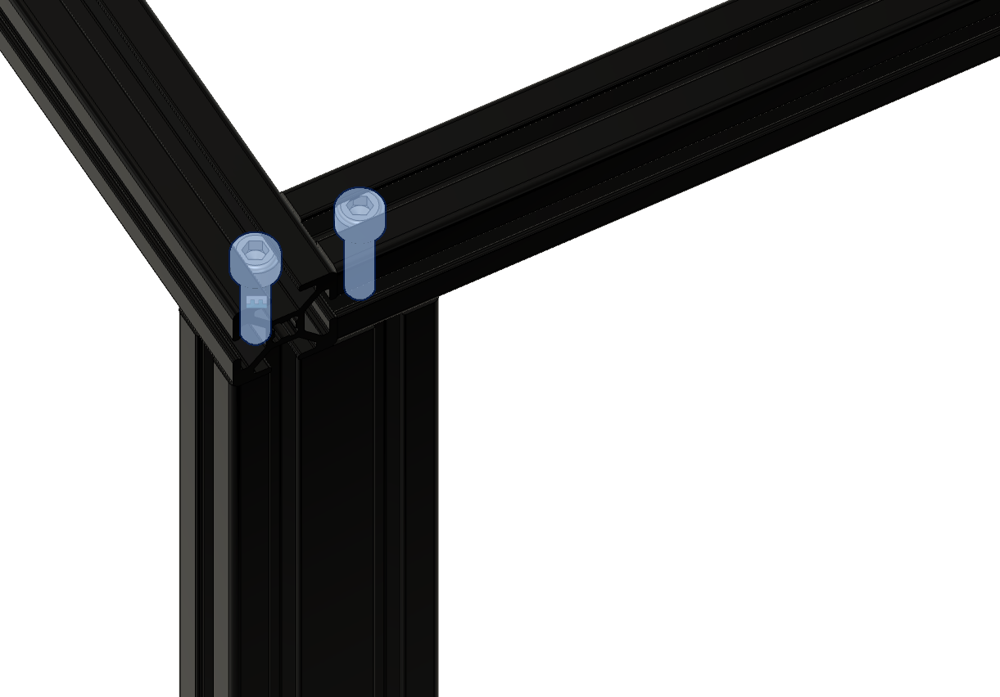 | 1) Tighten the 2020 extrusion's to the 2040 extrusion |

 
 

### Step 2

 
 

| | |
|-|-|
| 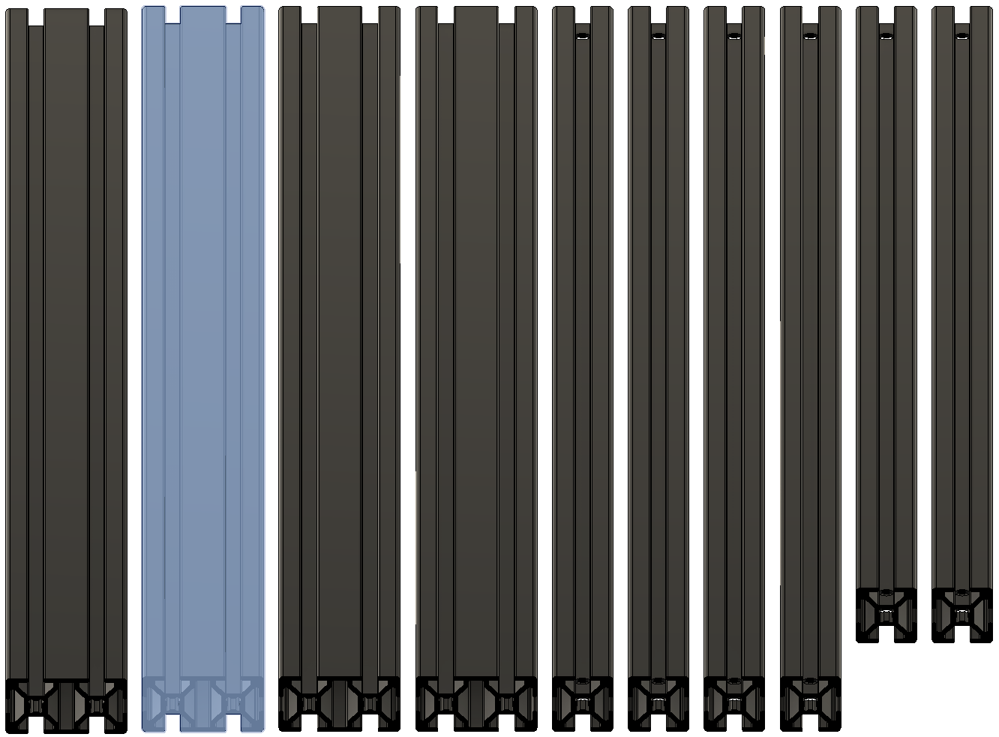 | 1) 2040 extrusion (530mm)   2) 2020 extrusion (530mm)   3) 2020 extrusion (460mm)   4) 2 x M5 25mm |
|  | 1) Align the extrusions flush |
|  | 1) Tighten the 2020 extrusion's to the 2040 extrusion |

 
 

### Step 3

 
 

| | |
|-|-|
| 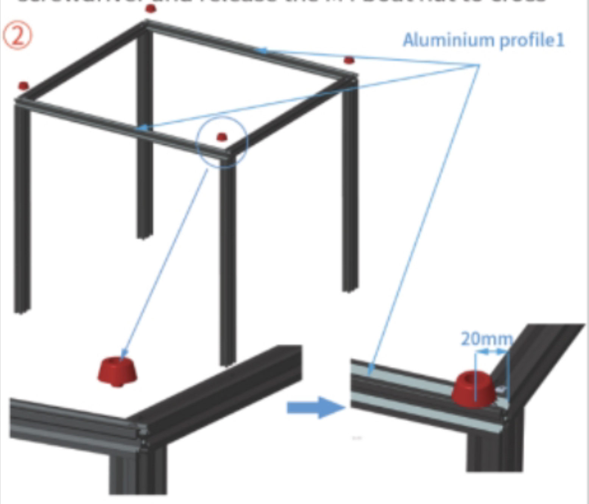 | 1) 2040 extrusion (530mm)   2) Assembly from Step 1 and 2   3) 2 x M5 25mm |
| 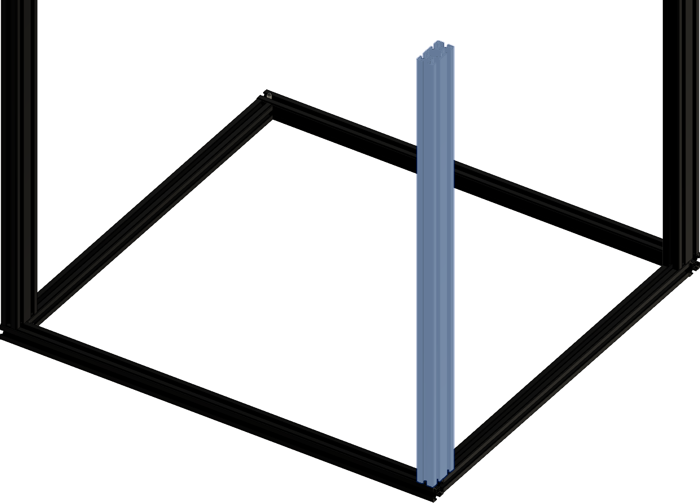 | 1) Align the extrusions flush with the both 2020 extrusion's |
|  | 1) Tighten the 2020 extrusion's to the 2040 extrusion |

 
 

### Step 4

 
 

| | |
|-|-|
| 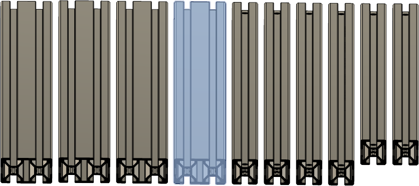 | 1) 2040 extrusion (530mm)   2) Assembly from Step 3   3) 2 x M5 25mm |
|  | 1) Align the extrusions flush with the both 2020 extrusion's |
|  | 1) Tighten the 2020 extrusion's to the 2040 extrusion |

 
 

### Step 5

TODO put assembled gantry on frame

### Step 6 ( optional )

| | |
|-|-|
| 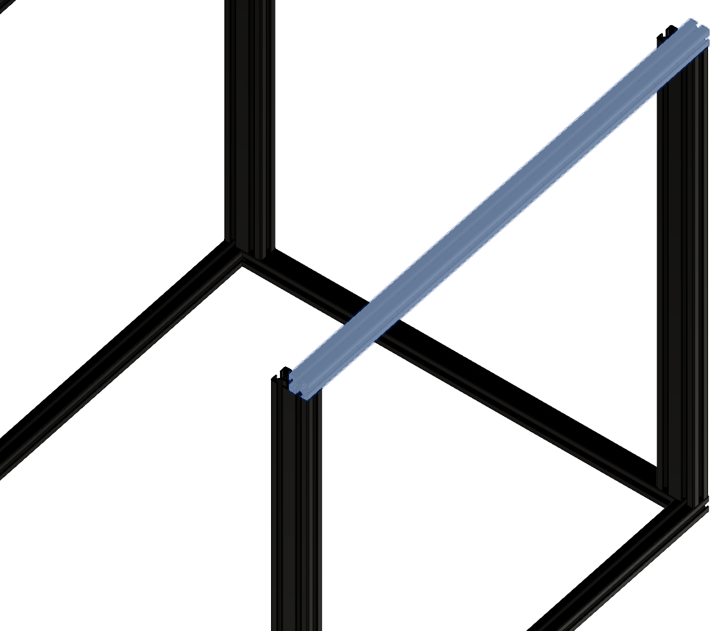 | 1) 6 x 2020 corner brackets   2) 12 x M4xXXmm   3) 12 x M4 t-nut   4) Insert screws and add t-nut |
|  | 1) Attach corner brackets to the frame, at the shown locations

### Step 7

 
 

| | |
|-|-|
|  | 1) Meassure from corner to corner   2) The distance should be the same   3) Do this for all side's of the printer |

 
 

### Step 8

 
 

| | |
|-|-|
|  | 1) 2x frame bracers   2) 4 x M4xXXmm   3) 4 x M4 t-nut   4) Insert screws and add t-nut |
| 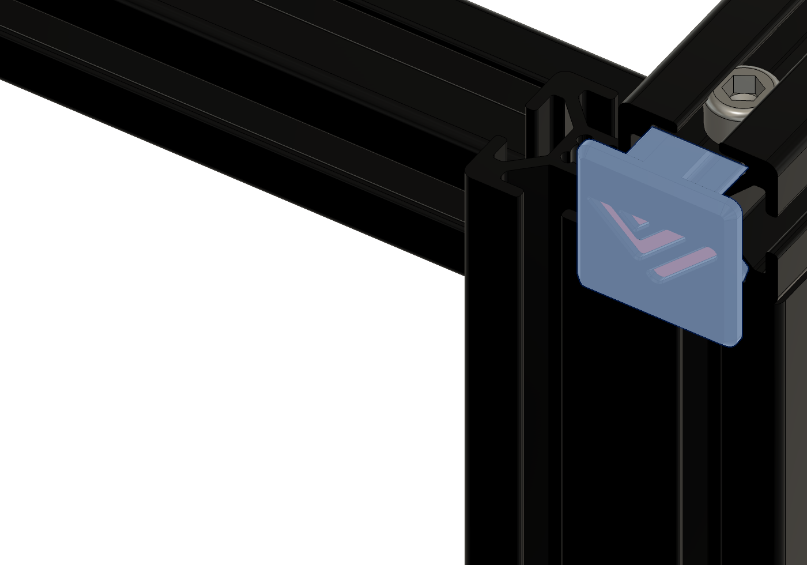 | 1) Attach frame bracers to the frame in the front left and right

 
 

### Step 9

 
 

| | |
|-|-|
|  | 1) 8x 2020 printed endpart's   2) Insert all 8 endpart's at the shown location. |
| 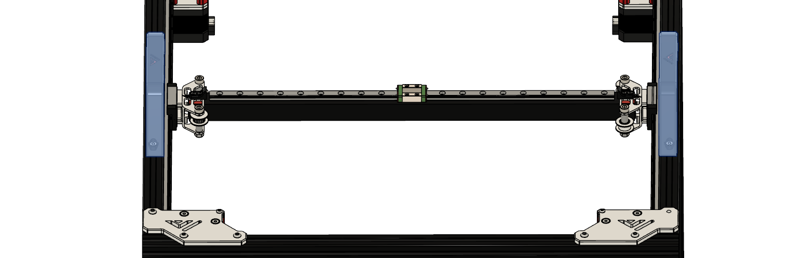 | 1) Put in the endpart's

 
 