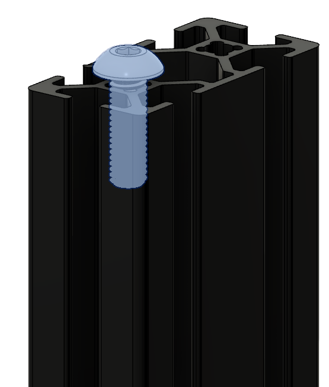
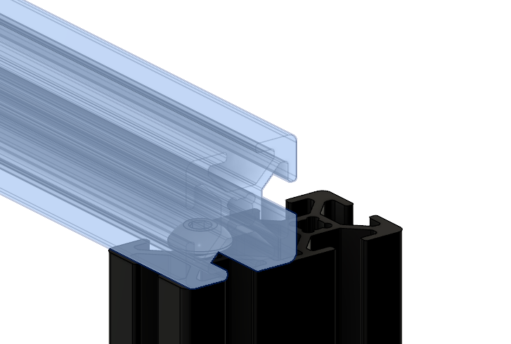
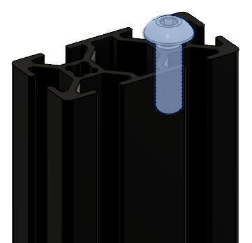
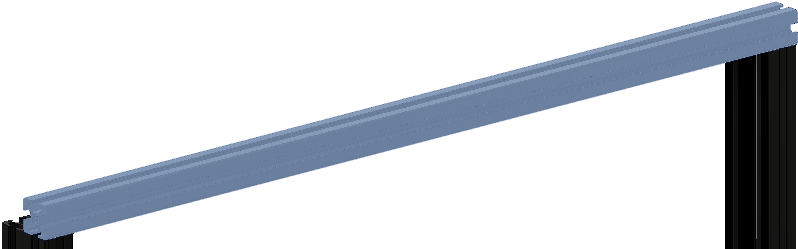
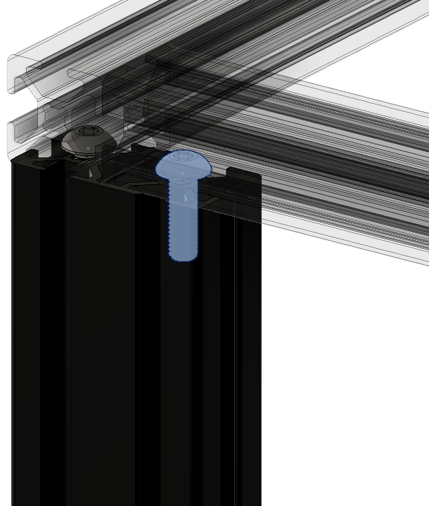
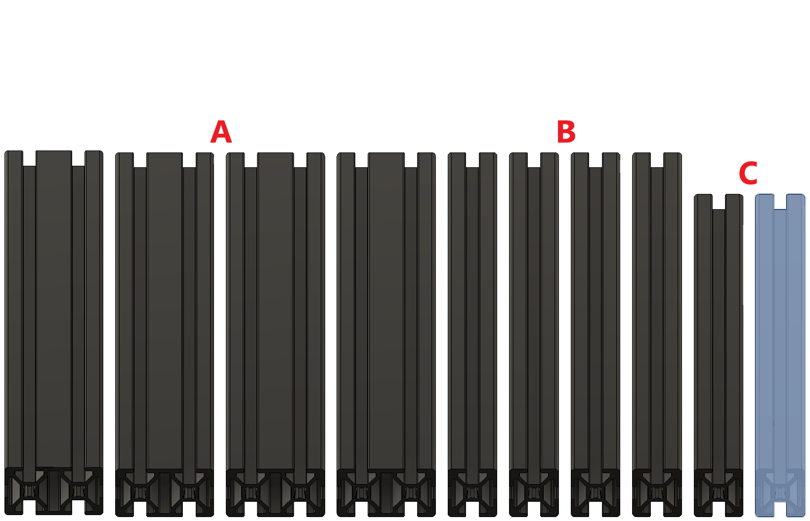
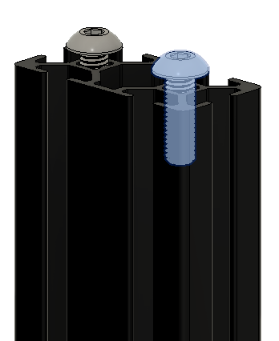

# 2. Frame

## Overview

The frame is assembled through a combination of blind joints and corner brackets. The corner brackets are to help stiffen up the frame and are optional, though we highly recommend using them on every possible corner for best results.

For detailed informations on how to assemble blind joints visit this [page](../general/blind-joints)

## STL's

<!-- Image Map Generated by http://www.image-map.net/ -->

<map name="image-map">
    <area target="_blank" alt="Bracer" title="Bracer" href="https://github.com/VzBoT3D/VzBoT-Vz330/blob/master/Assemblies%20BOM%20and%20STL/Frame/STLs/Frame_Brace.stl" coords="750,1103,1714,1586" shape="rect">
    <area target="_blank" alt="2020 endcap" title="2020 endcap" href="https://github.com/VzBoT3D/VzBoT-Vz330/blob/master/Assemblies%20BOM%20and%20STL/Frame/STLs/2020%20Endcap.stl" coords="124,705,443,1002" shape="rect">
    <area target="_blank" alt="Cable holder" title="Cable holder" href="https://github.com/VzBoT3D/VzBoT-Vz330/blob/master/Assemblies%20BOM%20and%20STL/Frame/STLs/cable%20holder%20frame%20side.stl" coords="769,612,1024,993" shape="rect">
    <area target="_blank" alt="Handles" title="Handles" href="https://github.com/VzBoT3D/VzBoT-Vz330/blob/master/Assemblies%20BOM%20and%20STL/Frame/STLs/handle.stl" coords="6,54,1752,595" shape="rect">
</map>

## Part's

| Material        | Quantity          | Notes | Identifier |
|:-------------|:------------------|:------| :------ |
|  | 4 | 2040 extrusion (530mm) | A |
|  | 4 | 2020 extrusion (530mm) | B |
|  | 4 | 2020 extrusion (460mm) | C |
|  | 8 | optional | D |
|  | 16 | - | E |

**During the assembly the part's get referenced by it's corresponding identifier specified in the part's section**

## Assembly

### Step 1

<map name="image-map">
    <area target="_blank" alt="test" title="test" href="http://www.google.de" coords="9,310,201,943" shape="rect">
</map>

| | |
|-|-|
|  | We take the **E screw** and fasten it in the outer hole of the **A extrusion**, there should be a gap between the **E screw** and the extrusion big enough to slide the **B extrusion** on.
| | |
| | |
| | |
|  | We now take the **B extrusion** and slide it on the **A extrusion** and tighten down the **E screw** just enough so that the **B extrusion** can't slide off. We will tighten up this screws later when we made sure the frame is square.|

### Step 2

| | |
|-|-|
|  | We take the **E screw** and fasten it in the outer hole of the **A extrusion**, there should be a gap between the **E screw** and the extrusion big enough to slide the **B extrusion** on.
| | |
| | |
| | |
|  | We now take the assembled part from **Step 1** and slide it on the **A extrusion** and tighten down the **E screw** just enough so that the **B extrusion** can't slide off. We will tighten up this screws later when we made sure the frame is square.

### Step 3
Repeat the steps from **Step 1** and **Step 2** for the other u-shaped side.

### Step 4

| | |
|-|-|
|  | We take the **E screw** and fasten it in the second hole of the **A extrusion**, there should be a gap between the **E screw** and the extrusion big enough to slide the **C extrusion** on.
| | |
| | |
| | |
|  | We now take the the **C extrusion** and slite it on the **A extrusion** and tighten down the **E screw** just enough so that the **C extrusion** can't slide off. We will tighten up this screws later when we made sure the frame is square.

### Step 5

| | |
|-|-|
|  | We take the **E screw** and fasten it to the other side of the u-shape in the second hole of the **A extrusion**, there should be a gap between the **E screw** and the extrusion big enough to slide the **C extrusion** on.
| | |
| | |
| | |
|  | We now take the the **C extrusion** and slite it on the **A extrusion** and tighten down the **E screw** just enough so that the **C extrusion** can't slide off. We will tighten up this screws later when we made sure the frame is square.

### Step 6

| | |
|-|-|
|  | We take the **E screw** and the second u-shape assemble and screw the **E screw** in the second hole of the **A extrusion**, there should be a gap between the **E screw** and the extrusion big enough to slide on the other assembly.
| | |
| | |
| | |
|  | We take another **E screw** and screw it in the second hole of the **A extrusion** on the other side of the one we did before, there should be a gap between the **E screw** and the extrusion big enough to slide on the other assembly.
| | |
| | |
| | |
|  | We now take the u-shape assembly and slide it in the existing part of the frame and screw down the **E screw** just enough so that the **C extrusion** can't slide off. We will tighten up this screws later when we made sure the frame is square.

### Step 7

We can take the assembly from **Step 1** to **Step 6** and flipp it upside down.

| | |
|-|-|
|  | We take the four **E screw** and screw them in the outer holes of the **A extrusions**, there should be a gap between the **E screw** and the extrusion big enough to slide on the missing **B extrusions**
| | |
| | |
| | |
|  | We now take the two remaining **B extrusions** and slide them over the inserted **E screws**. Tighten down the **E screw** just enough so that the **B extrusion** can't slide off, we let them like this because we need to adjust them later when we install the Gantry.

### Step 8

The last step for the frame is making sure that the extrusion's are mounted straight and square, when you unsured that tighten up all **E screws** beside the ones inserted in **Step 7**.