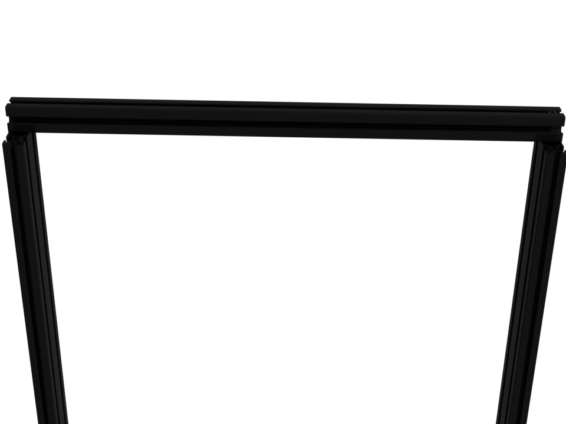
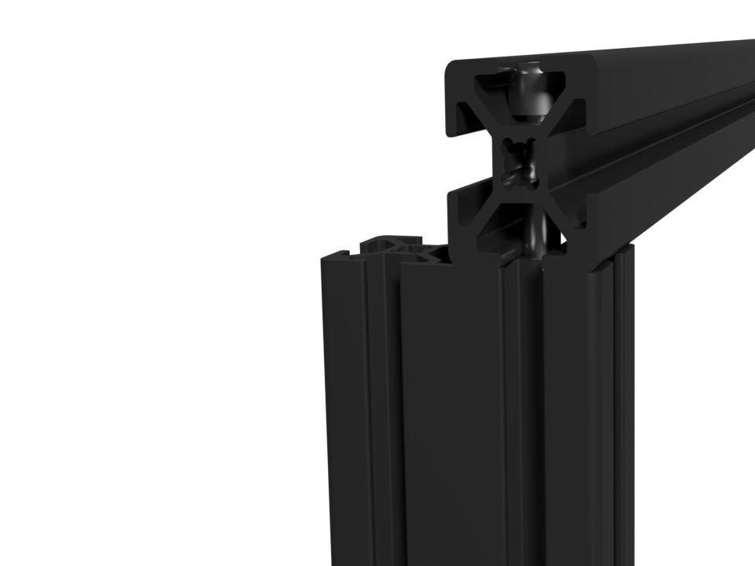
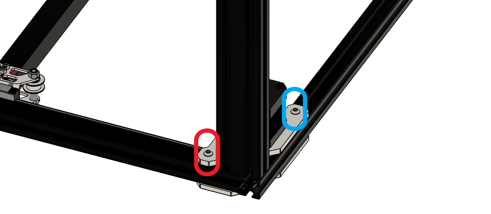
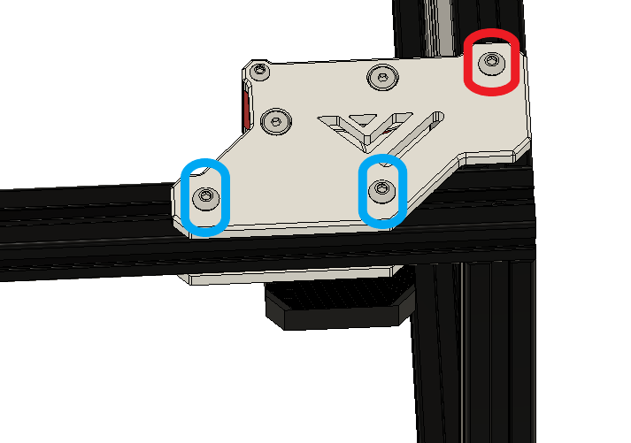
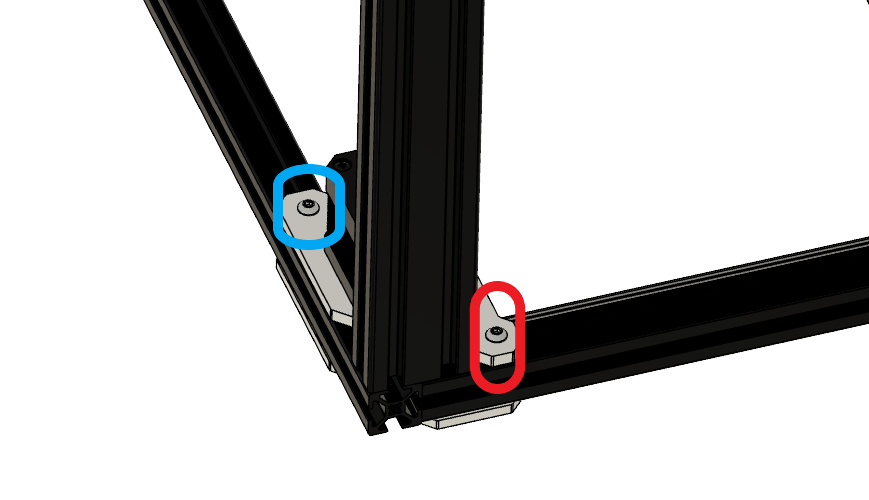
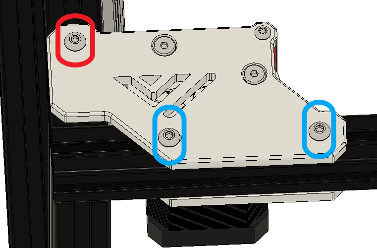
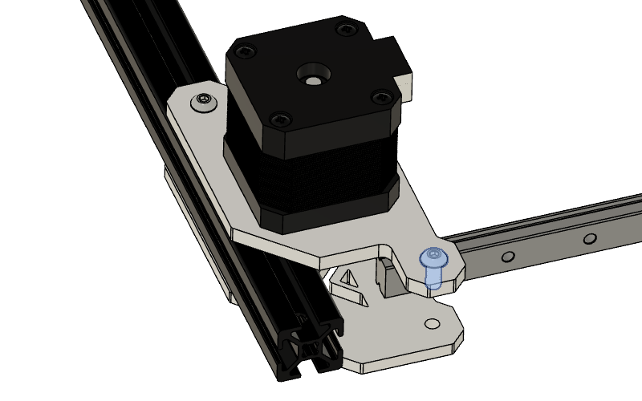
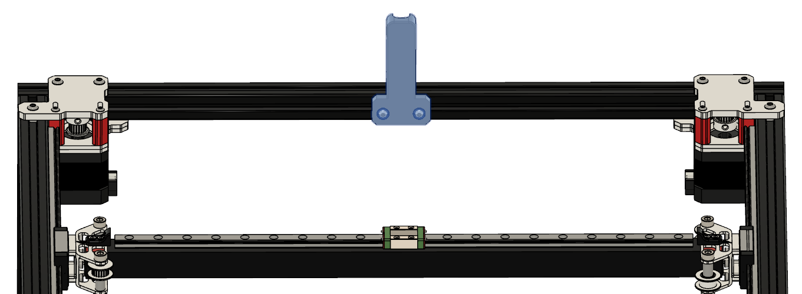
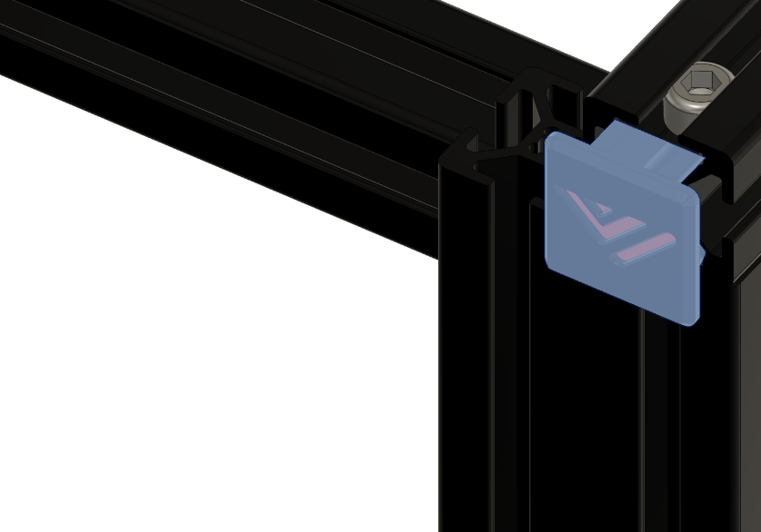

# 2. Frame

|:-|
|  |

## Parts

| Part | Location | Info |
|:-|:-|:-|
| 2040 extrusion (530)   Quantity: 4 | **Layer**: 2 |  |
| 2020 extrusion (530mm) with two holes   Quantity: 2 | **Layer**: 2 |  |
| 2020 extrusion (460mm) with two holes   Quantity: 2 | **Layer**: 2 |  |
| Preasembled gantry   Quantity: 1 | **Layer**: 1 |  |
| 2020 Corner brackets   Quantity: 1 | optional ( self sourced )|  |
| M5 x 25mm   Quantity: 16 | **Layer**: 3   **Box**: VZ330 Box 6 |  |
| M4 t-nut   Quantity: 10 | **Layer**: 3   **Box**: VZ330 Box 6 |  |
| M4 x 10mm   Quantity: 8 | **Layer**: 3   **Box**: VZ330 Box 6 |  |

## STLs

{: .highlight }
> You can click on the object you wanna print on the plate and the corresponding STL will open up.

  
  <map name="stl">
      <area target="_blank" alt="Handle" title="Handle" href="https://github.com/VzBoT3D/VzBoT-Vz330/blob/master/Assemblies%20BOM%20and%20STL/Frame/STLs/handle.stl" coords="6, 26, 696, 233" shape="rect">
      <area target="_blank" alt="2020 endcaps" title="2020 endcaps" href="https://github.com/VzBoT3D/VzBoT-Vz330/blob/master/Assemblies%20BOM%20and%20STL/Frame/STLs/2020%20Endcap.stl" coords="6, 238, 234, 423" shape="rect">
      <area target="_blank" alt="Cable Holder" title="Cable Holder" href="https://github.com/VzBoT3D/VzBoT-Vz330/blob/master/Assemblies%20BOM%20and%20STL/Frame/STLs/cable%20holder%20frame%20side.stl" coords="313, 241, 402, 396" shape="rect">
      <area target="_blank" alt="Frame stablizer" title="Frame stablizer" href="https://github.com/VzBoT3D/VzBoT-Vz330/blob/master/Assemblies%20BOM%20and%20STL/Frame/STLs/Frame_Brace.stl" coords="300, 433, 697, 699" shape="rect">
  </map>

## Video tutorial

Vz235 Build Part 1: The Frame  

[0:45](https://www.youtube.com/watch?v=d9kQt_cF3Xo&t=45s) Cutting the frame to size  
[1:17](https://www.youtube.com/watch?v=d9kQt_cF3Xo&t=77s) The frame  
[1:24](https://www.youtube.com/watch?v=d9kQt_cF3Xo&t=84s) Parts  
[4:44](https://www.youtube.com/watch?v=d9kQt_cF3Xo&t=284s) Water cooling kit  
[6:04](https://www.youtube.com/watch?v=d9kQt_cF3Xo&t=364s) Acrylic panels  
[6:49](https://www.youtube.com/watch?v=d9kQt_cF3Xo&t=409s) Aluminium parts  
[19:00](https://www.youtube.com/watch?v=d9kQt_cF3Xo&t=1140s) Bottom plate

## Step 1

|:-|
|  |

| Part | Location |
|:-|:-|
| 2040 extrusion ( 530 mm )   Quantity: 1 | **Layer**: 2 |
| 2020 extrusion ( 530mm ) with two holes   Quantity: 1 | **Layer**: 2 |
| 2020 extrusion ( 460 mm ) with two holes   Quantity: 1 | **Layer**: 2 |

|:-|:-|
|  | &#8226; Align the extrusions flush |
{: .instructiontable}

|:-|:-|
|  | &#8226; Tighten the 2020 extrusion's to the 2040 extrusion |
{: .instructiontable}

## Step 2

{: .highlight }
> Required 
>
> &#8226; Box 6 - M5 x 25mm

|:-|
|  |

| Part | Location |
|:-|:-|
| 2040 extrusion ( 530mm )   Quantity: 1 | **Layer**: 2 |
| 2020 extrusion ( 530mm ) with two holes   Quantity: 1 | **Layer**: 2 |
| 2020 extrusion ( 460mm ) with two holes   Quantity: 1 | **Layer**: 2 |
| M5 x 25mm   Quantity: 2 | **Layer**: 3   **Box**: VZ330 Box 6 |

|:-|:-|
|  | &#8226; Align the extrusions flush |
{: .instructiontable}

|:-|:-|
|  | &#8226; Tighten the 2020 extrusion's to the 2040 extrusion |
{: .instructiontable}

## Step 3

{: .highlight }
> Required
>
> &#8226; Box 6 - M5 x 25mm

|:-|
|  |

| Part | Location |
|:-|:-|
| 2040 extrusion ( 530mm )   Quantity: 1 | **Layer**: 2 |
| Assembly from Step 1 / 2   Quantity: 1 | [Part from step 2](#step-2) |
| M5 x 25mm   Quantity: 2 | **Layer**: 3   **Box**: VZ330 Box 6 |

|:-|:-|
|  | &#8226; Align the extrusions flush with the both 2020 extrusion's |
{: .instructiontable}

|:-|:-|
|  | &#8226; Tighten the 2020 extrusion's to the 2040 extrusion |
{: .instructiontable}

## Step 4

{: .highlight }
> Required
>
> &#8226; Box 6 - M5 x 25mm

|:-|
|  |

| Part | Location |
|:-|:-|
| 2040 extrusion (530mm)   Quantity: 1 | **Layer**: 2 |
| Assembly from Step 3   Quantity: 1 | [Part from step 3](#step-3) |
| M5 x 25mm   Quantity: 1 | **Layer**: 3   **Box**: VZ330 Box 6 |

|:-|:-|
|  | &#8226; Align the extrusions flush with the both 2020 extrusion's |
{: .instructiontable}

|:-|:-|
|  | &#8226; Tighten the 2020 extrusion's to the 2040 extrusion |
{: .instructiontable}

## Step 5

| Part | Location |
|:-|:-|
| Preasembled gantry   Quantity: 1 | **Layer**: 1 |

|:-|:-|
|     | &#8226; Remove red marked screw   &#8226; Losen blue screw   &#8226; Slide assembly to the left   &#8226; Remove the printed 2040 extrusion |
{: .instructiontable}

|:-|:-|
|     | &#8226; Remove red marked screw   &#8226; Losen blue screw   &#8226; Slide assembly to the right   &#8226; Remove the printed 2040 extrusion |
{: .instructiontable}

|:-|:-|
|  | &#8226; Remove selected part from assembly |
{: .instructiontable}

|:-|:-|
|  | &#8226; Remove printed 2040 extrusion part from the assembly |
{: .instructiontable}

|:-|:-|
|  | &#8226; Put preassembled assembly on the frame   &#8226; Loosen all screws on the back motor mounts   &#8226; Align extrusions   &#8226; Screw down M5 x 25mm screws   &#8226; Tighten screws on the motor mount again |
{: .instructiontable}

|:-|:-|
|  | &#8226; Add screw + t-nut to the bottom part of the idler on the left and right side.
{: .instructiontable}

|:-|:-|
|  | &#8226; Put second part on the frame   &#8226; Align extrusions   &#8226; Screw down M5x25mm screws |
{: .instructiontable}

|:-|:-|
|  | &#8226; Insert M4 Screw + t-nut in the upper part on the right / left side   &#8226; Tighten the front motor mounts  |
{: .instructiontable}

## Step 6 (optional)

| Part | Location |
|:-|:-|
| 2020 corner brackets   Quantity: 6 | - |
| M4 x 10mm   Quantity: 12 | - |
| M4 t-nut   Quantity: 12 | - |

|:-|:-|
|  | &#8226; Insert screws and add t-nut |
{: .instructiontable}

|:-|:-|
|  | &#8226; Attach corner brackets to the frame, at the shown locations
{: .instructiontable}

## Step 7

|:-|:-|
|  | &#8226; Meassure from corner to corner ( yellow and red line )   &#8226; The distance should be the same for the red and the yellow line.   &#8226; Do this for all side's of the printer |
{: .instructiontable}

## Step 8

{: .highlight }
> Required
>
> &#8226; Box 6 - M4 x 10mm  
> &#8226; Box 6 - M4 t-nut

| Part | Location |
|:-|:-|
| M4 x 10mm   Quantity: 4 | **Layer**: 3   **Box**: VZ330 Box 6 |
| M4 t-nut   Quantity: 4 | **Layer**: 3   **Box**: VZ330 Box 6 |
| Printed frame bracers   Quantity: 2 | [STLs](#stls) |

|:-|:-|
|  | &#8226; Insert screws and add t-nut for both parts |
{: .instructiontable}

|:-|:-|
|  | &#8226; Attach frame bracers to the frame in the front left and right
{: .instructiontable}

## Step 9

{: .highlight }
> Required 
>
> &#8226; Box 6 - M4 x 10mm  
> &#8226; Box 6 - M4 t-nut

| Part | Location |
|:-|:-|
| M4 x 10mm   Quantity: 4 | **Layer**: 3   **Box**: VZ330 Box 6 |
| M4 t-nut   Quantity: 4 | **Layer**: 3   **Box**: VZ330 Box 6 |
| Printed handles   Quantity: 2 | [STLs](#stls) |

|:-|:-|
|  | &#8226; Insert screws and add t-nut for both parts |
{: .instructiontable}

|:-|:-|
|  | &#8226; Attach handles to the left and right side of the frame and center them |
{: .instructiontable}

## Step 10

{: .highlight }
> Required
>
> &#8226; Box 6 - M4 x 10mm  
> &#8226; Box 6 - M4 t-nut

| Part | Location |
|:-|:-|
| M4 x 10mm   Quantity: 4 | **Layer**: 3   **Box**: VZ330 Box 6 |
| M4 t-nut   Quantity: 4 | **Layer**: 3   **Box**: VZ330 Box 6 |
| Printed cable holder   Quantity: 2 | [STLs](#stls) |

|:-|:-|
|  | &#8226; Insert screws and add t-nut |
{: .instructiontable}

|:-|:-|
|  | &#8226; Attach cable holder to the back of the frame and center it. |
{: .instructiontable}

## Step 11

| Part | Location |
|:-|:-|
| Printed endpart's   Quantity: 8 | [STLs](#stls) |

|:-|:-|
|  | &#8226; Insert all 8 endpart's at the shown location. |
{: .instructiontable}

|:-|:-|
|  | &#8226; Put in the endpart's
{: .instructiontable}
