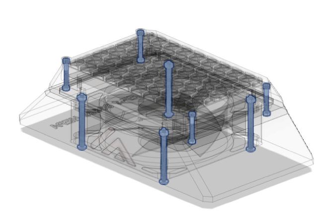
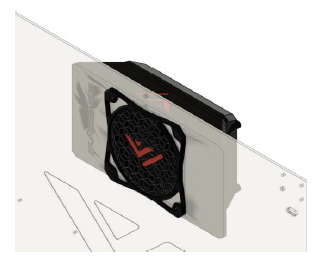

# 6. Fume extractor

## Overview

 

The VzBot fume extractor is an optional piece of hardware but highly recommended! This device gets rid of VOC’s (volatile organic compounds) and nasty smells that come from printing ABS filament.

## BOM

| Material        | Quantity          | Notes |
|:-------------|:------------------|:------|
| M3 25mm ( button head ) | 4 | - |
| M3 nut | 4 | - |
| M4 50mm ( button head ) | 4 | - |
| M4 nut | 8 | - |
| 120x120x38 fan | 1 | - |
| HEPA filter (self-cut) | 1 | Available for kitchen applications |
| Activated carbon filter (self-cut) | 1 | - |

## STL's

 

| File name | Amount to print | Note |
|-----------|-----------------|------|
| <a href="https://github.com/VzBoT3D/VzBoT-Vz330/blob/master/Assemblies%20BOM%20and%20STL/enclosure/Exhaust%20filter%20-%20Fume%20extractor/Exhaust%20fan%20guard/Exaust%20fan%20guard%20frame.stl" target="_blank">Fan guard</a> | 1 | - |
| <a href="https://github.com/VzBoT3D/VzBoT-Vz330/blob/master/Assemblies%20BOM%20and%20STL/enclosure/Exhaust%20filter%20-%20Fume%20extractor/Exhaust%20fan%20guard/Exaust%20fan%20guard%20center%20trim.stl" target="_blank">Fan guard insert</a> | 1 | - |
| <a href="https://github.com/VzBoT3D/VzBoT-Vz330/blob/master/Assemblies%20BOM%20and%20STL/enclosure/Exhaust%20filter%20-%20Fume%20extractor/Exhaust%20filter%20housing/STLs/Exhaust%20fan%20housing.stl" target="_blank">Exhaust fan housing</a> | 1 | - |
| <a href="https://github.com/VzBoT3D/VzBoT-Vz330/blob/master/Assemblies%20BOM%20and%20STL/enclosure/Exhaust%20filter%20-%20Fume%20extractor/Exhaust%20filter%20housing/STLs/exhaust%20middle%20cover%2015mm%20Hepa%20filter.stl" target="_blank">HEPA holder 15mm</a> | 1 | Print if your HEPA is 15mm "strong" |
| <a href="https://github.com/VzBoT3D/VzBoT-Vz330/blob/master/Assemblies%20BOM%20and%20STL/enclosure/Exhaust%20filter%20-%20Fume%20extractor/Exhaust%20filter%20housing/STLs/exhaust%20middle%20cover%2010mm%20Hepa%20filter.stl" target="_blank">HEPA holder 10mm</a> | 1 | Print if your HEPA is 10mm "strong" |
| <a href="https://github.com/VzBoT3D/VzBoT-Vz235/blob/main/Assemblies%20%26%20STL/Frame/Frame%20brace.stl" target="_blank">Exhaust cover</a> | 1 |

### Step 1
Start by inserting all the M4 and M3 nuts into the exhaust cover like shown below
 

### Step 2
Next put the two fans in the exhaust fan housing, put the fan cover on the back panel and mount the exhaust housing, exhaust cover and fans with the M4 hardware.
 

### Step 3
Lastly Insert you HEPA filter and activated carbon filter in the HEPA_holder and screw onto the main fume extractor housing. The activated carbon filter
