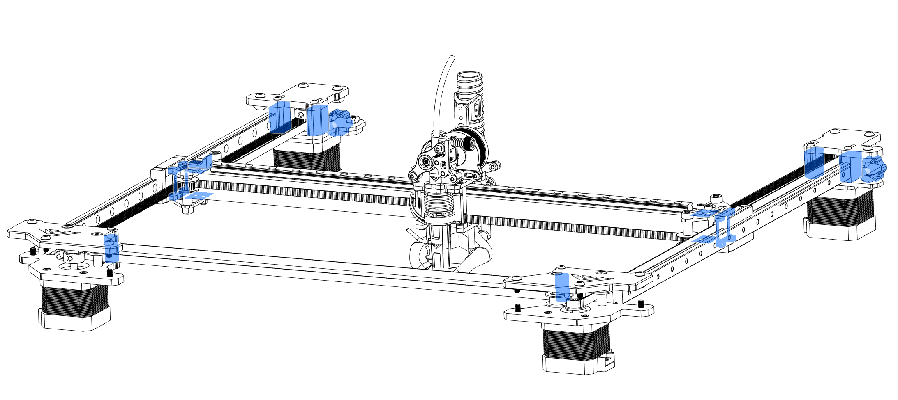

# 4. Gantry

## Overview

 

**Gantry comes pre-assembled with printed parts in PLA that are for transportation only. It should not be used on the printer. You can easily replace the parts without disassembling the whole thing.**

## STL's XY joiner

| File name | Amount to print | Note |
|-----------|-----------------|------|
| <a href="https://github.com/VzBoT3D/VzBoT-Vz330/blob/master/Assemblies%20BOM%20and%20STL/Gantry/Y%20gantry/Aluminum%20Y%20Gantry/STLs/spacer_alu_Y_gantry_0.5mm.stl" target="_blank">Y gantry tube spacers</a> | 4 | Only needed if the tube is not big enough and has play ( use as much as needed to get a good fit ) |
| <a href="https://github.com/VzBoT3D/VzBoT-Vz330/blob/master/Assemblies%20BOM%20and%20STL/Gantry/X%20Carbon%20fiber%20tube%20%2B%20rail/STLs/cf%20tube%20end.stl" target="_blank">Carbon fiber tube ends</a> | 2 | Goes inside the tube to avoid crushing it while torquing |
| <a href="https://github.com/VzBoT3D/VzBoT-Vz330/blob/master/Assemblies%20BOM%20and%20STL/Gantry/Y%20gantry/Aluminum%20Y%20Gantry/STLs/XendStop.stl" target="_blank">X limit switch stopper</a> | 1 | - |
| <a href="https://github.com/VzBoT3D/VzBoT-Vz330/blob/master/Assemblies%20BOM%20and%20STL/Gantry/Y%20gantry/Aluminum%20Y%20Gantry/STLs/XendStop.stl" target="_blank">Y gantry spacer</a> | 2 | newer kit has those in CNC aluminum, so no need to print |

On how to print the files for this printer please refer to [print settings](../general/print-settings)

## STL's rear motor mounts

| File name | Amount to print | Note |
|-----------|-----------------|------|
| <a href="https://github.com/VzBoT3D/VzBoT-Vz330/blob/master/Assemblies%20BOM%20and%20STL/Gantry/Motor%20Mounts/Aluminum/Left%20Motor%20Mount/STLs/Spacer%20frame%20side.stl" target="_blank">Spacer frame side</a> | 2 | - |
| <a href="https://github.com/VzBoT3D/VzBoT-Vz330/blob/master/Assemblies%20BOM%20and%20STL/Gantry/Motor%20Mounts/Aluminum/Left%20Motor%20Mount/STLs/Spacer%20inner%20side.stl" target="_blank">Spacer inner side</a> | 2 | - |
| <a href="https://github.com/VzBoT3D/VzBoT-Vz330/blob/master/Assemblies%20BOM%20and%20STL/Gantry/Motor%20Mounts/Aluminum/Left%20Motor%20Mount/STLs/knob.stl" target="_blank">Tension adjustment knob</a> | 2 | - |
| <a href="https://github.com/VzBoT3D/VzBoT-Vz330/blob/master/Assemblies%20BOM%20and%20STL/Gantry/Motor%20Mounts/Aluminum/Left%20Motor%20Mount/STLs/knob-cap.stl" target="_blank">Cap for tension adjustment knob</a> | 2 | - |

On how to print the files for this printer please refer to [print settings](../general/print-settings)

## STL's front motor mounts

| File name | Amount to print | Note |
|-----------|-----------------|------|
| <a href="https://github.com/VzBoT3D/VzBoT-Vz330/blob/master/Assemblies%20BOM%20and%20STL/Gantry/Front%20Idler-motor%20mounts%20AWD/Alu%20version/20mmSpacer.stl" target="_blank">Spacers</a> | 2 | - |

On how to print the files for this printer please refer to [print settings](../general/print-settings)

### Replace Parts

Next step is replacing all the pla printed parts with the parts from above, if this is done place the assembly on the frame and bolt down the upper part of the frame.s