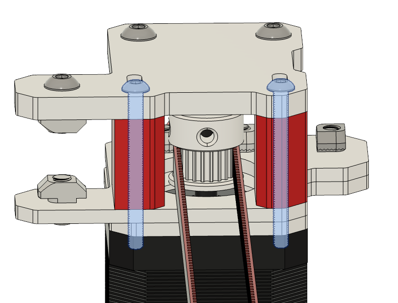
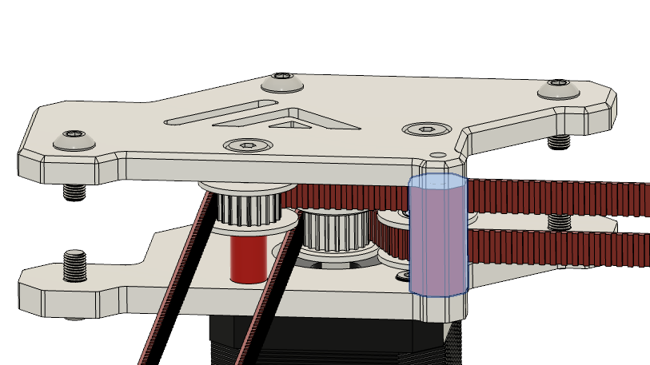
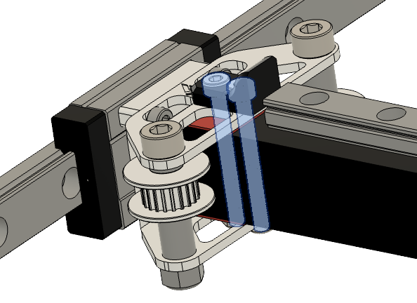
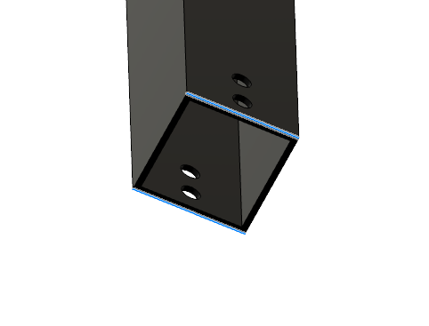

# STLs

{: .highlight }
> Do this for both back motor mounts

## Step1 

### Notes

|:-|
|  |

| Part | Location |
|:-|:-|
| Part 1   Quantity: 1 | [STL](#stls) |
| Part 2   Quantity: 1 | [STL](#stls) |

 

### Instructions

|:-|:-|
|  | &#8226; Remove the two M3 x 35mm screws from the motor mount. |
{: .instructiontable}

|:-|:-|
|  | &#8226; Remove the two highlighted PLA parts with the ABS ones.   &#8226; Screw back in the two M3 x 35mm screws.
{: .instructiontable}

 

{: .highlight }
> Do this for both front motor mounts

## Step 2

### Notes

|:-|
|  |

| Part | Location |
|:-|:-|
| Part 1   Quantity: 1 | [STL](#stls) |

 

### Instructions

|:-|:-|
|  | &#8226; Remove the two M3 x 30mm screws from the motor mount. |
{: .instructiontable}

|:-|:-|
|  | &#8226; Unscrew the two mitsumi shoulder bolts a bit. |
{: .instructiontable}

|:-|:-|
|  | &#8226; Remove the spacer and replace it with the ABS one   &#8226; Screw back in the m3 x 30mm screw   &#8226; Tighten the mitsumi shoulder bolts again. |
{: .instructiontable}

 

## Step 3

### Notes

|:-|
|  |

| Part | Location |
|:-|:-|
| Spacer   Quantity: 1 | [STL](#stls) |

 

### Instruction

|:-|:-|
|  | &#8226; Remove the two M3 screws on each side from the gantry part   &#8226; Slide the cf tube out of the gantry by tilting it. |
{: .instructiontable}

|:-|:-|
|  | &#8226; Messaure the height of your CF tube and substract it from 21 mm.   &#8226; Divide it then by two and print four spacers in that thickness.   &#8226; If you want to be super precicise do the same thing for the other side. And print each messaured thickness twice. |
{: .instructiontable}

|:-|:-|
|  | &#8226; Insert the created spacer's like shown and assemble the gantry with the m3 screws again. |
{: .instructiontable}
