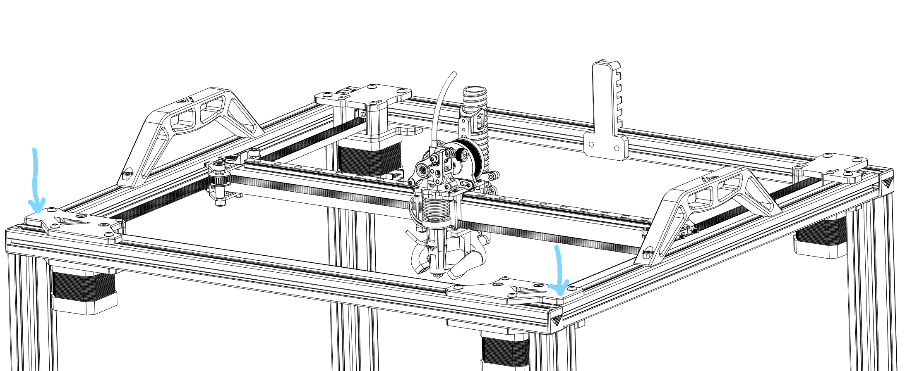

# 4.1 Y limit switch
## Overview

## Assembly

The motor/idler mounts may have been assembled the wrong position for the idlers. Refer to the CAD model [here](https://a360.co/3Q0ueRY) to make sure they are properly installed. Also something that we didn’t think about for the pre-assembled gantry, is that you will need to unbolt the front motor/idler full assembly in order to access the M5 frame bolt on both sides (refer to screen shot here). No need to disassemble the whole assembly, just remove the bolts that holds both aluminum plates to the frame so you can remove the whole assembly as one.   

**A good practice here on the 4 motors would be to make sure that motor gears are bolted to motor shaft on the round side of the shaft and NOT using the D cut out (the flat portion of the shaft) before you install the belts. This will help your later to sync all motors together. If the gears are installed on the D cut, then synching is impossible to achieve. Gears need to be able to adjust their position on the shaft. The build manual will explain you how to sync the motors later [here](./awd_motor)**