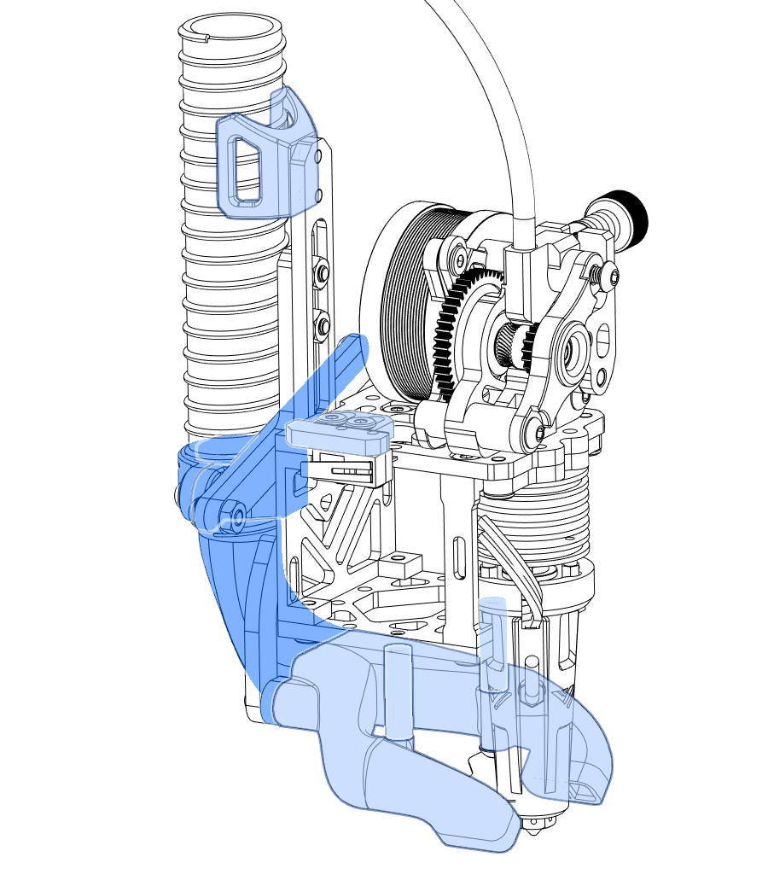
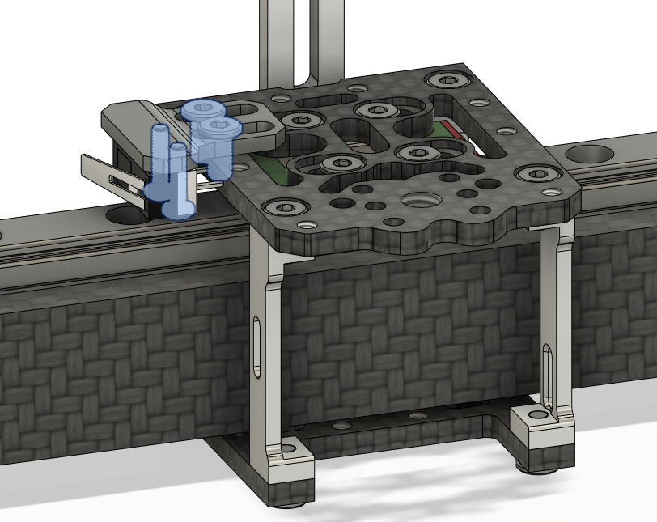
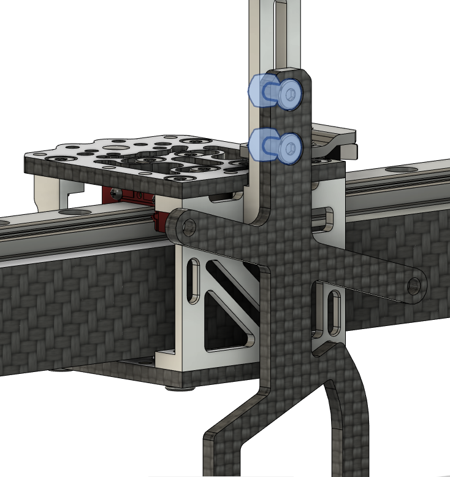
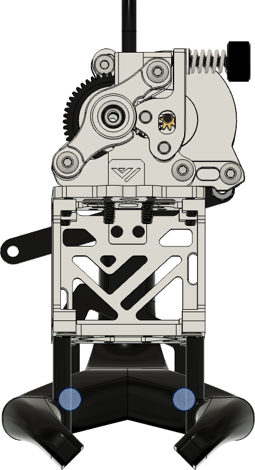
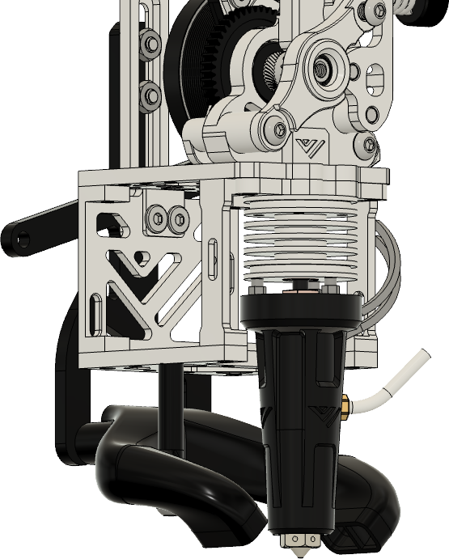
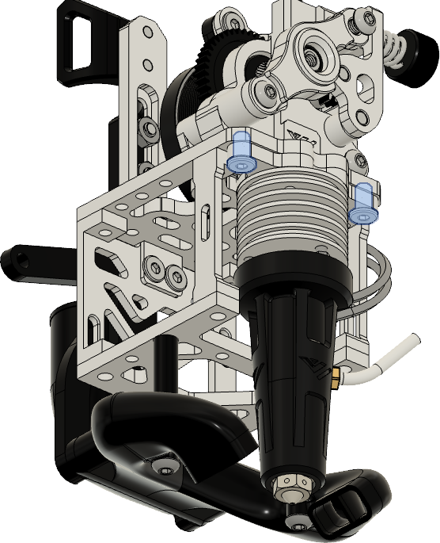

 

# Parts

| Part | Location | Info |
|:-|:-|:-|
| M3 x 5mm   Quantity: 4 | **Layer**: 3   **Box**: VZ330 Box 6 | |
| TODO | |

# STLs

| File name | Amount to print | Note |
|-----------|-----------------|------|
| <a href="https://github.com/VzBoT3D/Vz-Printhead-CNC/blob/main/STLs/X-endstop-mount.stl" target="_blank">X end stop switch mount</a> | 1 | - |
| <a href="https://github.com/VzBoT3D/Vz-Printhead-CNC/blob/main/STLs/cable_holder.stl" target="_blank">Cable Holder</a> | 1 | - |
| <a href="https://github.com/VzBoT3D/Vz-Printhead-CNC/blob/main/STLs/fan%20duct%20lower%20Goliath%20long.stl" target="_blank">Fan duct Goliath</a> | 1 | Pick this if no beacon is used |
| <a href="https://github.com/VzBoT3D/Vz-Printhead-CNC/blob/main/STLs/fan%20duct%20lower%20Goliath%20short%20with%20Beacon.stl" target="_blank">Fan duct Goliath ( beacon )</a> | 1 | Use this duct for Goliath and beacon |
| <a href="https://github.com/VzBoT3D/Vz-Printhead-CNC/blob/main/STLs/fan%20duct%20lower%20Goliath%20spacers.stl" target="_blank">Fan duct Goliath spacers</a> | 1 | - |
| <a href="https://github.com/VzBoT3D/Vz-Printhead-CNC/blob/main/STLs/CPAP%20turbo%20cooling%20system/STLs/upper%20duct.stl" target="_blank">Fan duct upper</a> | 1 | - |
| <a href="https://github.com/VzBoT3D/Vz-Printhead-CNC/blob/main/STLs/CPAP%20turbo%20cooling%20system/STLs/upper%20duct%20mount.stl" target="_blank">Upper duct mount</a> | 1 | - |
| <a href="https://github.com/VzBoT3D/Vz-Printhead-CNC/blob/main/STLs/CPAP%20turbo%20cooling%20system/STLs/c-clamp.stl" target="_blank">Upper duct cpcp c clamp</a> | 1 | - |
| <a href="https://github.com/VzBoT3D/Goliath/blob/main/STL/Air%20Cool%20Fan%20duct/Fan%20duct%202510-With%20flange%20for%20Vz-Printhead%20CNC.stl" target="_blank">Goliath 2410 fan duct</a> | 1 | - |

# Assembly

## Step 1

### Notes

{: .highlight }
> Required
>
> &#8226; Box 6 - M3 x 6mm  
> &#8226; Box C

| Part | Location
|:-|:-|
| M3 x 6mm   Quantity: 4 | **Layer**: 3   **Box**: VZ330 Box 6 |
| Back part of printhead | **Layer**: 3   **Box**: VZ330 Box C |
| Cable Holder | [STLs](#stls) |
| Printhead cable holder | [STLs](#stls) |

 

### Instructions

|:-|:-|
|  | &#8226; Screw on the printhead cable holder with two M3 x 6mm screws   &#8226; Attach the printed cable holder to the top with two M3 x 6mm screws.
{: .instructiontable}

 

## Step 2

### Notes

{: .highlight }
> Required
>
> &#8226; Box 6 - M3 x 6mm  
> &#8226; Box 6 - M3 x 5mm  
> &#8226; Box C

| Part | Location
|:-|:-|
| M3 x 6mm   Quantity: 8 | **Layer**: 3   **Box**: VZ330 Box 6|
| M3 x 5mm   Quantity: 4 | **Layer**: 3   **Box**: VZ330 Box 6 |
| Part from step 1 | [Part from step 1](#step-1) |
| Top plate | **Layer**: 3   **Box**: VZ330 Box C |
| Bottom plate | **Layer**: 3   **Box**: VZ330 Box C |
| Side pieces | **Layer**: 3   **Box**: VZ330 Box C |

 

### Instructions

{: .warning }
> Important
>
> The spacer need to be installed like shown in the picture, be careful otherwise the belt routing will not work.

|:-|:-|
|  | &#8226; Screw on the top plate to the carriage with the four M3 x 5mm screws   &#8226; Install the back part from step 1 to the top plate with the two M3 x 6mm screws   &#8226; Install the front spacers with two M3 x 6mm screws   &#8226; Install the bottom plate to the assembly with four M3 x 6mm screws.
{: .instructiontable}

 

## Step 3

### Notes

{: .highlight }
> Required
>
> &#8226; Box 6 - M3 x 6mm  
> &#8226; Box 6 - M2 x 8mm

| Part | Location |
|:-|:-|
| M3 x 6mm   Quantity: 2 | **Layer**: 3   **Box**: VZ330 Box 6 |
| M2 x 8mm   Quantity: 2 | **Layer**: 3   **Box**: VZ330 Box 6 |

 

### Instructions

|:-|:-|
|  | &#8226; Screw on the printhead cable holder with two M3 x 6mm screws   &#8226; Attach the printed cable holder to the top with two M3 x 6mm screws.
{: .instructiontable}

 

## Step 4

### Notes

{: .highlight }
> Required
>
> &#8226; Box 6 - M3 x 6mm  
> &#8226; Box 6 - M3 t-nut

| Part | Location
|:-|:-|
| M3 x 6mm   Quantity: 2 | **Layer**: 3   **Box**: VZ330 Box 6 |
| M3 nut   Quantity: 2 | **Layer**: 3   **Box**: VZ330 Box 6 |
| Part from step 3 | [Part from step 3](#step-3) |
| Fan holder | [STL](#stls) |

 

### Instructions

|:-|:-|
|  | &#8226; Screw on the printhead fan holder to the assembly with two M3 x 6mm screws and M3 nuts.
{: .instructiontable}

## Step 5

### Notes

{: .highlight }
> Required
>
> &#8226; Box 2

| Part | Location
|:-|:-|
| GT2 belt   Quantity: 1 | **Layer**: 1   **Box**: VZ330 Box 2 |
| Belt clips   Quantity: 2 | [STL](#stls) |

 

### Instructions

|:-|:-|
|  | &#8226; Insert the first belt like so ( watch the video linked below for more details.)

|:-|:-|
|  | &#8226; Insert the second belt like so ( watch the video linked below for more details.) |

|:-|:-|
|  | &#8226; Make sure the motor's in the back are in the loosest position possible, moved to the front of the motor mount. |
{: .instructiontable}

 

## Step 6

### Notes

{: .highlight }
> Required
>
> &#8226; Box 6 - M3 x 10mm  
> &#8226; Box 6 - M3 x 30mm

| Part | Location |
|:-|:-|
| M3 x 10mm   Quantity: 2 | **Layer**: 3   **Box**: VZ330 Box 6 |
| M3 x 30mm   Quantity: 2 | **Layer**: 3   **Box**: VZ330 Box 6 |
| M3 heat insert   Quantity: 2 | self source |
| Fanduct   Quantity: 1 | [STL's](#stls) |
| xx   Quantity: 1 | [STL's](#stls) |

 

### Instructions

|:-|:-|
|   | &#8226; Insert the heat insert's in the back holes of the fanduct |
{: .instructiontable}

|:-|:-|
|   | &#8226; Screw on the fan duct with the cpap connector to the printhead, with the M3 x 10mm screws. |
{: .instructiontable}

|:-|:-|
|   | &#8226; Use the printed spacers and the M3 x 30mm screws to secure and stabilize the duct to the printhead. |
{: .instructiontable}

## Step 7

### Notes

{: .highlight }
> Required
>
> &#8226; Box 6 - M3 x 6mm

|:-|
|  |

| Part | Location |
|:-|:-|
| M3 x 6mm (ultra low profile )   Quantity: 2 | **Layer**: 3   **Box**: VZ330 Box 6 |

 

### Instructions

|:-|:-|
|   | &#8226; Attach the preassembled extruder to the printhead with the M3 x 5mm ( ultra low profile ) screws |
{: .instructiontable}

 

## Step 8

### Notes

{: .highlight }
> Required
>
> &#8226; Box 6 - M2.5 x 5mm  
> &#8226; Box 6 - M3 x 6mm  
> &#8226; Box C

|:-|
|  |

| Part | Location |
|:-|:-|
| M2.5 x 5mm (ultra low profile )   Quantity: 2 | **Layer**: 3   **Box**: VZ330 Box 6 |
| M3 x 6mm (ultra low profile )   Quantity: 4 | **Layer**: 3   **Box**: VZ330 Box 6 |
| PFTE Tube (22mm)   Quantity: 1 | self source |
| Goliath Hotend   Quantity: 1 | **Layer**: 3   **Box**: VZ330 Box C |
| Adapter plate   Quantity: 1 | **Layer**: 3   **Box**: VZ330 Box C |

 

### Instructions

### NOTE: Before assembling the Goliath hotend to the printhead, make sure you have applied thermal paste between the heatbreak and the heatsink. Also make sure that all screws are tight and that heatbreak is tight on the heatblock. Please refer to this [article](https://github.com/VzBoT3D/Goliath/tree/main/Instructions)

|:-|:-|
|   | &#8226; Attache the adapter plate to the goliath hotendend with the M2.5 x 5mm ?? mm screws. |
{: .instructiontable}

|:-|:-|
|   | &#8226; Slide on the printed fanholder to the goliath hotend    &#8226; Insert the 22mm pfte tube into the goliath on top   &#8226; Screw on the goliath to the printhead with the M3 x 6mm |
{: .instructiontable}

 
