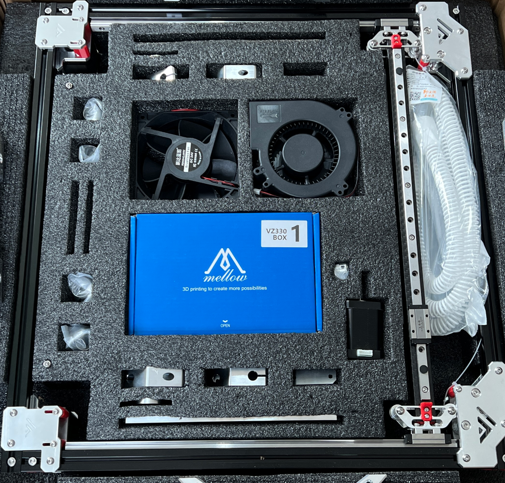

# 1. Preparation

## Tools

The following tool's you will need to build up your VzBoT330 from a mellow kit:

* Tool 1
* Tool 2
* Tool 3

## Content

The following part's are included in the kit

TODO

## STL's

The following part's you need to print to build up your VzBoT330 follow the settings on [print settings](../general/print-settings)

TODO