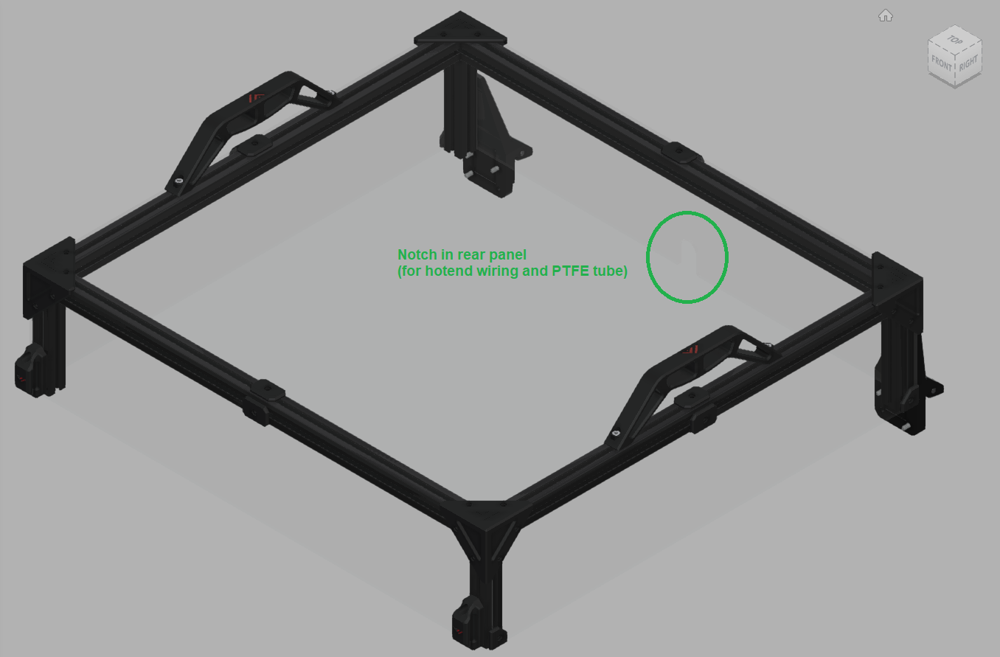
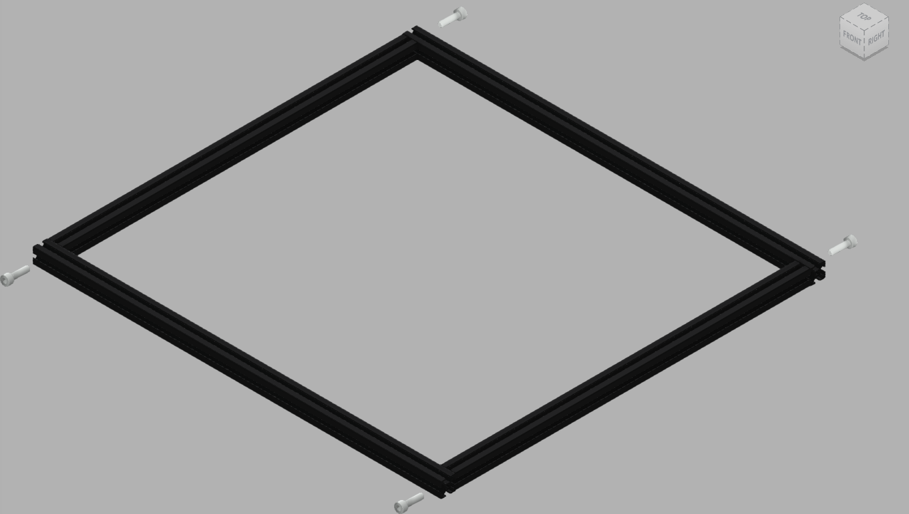

# 9. Top cover and doors panels

## Overview
A finished top cover ('Top Hat') looks like this.
|:-|
|  |

## Parts

| Part | Location | Info |
|:-|:-|:-|

| 2020 extrusion (530mm) with two holes   Quantity: 2 | **Layer**: 2 |  |
| 2020 extrusion (460mm)   Quantity: 2 | **Layer**: 2 |  |
| 2020 extrusion (100mm)   Quantity: 4 | **Layer**: 2 |  |

| M5 x 25mm   Quantity: 4 | **Layer**: 3   **Box**: VZ330 Box 6 |  |
| M4 t-nut   Quantity: 12 |||
| M4 x 10mm   Quantity: 8 |||
| M3 t-nut   Quantity: 36 (NOTE: Use roll-in type if available) |||
| M3 x 10mm   Quantity: 36 |||
| 4mm x 50mm pin   Quantity: 2 |||

## STLs

(in order of appearance)
* (Enclosure/Panel Trim) Trim - Top Cover corner x4.stl
* (Enclosure/Panel Trim) Trim - centre x16.stl (x8 are used here)
* (Enclosure/Panel Trim) Trim - Top Cover lower side corner x4.stl
* (Enclosure/Panel Trim) Top cover front handle x2.stl
* (Top Hinges) Left top.stl
* (Top Hinges) Right top.stl
* (Top Hinges) Left middle.stl
* (Top Hinges) Right middle.stl
* (Frame) handle x4.stl (x2 are used here)

## Step 1

|:-|:-|
|  | &#8226; Fasten the top frame extrusions with 4x M5 x 25mm bolts |
{: .instructiontable}
