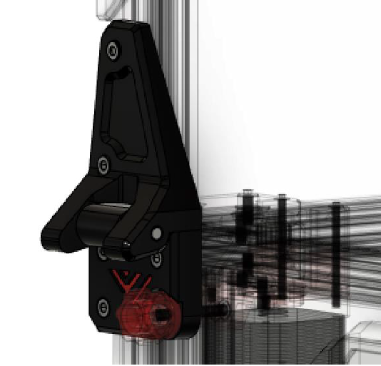
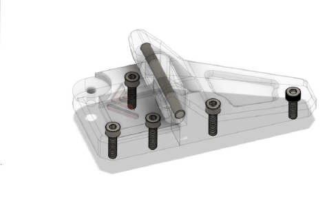

# 9.1 Top Cover hinges

## Overview

## BOM

| Material         | Quantity | Notes            |
|:-----------------|:---------|:-----------------|
| 5mm x 50mm shaft | 2        | -                |
| M4 14mm or 15mm  | 8        | -                |
| M4 12mm          | 2        | The top two ones |
| M4 t-nut         | 10       | -                |

## STL's

| File name        | Amount to print |
|------------------|-----------------|
| [Left top][]     | 1               |
| [Left middle][]  | 1               |
| [Left bottom][]  | 1               |
| [Right top][]    | 1               |
| [Right middle][] | 1               |
| [Right bottom][] | 1               |

### Step 1

Attach both top parts to the enclosure lid if using F3ds kit there should be pre-drilled holes.

### Step 2

Attach bottom part loosely.

### Step 3

Connect the middle part on both sides to your lid with the 5mm shaft.

### Step 4

Place the lid on top of your VzBot and slot the middle pieces in to the bottom parts and finally tighten the bottom part

### Step 5

Repeate **Step 1 - 4** for the second hinge

### Step 6

Assemble the head "frame" ..... TODO

[Left bottom]: https://github.com/VzBoT3D/VzBoT-Vz330/blob/master/Assemblies%20BOM%20and%20STL/enclosure/Top%20cover%20hinges%20with%20tensioner/STLs/Left%20bottom.stl
[Left middle]: https://github.com/VzBoT3D/VzBoT-Vz330/blob/master/Assemblies%20BOM%20and%20STL/enclosure/Top%20cover%20hinges%20with%20tensioner/STLs/Left%20middle.stl
[Left top]: https://github.com/VzBoT3D/VzBoT-Vz330/blob/master/Assemblies%20BOM%20and%20STL/enclosure/Top%20cover%20hinges%20with%20tensioner/STLs/Left%20top.stl
[Right bottom]: https://github.com/VzBoT3D/VzBoT-Vz330/blob/master/Assemblies%20BOM%20and%20STL/enclosure/Top%20cover%20hinges%20with%20tensioner/STLs/Right%20bottom.stl
[Right middle]: https://github.com/VzBoT3D/VzBoT-Vz330/blob/master/Assemblies%20BOM%20and%20STL/enclosure/Top%20cover%20hinges%20with%20tensioner/STLs/Right%20middle.stl
[Right top]: https://github.com/VzBoT3D/VzBoT-Vz330/blob/master/Assemblies%20BOM%20and%20STL/enclosure/Top%20cover%20hinges%20with%20tensioner/STLs/Right%20top.stl
