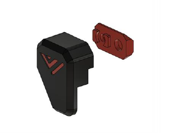

# 9.3 Front door latches

## Overview

 

## BOM

| Material        | Quantity          | Notes |
|:-------------|:------------------|:------|
| M3 6mm           | 4 | - |
| M3 10mm | 4 | - |
| M3 nut | 8 | - |
| 2x5mm magnet | 8 |

## STL's

 

| File name | Amount to print |
|-----------|-----------------|
| <a href="https://github.com/VzBoT3D/VzBoT-Vz330/blob/master/Assemblies%20BOM%20and%20STL/enclosure/Front%20door%20latches/Magnetic%20latch/Door%20latch%20bottom%20left.stl" target="_blank">Door latch bottom left</a> | 1 |
| <a href="https://github.com/VzBoT3D/VzBoT-Vz330/blob/master/Assemblies%20BOM%20and%20STL/enclosure/Front%20door%20latches/Magnetic%20latch/Door%20latch%20bottom%20right.stl" target="_blank">Door latch bottom right</a> | 1 |
| <a href="https://github.com/VzBoT3D/VzBoT-Vz330/blob/master/Assemblies%20BOM%20and%20STL/enclosure/Front%20door%20latches/Magnetic%20latch/Door%20latch%20top%20left.stl" target="_blank">Door latch top left</a> | 1 |
| <a href="https://github.com/VzBoT3D/VzBoT-Vz330/blob/master/Assemblies%20BOM%20and%20STL/enclosure/Front%20door%20latches/Magnetic%20latch/Door%20latch%20top%20right.stl" target="_blank">Door latch top right</a> | 1 |

### Step 1
Insert the 2x5mm magnet in the latches, they are press fit. If not tight use super glue to hold them in.

### Step 2
Insert the M3 nuts in the latches

### Step 3
Screw the latches to the door panels using the M3 buttonheads
 

### Step 4
Untighten the set screws in the frame side latches and line them up with the latches, then to lock them tighten the M3 screw.