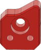
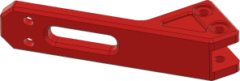
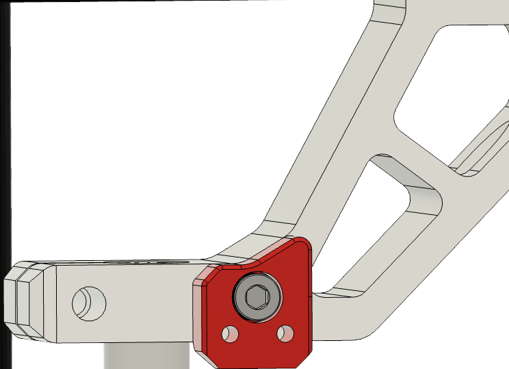
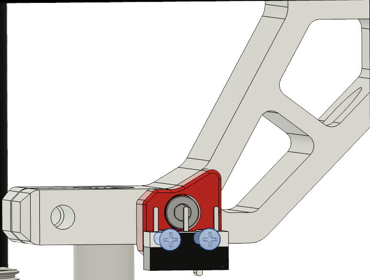
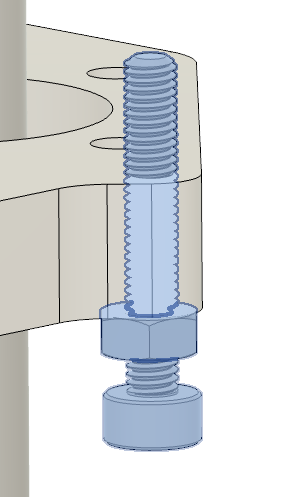
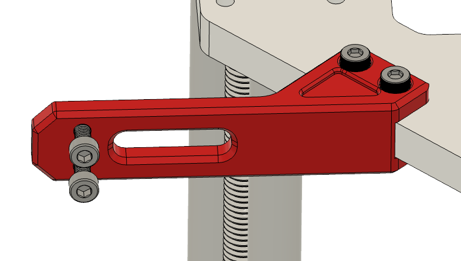

# 3.5 Z-Switch & bed chain

|:-|
|  |

## Parts

| Part | Location | Info |
|:-------------|:------------------|
| M2 x 10mm   Quantity: 2 | **Layer**: 3   **Box**: VZ330 Box 6 |  |
| M3 x 6mm   Quantity: 2 | **Layer**: 3   **Box**: VZ330 Box 6 |  |
| M3 x 8mm   Quantity: 4 | **Layer**: 3   **Box**: VZ330 Box 6 |  |
| M3 x 10mm   Quantity: 1 | **Layer**: 3   **Box**: VZ330 Box 6 |  |
| M3 x 45mm   Quantity: 1 | **Layer**: 3   **Box**: VZ330 Box 6 |  |
| M3 nut   Quantity: 1 | **Layer**: 3   **Box**: VZ330 Box 6 |  |
| M3 t-nut   Quantity: 2 | **Layer**: 3   **Box**: VZ330 Box 6 |  |
| Microswitch   Quantity: 1 | **Layer**: 2   **Box**: VZ330 Box 2 |  |
| Endstop holder   Quantity: 1 | **Layer**: 2   **Box**: VZ330 Box 2 |  |
| Z-chain holder   Quantity: 1 | **Layer**: 2   **Box**: VZ330 Box 2 |  |

## Step 1

### Notes

{: .highlight }
> Required
>
> &#8226; Box 6 - M3 x 10mm  
> &#8226; Box 2

|:-|
|  |

| Part | Location |
|:-|:-|
| M3 x 10mm   Quantity: 1 | **Layer**: 3   **Box**: VZ330 Box 6   **Bag**: M3   **Bagnumber**: 4/16 |
| Endstop holder   Quantitiy: 1 | **Layer**: 2   **Box**: VZ330 Box 2 |

|:-|:-|
|  | &#8226; Screw in the endstop holder with the M3 x 10mm screw to the top front z rod holder. |
{: .instructiontable}

## Step 2

{: .highlight }
> Required
>
> &#8226; Box 6 - M2 x 10mm  
> &#8226; Box 2

|:-|
|  |

| Part | Location |
|:-|:-|
| M2 x 10mm   Quantity: 2 | **Layer**: 3   **Box**: VZ330 Box 6  |
| Endstop holder   Quantitiy: 1 | [From step 1](#step-1) |
| Microswitch   Quantity: 1 | **Box**: VZ330 Box 2 |

|:-|:-|
|  | &#8226; The pin from the microswitch needs to point to the outerside of the frame   &#8226; Mount the microswitch to the endstop with the two M2 x 10mm screws. |
{: .instructiontable}

## Step 3

{: .highlight }
> Required
>
> &#8226; Box 6 - M3 x 45mm  
> &#8226; Box 6 - M3 nut

|:-|
|  |

| Part                        | Location                                |
|:----------------------------|:----------------------------------------|
| M3 x 45mm   Quantity: 1 | **Layer**: 3   **Box**: VZ330 Box 6 |
| M3 nut   Quantitiy: 1 | **Layer**: 3   **Box**: VZ330 Box 6 |

|:-|:-|
|  | &#8226; Screw on the m3 nut to the M3 x 45mm screw   &#8226; Screw in the nut screw combination to the front right of the bed support piece in the corresponding hole   &#8226; The actual position of the screw will be aligned later in the build |
{: .instructiontable}

## Step 4

{: .highlight }
> Required
>
> &#8226; Box 6 - M3 x 6mm  
> &#8226; Box 6 - M3 x 8mm  
> &#8226; Box 2

|:-|
|  |

| Part                           | Location                                |
|:-------------------------------|:----------------------------------------|
| M3 x 6mm   Quantity: 2     | **Layer**: 3   **Box**: VZ330 Box 6 |
| M3 x 8mm   Quantity: 2     | **Layer**: 3   **Box**: VZ330 Box 6 |
| Chain holder   Quantity: 1 | **Layer**: 2   **Box**: VZ330 Box 2 |

|:-|:-|
|  | &#8226; Use the M3 x 6mm screws to attach the chain holder to the bed support   &#8226; Put in the M3 x 8mm screws in the other two holes, with them we later attach the chain to the holder  |
{: .instructiontable}

## Step 5

Install chain \[...\]
