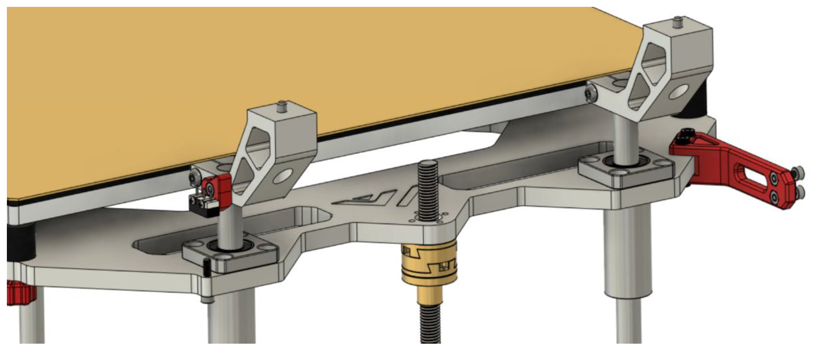

 

|:-|
|  |

 
 

# Part's

|:-------------|:------------------|:------|
| **Type**:   **Amount**: | M2 x 10mm   2 | **Layer**: 3   **Box**: VZ330 Box 6   **Bag**: M2   **Bagnumber**: 2/5 |
| **Type**:   **Amount**: | M3 x 6mm   2 | **Layer**: 3   **Box**: VZ330 Box 6   **Bag**: M3   **Bagnumber**: 14/16 |
| **Type**:   **Amount**: | M3 x 8mm   4 | **Layer**: 3   **Box**: VZ330 Box 6   **Bag**: M3   **Bagnumber**: 9/16 |
| **Type**:   **Amount**: | M3 x 10mm   1 | **Layer**: 3   **Box**: VZ330 Box 6   **Bag**: M3   **Bagnumber**: 4/16 |
| **Type**:   **Amount**: | M3 x 45mm   1 | **Layer**: 3   **Box**: VZ330 Box 6   **Bag**: M3   **Bagnumber**: 8/16 |
| **Type**:   **Amount**: | M3 nut   1 | **Layer**: 3   **Box**: VZ330 Box 6   **Bag**: M3   **Bagnumber**: 12/16 |
| **Type**:   **Amount**: | M3 t-nut   2 | **Layer**: 3   **Box**: VZ330 Box 6   **Bag**: M3   **Bagnumber**: 1/16 |
| **Type**:   **Amount**: | Microswitch   1 | **Layer**: 2   **Box**: VZ330 Box 2 |

# Assembly

## Step 1

Install endstop holder

## Step 2

Install endstop

## Step 3

Install screw + nut in bed

## Step 4

Install chain holder

## Step 5

Install chain
