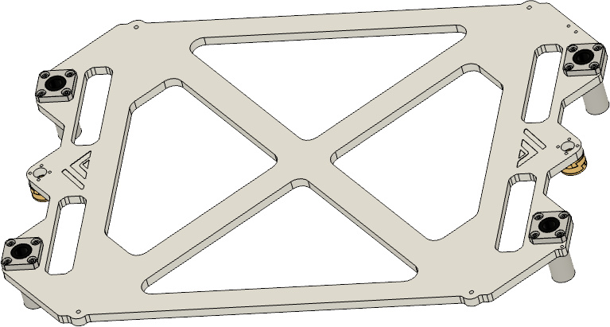
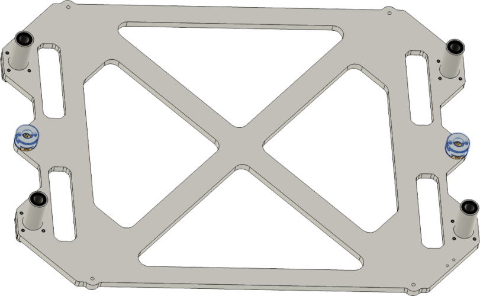
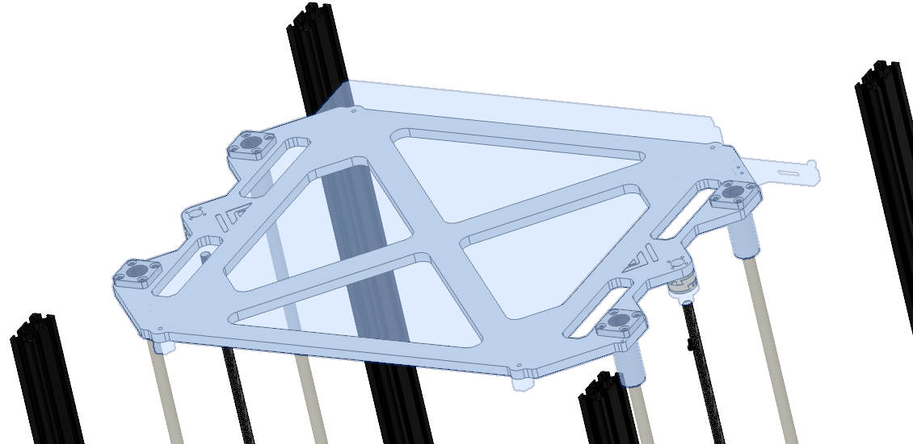
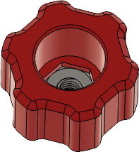
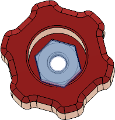

 

 
 

# Parts

| Part | Location | Info |
|:-------------|:------------------|:------|
| M3 x 10mm   Quantity: 4 | **Layer**: 3   **Box**: VZ330 Box 6 |  |
| M3 x 45mm (countersunk)   Quantity: 4 | **Layer**: 3   **Box**: VZ330 Box 6 |  |
| M3 nut   Quantity: 4 | **Layer**: 3   **Box**: VZ330 Box 6 |  |
| M4 x 10mm   Quantity: 16 | **Layer**: 3   **Box**: VZ330 Box 6 |  |
| LMK10LUU   Quantity: 4 | **Layer**: 2 |  |
| Oldham coupler   Quantity: 2 | **Layer**: 2 |  |
| Springs / Silicon dumper   Quantity: 4 | **Box**: VZ330 Box 2 | |

# STLs

 

{: .highlight }
> You can click on the object you wanna print on the plate and the corresponding STL will open up.

 

  
  <map name="stl">
    <area target="_blank" alt="Bed level knobs" title="Bed level knobs" href="https://github.com/VzBoT3D/VzBoT-Vz330/blob/master/Assemblies%20BOM%20and%20STL/Z%20complete%20system%20-%20Aluminum/STLs/Bed%20level%20adjustment%20knobs%20.stl" coords="260,269,450,430" shape="rect">
</map>

# Assembly

## Step 1

### Notes

{: .highlight }
> Required 
>
> &#8226; Box 6 - M4 x 10mm

|:-|
|  |

| Part | Location |
|:-|:-|
| Single bed piece   Quantity: 1 | **Layer**: 4 |
| LMK10LUU   Quantity: 4 | **Layer**: 1 |
| Oldham couplers   Quantity: 2 | **Layer**: 2 |
| M4 x 10mm   Quantity: 16 | **Layer**: 3   **Box**: VZ330 Box 6   **Bag**: M4   **Bagnumber**: 4/16 |

 

### Instructions

|:-|:-|
|  | &#8226; Insert LMK10LUU in the four holes   &#8226; fixate them with the M4 x 10mm screws |
{: .instructiontable}

 

## Step 2

### Notes

{: .highlight }
> Required 
>
> &#8226; Box 6 - M3 x 10mm

|:-|
|  |

| Part | Location |
|:-|:-|
| Upper part of the oldham coupler   Quantity: 2 | **Layer**: 2 |
| M3 x 10mm   Quantity: 4 | **Layer**: 3   **Box**: VZ330 Box 6 |

 

### Instructions

|:-|:-|
|  | &#8226; Attach the part of the oldham coupler to the center hole   &#8226; Fixate it with the M3 x 8mm screw |
{: .instructiontable}

|:-|:-|
|  | &#8226; Attach the rest of the oldham coupler to the fixated part |
{: .instructiontable}

 

## Step 3

### Notes

|:-|
|  |

| Part | Location |
|:-|:-|
| Assembled bed bracket   Quantity: 1 | **Layer**: 4 |

 

{: .important }
> Pay attention when you assemble the bed the hole with the thread needs to point to the front right.

### Instructions

|:-|:-|
|  | &#8226; The part with the threaded hole needs to point to the front right   &#8226; Slide the assembled bed bracket onto the rod's   &#8226; Screw in the leadscrew to the assembled oldham coupler |
{: .instructiontable}

 

## Step 4

### Notes

| Part | Location |
|:-|:-|
| Aluminium Bed   Quantity: 1 | **Layer**: 4 |
| Heatbed   Quantity: 1 | **Layer**: 4 |
| Magnetic sheet  Quantity: 1 | **Layer**: 4 |

### Instructions

{: .highlight }
> You should first apply the magnetic sheet and then the heated bed, due to the reason that the bed isn't flat anymore after applying the heated bed due to the thermistor build into it.

#### Magnetic sheet

|:-|:-|
|  | &#8226; How to apply the magnetic sheet to the aluminium plate |
{: .instructiontable}

 

#### Heatbed

|:-|:-|
|  | &#8226; How to apply the heatbed to the aluminium plate |
{: .instructiontable}

 

## Step 5

### Notes

{: .highlight }
> Required 
>
> &#8226; Box 6 - M3 nut

|:-|
|  |

|:-|:-|
| Bed leveling knobs   Quantity: 4 | [STLs](#stls) |
| M3 nut   Quantity: 4 | **Layer**: 3   **Box**: VZ330 Box 6 |

 

### Instructions

|:-|:-|
|  | &#8226; Insert the m3 nut in the leveling knob and press it in so it sits flush at the bottom |
{: .instructiontable}

 

## Step 6

### Notes

{: .highlight }
> Required 
>
> &#8226; Box 6 - M3 x 45mm  
> &#8226; Box 2

|:-|
|  |

|:-|:-|
| Bed with attached heatmat and magnetic sheet   Quantity: 1 | [Part from step 5](#step-5) |
| M3 x 45mm   Quantity: 4 | **Layer**: 3   **Box**: VZ330 Box 6 |
| Spring's or silicon dumper   Quantity: 4 | **Box**: VZ330 Box 2 |
| Bed leveling knob's   Quantity: 4 | [STLs](#stls)

 

### Instructions

|:-|:-|
|  | &#8226; Put the silicon dumper's or the springs on the 4 holes in the bed bracket   &#8226; Put the assembled printbed ontop of the silicon dumpers or springs   &#8226; Put the M3 x 45mm screws through the holes in the plate and secure them with the knobs from the bottom|
{: .instructiontable}
