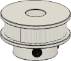
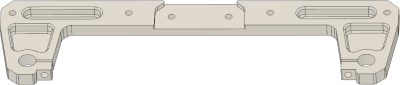
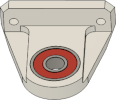
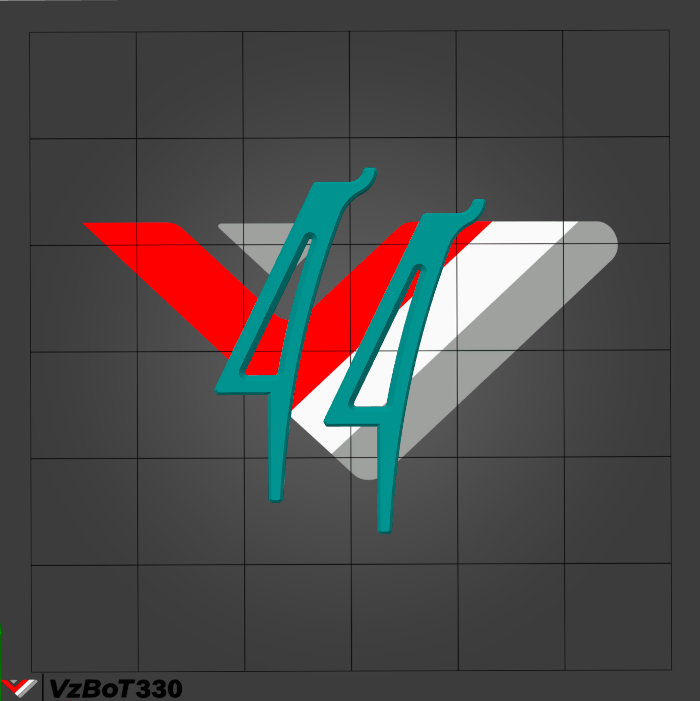
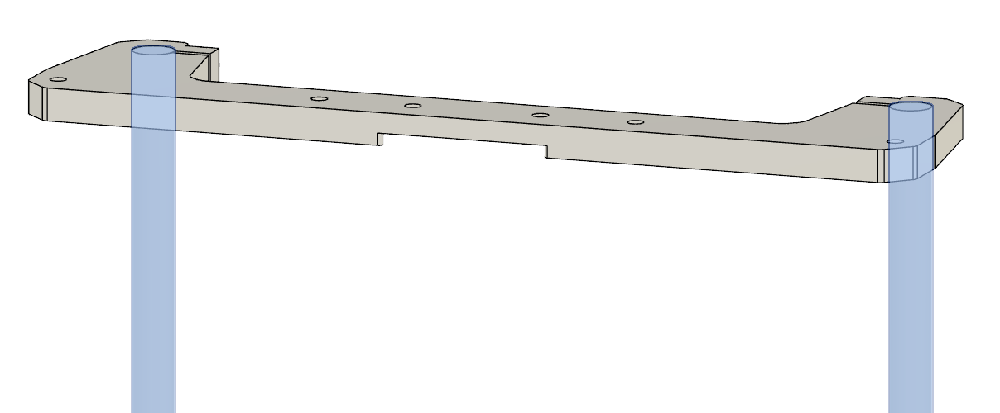
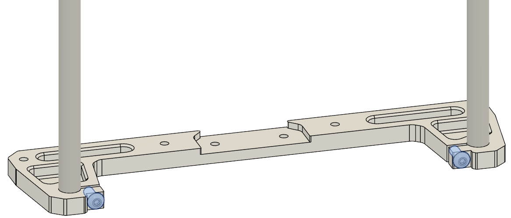
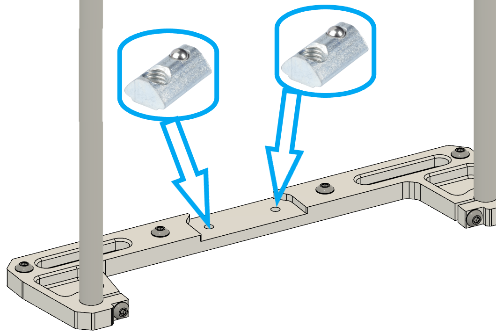
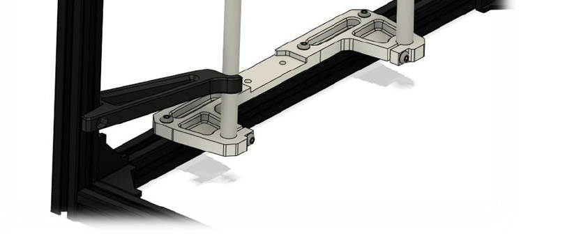
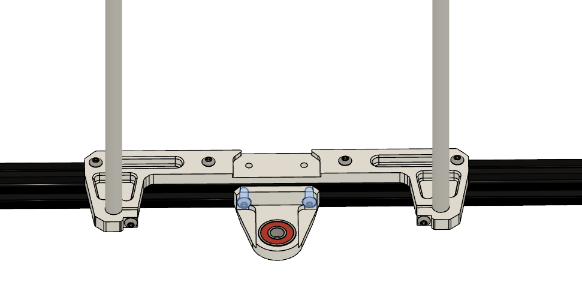
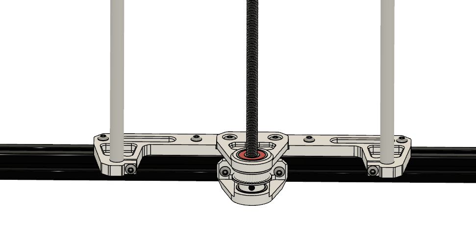

 

|:-|
|  |

 
 

# Part's

| Part | Location |
|:-------------|:------------------|
| M4 x 10mm   Quantity: 4 | **Layer**: 3   **Box**: VZ330 Box 6   **Bag**: M4   **Bagnumber**: 14/16 |  |
| M4 x 12mm   Quantity: 16 | **Layer**: 3   **Box**: VZ330 Box 6   **Bag**: M4   **Bagnumber**: 13/16 |  |
| M4 t-nut   Quantity: 20 | **Layer**: 3   **Box**: VZ330 Box 6   **Bag**: M4   **Bagnumber**: 2/16 |  |
| M4 rollin t-nut   Quantity: 4 | **Box**: VZ330 Box 6   **Bag**: M4   **Bagnumber**: 3/16 |  |
| 10mm rods ( 500mm )   Quantity: 4 | **Layer**: 2  |  |
| Belt GT2 closed ( 1100mm )   Quantity: 1 | **Layer**: 2   **Box**: VZ330 Box 2 | picture |
| Leadscrew TR8 ( 500 mm )   Quantity: 2 | **Layer**: 2 |  |
| GT2 40 teeth   Quantity: 2 | **Layer**: 2   **Box**: VZ330 Box 2 |  |
| z bracket   Quantity: 2 | **Layer**: 1 |  |
| Lower leadscrew mount   Quantity: 2 | **Layer**: 1 |  |
| Upper leadscrew mount   Quantity: 2 | **Layer**: 1 |  |

# STL's

 

{: .highlight }
> You can click on the object you wanna print on the plate and the corresponding STL will open up.

 

  
  <map name="stl">
    <area target="_blank" alt="Alignment tool" title="Alignment tool" href="https://github.com/VzBoT3D/VzBoT-Vz330/blob/master/Assemblies%20BOM%20and%20STL/Alignment%20Tools/Z%20Alignment%20tool%2010mm%20rod.stl" coords="204,154,498,553" shape="rect">
    </map>

# Assembly

 

## Step 1 (do for each side)

### Notes

{: .highlight }
> Required
>
> &#8226; Box 6 - M4 - 13/16

|:-|
|  |

| Part | Location |
|:-|:-|
| z bracket   Quantity: 2 | **Layer**: 1  |
| M4 x 12mm   Quantity: 4 | **Layer**: 3   **Box**: VZ330 Box 6   **Bag**: M4   **Bagnumber**: 13/16 |
| Rods ( 10mm )   Quantity: 4 | **Layer**: 1 |

 

### Instructions

|:-|:-|
|  | &#8226; Align the rod flush with the bottom of the z bracket |
{: .instructiontable}

|  | &#8226; Tighten the M4 x 12mm screw |
{: .instructiontable}

 

## Step 2 (do for each side)

### Notes

{: .highlight }
> Required
>
> &#8226; Box 6 - M4 - 13/16  
> &#8226; Box 6 - M4 - 2/16  
> &#8226; Box 6 - M4 - 3/16 

|:-|
|   |

| Part | Location |
|:-|:-|
| z bracket   Quantity: 2 | **Layer**: 1 |
| M4 x 12mm   Quantity: 8 | **Layer**: 3   **Box**: VZ330 Box 6   **Bag**: M4   **Bagnumber**: 13/16 |
| M4 t-nut   Quantity: 8 | **Layer**: 3   **Box**: VZ330 Box 6   **Bag**: M4   **Bagnumber**: 2/16 |
| M4 rollin t-nut   Quantity: 4 | **Box**: VZ330 Box 6   **Bag**: M4   **Bagnumber**: 3/16 |

 

### Instructions

|:-|:-|
|  | &#8226; Insert rollin t-nut in the extrusion below the middle two holes | 
{: .instructiontable}

|:-|:-|
|  | &#8226; Attach M4 x 12mm + t-nut to the z bracket   &#8226; **Tip:** screw in two screws for now in the two holes and the rollin t-nuts so they move with the part if you move it around. |
{: .instructiontable}

|:-|:-|
|  | &#8226; Tighten the M4 x 12mm screw loosly, we need to align the z bracket |
{: .instructiontable}

|:-|:-|
|  | &#8226; Align the front rod with the z-alignment tool   &#8226; tighten the M4 x 12mm screws, when it's aligned |
{: .instructiontable}

 

## Step 3 (do for each side)

### Notes

{: .highlight }
> Required
>
> &#8226; Box 6 - M4 - 13/16  
> &#8226; Box 6 - M4 - 2/16 

|:-|
|  |

| Part | Location |
|:-|:-|
| Lower leadscrew mount   Quantity: 2 | **Layer**: 1 |
| M4 x 12mm   Quantity: 4 | **Layer**: 3   **Box**: VZ330 Box 6   **Bag**: M4   **Bagnumber**: 13/16 |
| M4 t-nut   Quantity: 4 | **Layer**: 3   **Box**: VZ330 Box 6   **Bag**: M4   **Bagnumber**: 2/16 |

 

### Instructions

|:-|:-|
|  | &#8226; Attach M4 x 10mm + t-nut to the lower leadscrew mount |
{: .instructiontable}

|:-|:-|
|  | &#8226; Insert lower leadscrew mount to bottom extrusion   &#8226; Tighten the M4 x 12mm screw loosly, and center the lower leadscrew mount   &#8226; We will align the parts in **Step 5** |
{: .instructiontable}

 

## Step 4 (do for each side)

### Notes

{: .highlight }
> Required
>
> &#8226; Box 6 - M4 - 13/16

|:-|
|  |

|:-|:-|
| Upper leadscrew mount   Quantity: 2 | **Layer**: 1 |
| M4 x 12mm   Quantity: 4 | **Layer**: 3   **Box**: VZ330 Box 6   **Bag**: M4   **Bagnumber**: 13/16 |

 

### Instructions

|:-|:-|
|  | &#8226; Insert upper leadscrew mount to single z bracket   &#8226; Tighten the M4 x 12mm screw loosly, and center the lower leadscrew mount   &#8226; Use a drill bit or a similar tool (with 8mm diameter), put it through the two bearing's and prealign the two mounts   &#8226; We will align the parts in **Step 5** |

 

## Step 5 (do for each side)

### Notes

{: .highlight }
> Required
>
> &#8226; Box 2

|:-|
|  |

|:-|:-|
| Leadscrew   Quantity: 2 | **Layer**: 2 |
| GT2 40 teeth idler   Quantity: 2 | **Layer**: 2   **Box**: VZ330 Box 2 |
| Closed GT2 belt ( 1100mm )   Quantity: 1 | **Layer**: 2   **Box**: VZ330 Box 2 |

 

### Instructions

|:-|:-|
|  | &#8226; Insert closed GT2 belt between lower and upper leadscrew mount   &#8226; Insert GT2 40 tooth idler between lower and upper leadscrew mount (the beld should be around the idler )   &#8226; Insert leadscrew   &#8226; Secure leadscrew with grub screws of the GT2 idler (leadscrew shouldn't rub on the ground)   &#8226; Check that leadscrew is straight and tighten upper and lower leadscrew bracket |