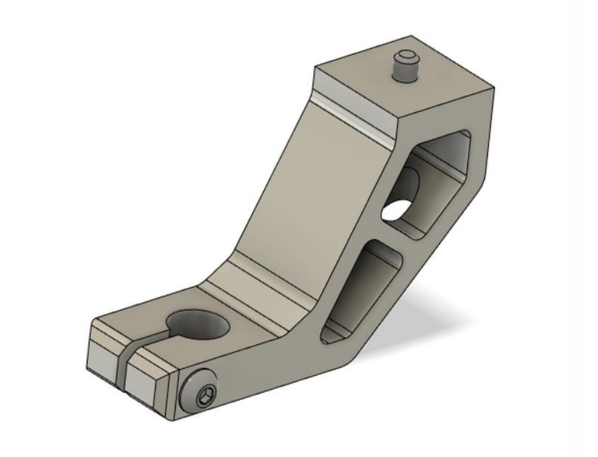
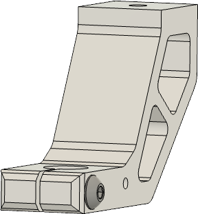
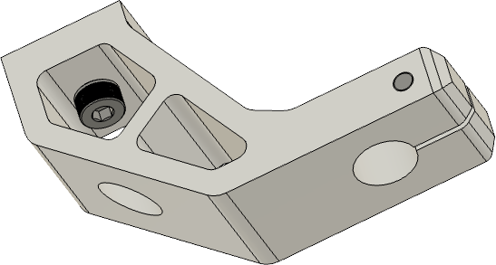
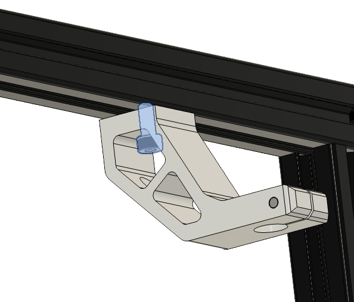
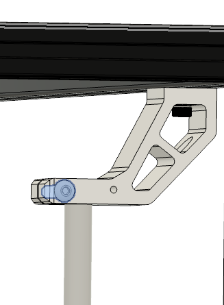

# 3.3 Top rod mounts

## Parts

| Part | Location | Info |
|:-------------|:------------------|
| M4 x 10mm   Quantity: 4 | **Layer**: 3   **Box**: VZ330 Box 6 |  |
| M4 x 20mm   Quantity: 4 | **Layer**: 3   **Box**: VZ330 Box 6 |  |
| M4 t-nut    Quantity: 4 | **Layer**: 3   **Box**: VZ330 Box 6 |  |
| Top rod mount   Quantity: 4 | **Layer**: 1 |  |

## Step 1

{: .highlight }
> Required
>
> &#8226; Box 6 - M4 - 8/16

|:-|
|  |

| Part | Location |
|:-|:-|
| Top rod mount   Quantity: 4 | **Layer**: 1 |
| M4 x 20mm   Quantity: 4 | **Layer**: 3   **Box**: VZ330 Box 6 |

|:-|:-|
|  | &#8226; Screw in the M4 x 20mm screw to all Top rod mounts |
{: .instructiontable}

## Step 2

{: .highlight }
> Required
>
> &#8226; Box 6 - M4 x 10mm  
> &#8226; Box 6 - M4 t-nut

|:-|
|  |

| Part | Location |
|:-|:-|
| Top rod mount   Quantity: 4 | **Layer**: 1 |
| M4 x 10mm   Quantity: 4 | **Layer**: 3   **Box**: VZ330 Box 6   **Bag**: M4   **Bagnumber**: 4/16 |
| M4 t-nut   Quantity: 4 | **Layer**: 3   **Box**: VZ330 Box 6   **Bag**: M4   **Bagnumber**: 2/16 |

|:-|:-|
|  | &#8226; Screw in the M4 x 10mm screw with the t-nut to all top rod mounts |
{: .instructiontable}

## Step 3

Follow these steps once for each of all four mounts

|:-|
|  |

| Part | Location |
|:-|:-|
| Top rod mount   Quantity: 4 | [Part from step 2](#step-2) |

|:-|:-|
|  | &#8226; But the top rod mounts over the rod   &#8226; Attach the top part to the extrusion &#8226; Tighten the M4x20mm screw |
{: .instructiontable}

## Step 4

Follow these steps once for each of all four mounts

|:-|
|  |

| Part | Location |
|:-|:-|
| Top rod mounts   Quantity: 4 | [Part from step 2](#step-2) |

|:-|:-|
|  | &#8226; Now that the top rod mounts are mounted to the extrusion tighten the M4 x 20mm screws to secure the rods to the mounts |
{: .instructiontable}
