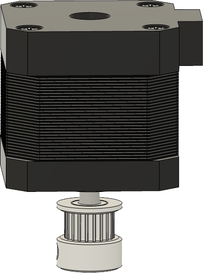
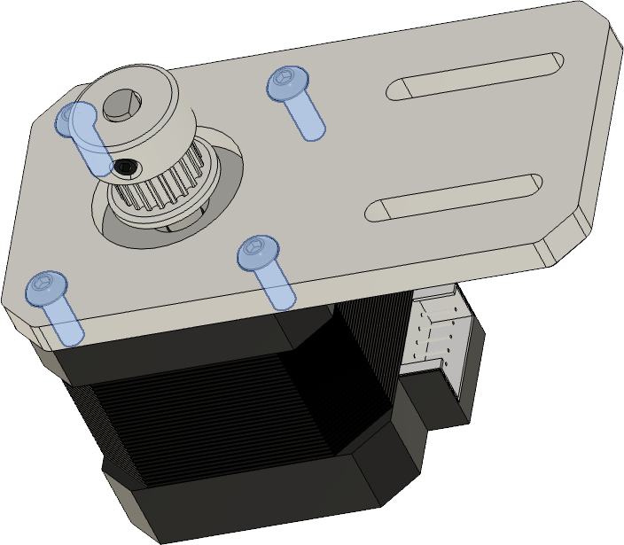

# 3.4 Z-Motor bracket

## Overview

## BOM

| Material        | Quantity          | Notes |
|:-------------|:------------------|:------|
| M3 10mm | 4 | -  |
| M4 10mm | 4 | - |
| M4 t-nut | 2 | - |
| GT2 20 teeth | 1 | - |
| NEMA 17 stepper | 1 | - |

### Step 1

 
 

| | |
|-|-|
|  | 1) 1 x NEMA 17 motor   2) GT2 20 teeth idler |
|  | 1) Attache the GT2 idler to the motor shaft of the nema 17 motor ( we will align it later ) |

 
 

### Step 2

 
 

| | |
|-|-|
|  | 1) 1 x NEMA 17 motor   2) Motor piece from the Single Z mount |
|  | 1) Attach the NEMA 17 motor to the motor piece with the four M3 x 10mm screws   2) Take care that the motor cable points to the back ( the side with the slides in the plate) |

 
 

### Step 3

 
 

| | |
|-|-|
|  | 1) 1 x Extrusion mount plate   2) 2 x M4 x 10mm   3) 2 x M4 t-nut |
|  | 1) Attach the M4 x 10 mm screw and the M4 t-nut to the plate |

 
 

### Step 4

 
 

| | |
|-|-|
|  | 1) 1 x Extrusion mount plate |
|  | 1) Attach the extrusion mount plate to the frame ( take care it's in the middle of the back extrusion ) |

 
 

### Step 5

 
 

| | |
|-|-|
|  | 1) 1 x Assembled Motor mount   2) 2 x M4 x 10mm|
|  | 1) Put the assembled mount on the extrusion plate and screw in the M4 x 10mm screws slightly |

 
 

### Step 6

- Put on the z-belt and tighten the belt by pulling the motor back and fixate it with the slightly screwed in M4 x 10mm screws.
- Loose the GT2 grub screws and align the belt that it is horizontal and tighten the grub screws on the flat spots of the motor after.